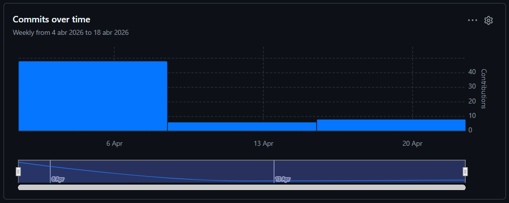
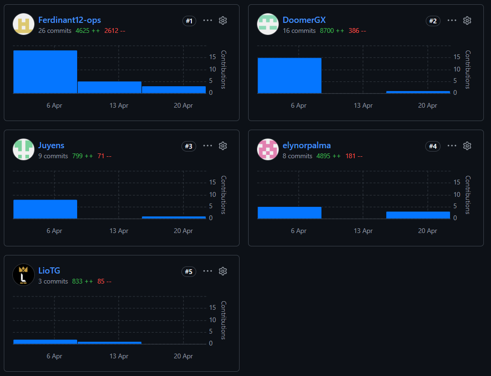
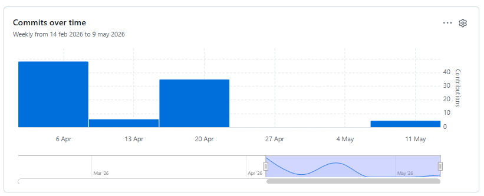
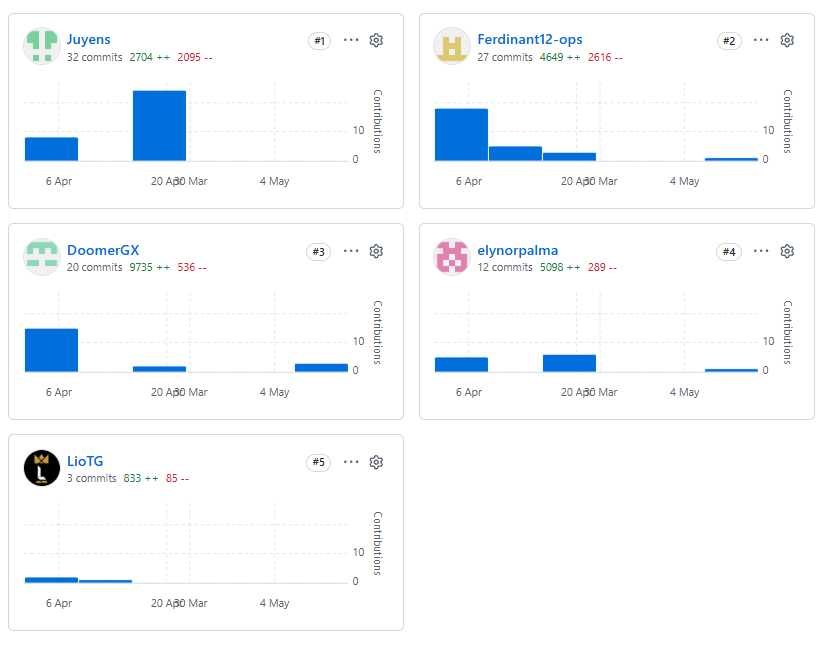
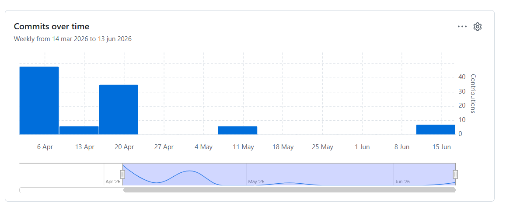
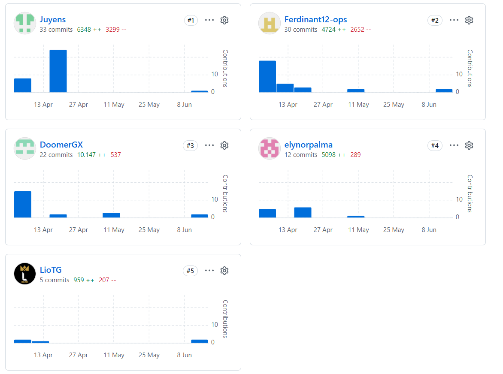

---

### Universidad Peruana de Ciencias Aplicadas

<small>Facultad de Ingeniería &nbsp;·&nbsp; Ingeniería de Software &nbsp;·&nbsp; 5to Ciclo</small>

Aplicaciones Web

<small>Código: 1ASI0730 &nbsp;·&nbsp; NRC: 12190 &nbsp;·&nbsp; Profesor: Hugo Allan Mori Paiva</small>

### Informe del Trabajo Final

<small>Startup &nbsp;·&nbsp; Kauflink</small>

<small>Producto &nbsp;·&nbsp; Entreprenly</small>

### Integrantes

| Código     | Alumno                             |
| :--------: | :--------------------------------: |
| u20241d992 | Camargo Briceño, Joseph Julius     |
| u202414715 | Peirano Brun, Jose Antonio         |
| u20241a972 | Palma De Los Santos, Elynor Mikela |  
| u20241a290 | Flores Pinchi, Jose Fernando       |
| u202416151 | Chavez Carrasco, Lionel Abraham    |

<small>Junio &nbsp;·&nbsp; 2026</small>

---

# Registro de Versiones del Informe

| Versión  | Fecha          | Autor                 | Descripción de modificación |
| :------: | :------------: | :-------------------: | :-------------------------: |
| AV1      | 02 / 04 / 2026 | Todos los integrantes | Primera versión             |
| TB1      | 12 / 05 / 2026 | Todos los integrantes | Segunda versión             |
| AV2      | 12 / 06 / 2026 | Todos los integrantes | Tercera versión             |
| TB2      | 06 / 07 / 2026 | Todos los integrantes | Cuarta versión              |

# Project Report Collaboration Insights

En esta sección se presenta la evidencia de colaboración del equipo Kauflink durante la elaboración del informe del Trabajo Final. El trabajo se desarrolló sobre el repositorio del Project Report (`ap-entreprenly`), bajo la organización [Kauflink](https://github.com/Kauflink), donde los cinco integrantes participaron mediante commits y Pull Requests a lo largo de las entregas AV1, TB1, AV2 y TB2. Para cada entrega se describe cómo se desarrollaron las actividades de elaboración del informe y se presentan las capturas de los analíticos de colaboración y commits del repositorio, en coherencia con el Registro de Versiones del Informe.

---

## Repositorio del Informe — `ap-entreprenly`

**URL:** https://github.com/Kauflink/ap-entreprenly

### **AV1: Entregable Inicial**

Durante la elaboración de la AV1, los cinco integrantes del equipo contribuyeron en la redacción y revisión del informe, distribuyendo la carga de trabajo por capítulos. El trabajo se organizó en ramas por capítulo siguiendo el flujo GitFlow, con integraciones periódicas a la rama `main` mediante Pull Requests.

#### Distribución de contribuciones por integrante (AV1)

| Integrante | Secciones principales del informe |
| :--- | :--- |
| Camargo Briceño, Joseph Julius | 1.1 Startup Profile · 1.1.1 Descripción de la Startup · 5.1 Software Configuration Management · 5.2.1 Sprint 1 (Sprint Planning, Sprint Backlog, Development Evidence, Deployment Evidence, Team Collaboration Insights) |
| Chavez Carrasco, Lionel Abraham | 4.1 Style Guidelines · 4.3 Landing Page UI Design (Wireframes y Mock-ups) · 4.4 Web Applications UX/UI Design · 5.2.1.5 Execution Evidence for Sprint Review |
| Palma De Los Santos, Elynor Mikela | 2.2 Entrevistas · 2.3 Needfinding (User Personas, Empathy Mapping, User Journey Mapping) · 3.1 User Stories (criterios de aceptación) · Student Outcome |
| Peirano Brun, José Antonio | 2.1 Competidores · 2.4 Big Picture Event Storming · 4.6 Domain-Driven Software Architecture · 4.7 Software Object-Oriented Design |
| Flores Pinchi, José Fernando | 1.2 Solution Profile · 1.3 Segmentos objetivo · 3.2 Impact Mapping · 3.3 Product Backlog · 4.8 Database Design |

---

### **TB1: Frontend Web Application y Sprint 2**

Para la entrega TB1, el equipo se enfocó en la implementación del Frontend Web Application en Vue 3 + PrimeVue cubriendo los Bounded Contexts planificados, la ejecución del Sprint 2 y la documentación correspondiente, aplicando las correcciones indicadas por el docente sobre la AV1.

#### Distribución de contribuciones por integrante (TB1)

| Integrante | Secciones principales del informe |
| :--- | :--- |
| Camargo Briceño, Joseph Julius | 5.2.2.1 Sprint Planning 2 · 5.2.2.4 Development Evidence for Sprint Review · 5.2.2.7 Software Deployment Evidence for Sprint Review · Correcciones a 5.1 Software Configuration Management |
| Chavez Carrasco, Lionel Abraham | 5.2.2.5 Execution Evidence for Sprint Review · Bounded Context: Subscription · Actualización de 4.4 Web Applications UX/UI Design (Mockups Sprint 2) |
| Palma De Los Santos, Elynor Mikela | 5.2.2.6 Services Documentation Evidence for Sprint Review · 5.2.2.8 Team Collaboration Insights during Sprint · Student Outcome TB1 · Correcciones a 3.1 User Stories (criterios de aceptación) |
| Peirano Brun, José Antonio | 5.2.2.2 Aspect Leaders and Collaborators · Bounded Context: Inventory · Vistas Home y Help del Dashboard · Correcciones a 4.6 Domain-Driven Software Architecture y 4.7 Software Object-Oriented Design · Revisión y mantenimiento del repositorio |
| Flores Pinchi, José Fernando | 5.2.2.3 Sprint Backlog 2 · Bounded Context: Sales (Punto de Venta) · Correcciones a 3.3 Product Backlog · Avance de Conclusiones, Bibliografía y Anexos |

---

### **AV2: Backend Web Services, Validación y Cierre del Proyecto**

Para la entrega AV2, el equipo se enfocó en la implementación del backend de los Bounded Contexts mediante servicios web RESTful en ASP.NET Core (C#) sobre el repositorio `ap-entreprenly-web-services`, consumidos por el Frontend Web Application en Vue (`ap-entreprenly-frontend`); la mejora visual y el diseño responsive de las aplicaciones web, la ejecución de las entrevistas de validación con usuarios del segmento objetivo y la incorporación de las correcciones finales sobre el informe. El trabajo se desarrolló bajo el flujo GitFlow, con integraciones a la rama `main` mediante Pull Requests.

#### Distribución de contribuciones por integrante (AV2)

| Integrante | Secciones principales del informe |
| :--- | :--- |
| Camargo Briceño, Joseph Julius | Backend de los Bounded Contexts: Profiles e IAM (ASP.NET Core) · Mejora visual y diseño responsive de sus vistas · Redacción del Sprint 3 · Actualización del Landing Page |
| Chavez Carrasco, Lionel Abraham | Backend del Bounded Context: Subscription (ASP.NET Core) · Mejora visual y diseño responsive del Bounded Context · Redacción de la Evaluación Heurística (5.3.3) · Actualización del Landing Page |
| Palma De Los Santos, Elynor Mikela | Backend del Bounded Context: Chatbot (ASP.NET Core) · Mejora visual y diseño responsive del Bounded Context · Actualización del Class Diagram y del Diagrama de Base de Datos (Capítulo IV) · Entrevistas de Validación y entrevistas About the Product |
| Peirano Brun, José Antonio | Backend del Bounded Context: Inventory (ASP.NET Core) · Mejora visual y diseño responsive del Bounded Context · Revisión de errores de las User Stories (Capítulo III) · Actualización de los diagramas Structurizr y de la Evaluación Heurística |
| Flores Pinchi, José Fernando | Backend del Bounded Context: Sales (ASP.NET Core) · Mejora visual y diseño responsive del Bounded Context · Revisión de errores del Capítulo III · Entrevistas de Validación y entrevistas About the Product |

---

### **TB2: Correcciones Finales del Informe y Cierre del Proyecto**

Para la entrega TB2, el equipo aplicó cambios en el Landing Page y en el Frontend Web Application en Vue, afinó el backend de los Bounded Contexts sobre el repositorio `ap-entreprenly-web-services` en ASP.NET Core (C#) e incorporó las correcciones finales de la documentación: actualización del prototipo en Figma, corrección de los diagramas de componentes, de contenedores y de base de datos, actualización de las User Stories y reorganización del Product Backlog. El trabajo se desarrolló bajo el flujo GitFlow, con integraciones a la rama `main` mediante Pull Requests.

#### Distribución de contribuciones por integrante (TB2)

| Integrante | Secciones principales del informe |
| :--- | :--- |
| Camargo Briceño, Joseph Julius | Cambios en el Landing Page y el Frontend Web Application · Afinamiento del backend del Bounded Context: Profiles e IAM · Corrección del prototipo en Figma · Actualización de las tareas de los sprints |
| Chavez Carrasco, Lionel Abraham | Cambios en el Landing Page y el Frontend Web Application · Afinamiento del backend del Bounded Context: Subscription · Corrección del prototipo en Figma · Actualización de las tareas de los sprints |
| Palma De Los Santos, Elynor Mikela | Cambios en el Frontend Web Application · Afinamiento del backend del Bounded Context: Chatbot · Corrección del Diagrama de Base de Datos · Actualización de las User Stories (Capítulo III) |
| Peirano Brun, José Antonio | Cambios en el Frontend Web Application · Afinamiento del backend del Bounded Context: Inventory · Corrección de los diagramas de componentes y de contenedores · Reorganización del Product Backlog |
| Flores Pinchi, José Fernando | Cambios en el Frontend Web Application · Afinamiento del backend del Bounded Context: Sales · Actualización de las User Stories (Capítulo III) · Reorganización del Product Backlog |

---

# Contenido

### Capítulo I: Introducción
- [1.1. Startup Profile](docs/capitulo-1.md#11-startup-profile)
  - [1.1.1. Descripción de la Startup](docs/capitulo-1.md#111-descripción-de-la-startup)
  - [1.1.2. Perfiles de integrantes del equipo](docs/capitulo-1.md#112-perfiles-de-integrantes-del-equipo)
- [1.2. Solution Profile](docs/capitulo-1.md#12-solution-profile)
  - [1.2.1. Antecedentes y problemática](docs/capitulo-1.md#121-antecedentes-y-problemática)
  - [1.2.2. Lean UX Process](docs/capitulo-1.md#122-lean-ux-process)
    - [1.2.2.1. Lean UX Problem Statements](docs/capitulo-1.md#1221-lean-ux-problem-statements)
    - [1.2.2.2. Lean UX Assumptions](docs/capitulo-1.md#1222-lean-ux-assumptions)
    - [1.2.2.3. Lean UX Hypothesis Statements](docs/capitulo-1.md#1223-lean-ux-hypothesis-statements)
    - [1.2.2.4. Lean UX Canvas](docs/capitulo-1.md#1224-lean-ux-canvas)
- [1.3. Segmentos objetivo](docs/capitulo-1.md#13-segmentos-objetivo)

### Capítulo II: Requirements Elicitation & Analysis
- [2.1. Competidores](docs/capitulo-2.md#21-competidores)
  - [2.1.1. Análisis competitivo](docs/capitulo-2.md#211-análisis-competitivo)
  - [2.1.2. Estrategias y tácticas frente a competidores](docs/capitulo-2.md#212-estrategias-y-tácticas-frente-a-competidores)
- [2.2. Entrevistas](docs/capitulo-2.md#22-entrevistas)
  - [2.2.1. Diseño de entrevistas](docs/capitulo-2.md#221-diseño-de-entrevistas)
  - [2.2.2. Registro de entrevistas](docs/capitulo-2.md#222-registro-de-entrevistas)
  - [2.2.3. Análisis de entrevistas](docs/capitulo-2.md#223-análisis-de-entrevistas)
- [2.3. Needfinding](docs/capitulo-2.md#23-needfinding)
  - [2.3.1. User Personas](docs/capitulo-2.md#231-user-personas)
  - [2.3.2. User Task Matrix](docs/capitulo-2.md#232-user-task-matrix)
  - [2.3.3. User Journey Mapping](docs/capitulo-2.md#233-user-journey-mapping)
  - [2.3.4. Empathy Mapping](docs/capitulo-2.md#234-empathy-mapping)
- [2.4. Big Picture Event Storming](docs/capitulo-2.md#24-big-picture-event-storming)
- [2.5. Ubiquitous Language](docs/capitulo-2.md#25-ubiquitous-language)

### Capítulo III: Requirements Specification
- [3.1. User Stories](docs/capitulo-3.md#31-user-stories)
- [3.2. Impact Mapping](docs/capitulo-3.md#32-impact-mapping)
- [3.3. Product Backlog](docs/capitulo-3.md#33-product-backlog)

### Capítulo IV: Product Design
- [4.1. Style Guidelines](docs/capitulo-4.md#41-style-guidelines)
  - [4.1.1. General Style Guidelines](docs/capitulo-4.md#411-general-style-guidelines)
  - [4.1.2. Web Style Guidelines](docs/capitulo-4.md#412-web-style-guidelines)
- [4.2. Information Architecture](docs/capitulo-4.md#42-information-architecture)
  - [4.2.1. Organization Systems](docs/capitulo-4.md#421-organization-systems)
  - [4.2.2. Labeling Systems](docs/capitulo-4.md#422-labeling-systems)
  - [4.2.3. SEO Tags and Meta Tags](docs/capitulo-4.md#423-seo-tags-and-meta-tags)
  - [4.2.4. Searching Systems](docs/capitulo-4.md#424-searching-systems)
  - [4.2.5. Navigation Systems](docs/capitulo-4.md#425-navigation-systems)
- [4.3. Landing Page UI Design](docs/capitulo-4.md#43-landing-page-ui-design)
  - [4.3.1. Landing Page Wireframe](docs/capitulo-4.md#431-landing-page-wireframe)
  - [4.3.2. Landing Page Mock-up](docs/capitulo-4.md#432-landing-page-mock-up)
- [4.4. Web Applications UX/UI Design](docs/capitulo-4.md#44-web-applications-uxui-design)
  - [4.4.1. Web Applications Wireframes](docs/capitulo-4.md#441-web-applications-wireframes)
  - [4.4.2. Web Applications Wireflow Diagrams](docs/capitulo-4.md#442-web-applications-wireflow-diagrams)
  - [4.4.3. Web Applications Mock-ups](docs/capitulo-4.md#443-web-applications-mock-ups)
  - [4.4.4. Web Applications User Flow Diagrams](docs/capitulo-4.md#444-web-applications-user-flow-diagrams)
- [4.5. Web Applications Prototyping](docs/capitulo-4.md#45-web-applications-prototyping)
- [4.6. Domain-Driven Software Architecture](docs/capitulo-4.md#46-domain-driven-software-architecture)
  - [4.6.1. Design-Level Event Storming](docs/capitulo-4.md#461-design-level-event-storming)
  - [4.6.2. Software Architecture Context Diagram](docs/capitulo-4.md#462-software-architecture-context-diagram)
  - [4.6.3. Software Architecture Container Diagrams](docs/capitulo-4.md#463-software-architecture-container-diagrams)
  - [4.6.4. Software Architecture Components Diagrams](docs/capitulo-4.md#464-software-architecture-components-diagrams)
- [4.7. Software Object-Oriented Design](docs/capitulo-4.md#47-software-object-oriented-design)
  - [4.7.1. Class Diagrams](docs/capitulo-4.md#471-class-diagrams)
- [4.8. Database Design](docs/capitulo-4.md#48-database-design)
  - [4.8.1. Database Diagrams](docs/capitulo-4.md#481-database-diagrams)
  - [4.8.2. Organización del esquema de base de datos](docs/capitulo-4.md#482-organización-del-esquema-de-base-de-datos)
  - [4.8.3. Relaciones entre tablas](docs/capitulo-4.md#483-relaciones-entre-tablas)
  - [4.8.4. Normalización aplicada](docs/capitulo-4.md#484-normalización-aplicada)

### Capítulo V: Product Implementation, Validation & Deployment
- [5.1. Software Configuration Management](docs/capitulo-5.md#51-software-configuration-management)
  - [5.1.1. Software Development Environment Configuration](docs/capitulo-5.md#511-software-development-environment-configuration)
  - [5.1.2. Source Code Management](docs/capitulo-5.md#512-source-code-management)
  - [5.1.3. Source Code Style Guide & Conventions](docs/capitulo-5.md#513-source-code-style-guide--conventions)
  - [5.1.4. Software Deployment Configuration](docs/capitulo-5.md#514-software-deployment-configuration)
- [5.2. Landing Page, Services & Applications Implementation](docs/capitulo-5.md#52-landing-page-services--applications-implementation)
  - [5.2.1. Sprint 1](docs/capitulo-5.md#521-sprint-1)
    - [5.2.1.1. Sprint Planning 1](docs/capitulo-5.md#5211-sprint-planning-1)
    - [5.2.1.2. Aspect Leaders and Collaborators](docs/capitulo-5.md#5212-aspect-leaders-and-collaborators)
    - [5.2.1.3. Sprint Backlog 1](docs/capitulo-5.md#5213-sprint-backlog-1)
    - [5.2.1.4. Development Evidence for Sprint Review](docs/capitulo-5.md#5214-development-evidence-for-sprint-review)
    - [5.2.1.5. Execution Evidence for Sprint Review](docs/capitulo-5.md#5215-execution-evidence-for-sprint-review)
    - [5.2.1.6. Services Documentation Evidence for Sprint Review](docs/capitulo-5.md#5216-services-documentation-evidence-for-sprint-review)
    - [5.2.1.7. Software Deployment Evidence for Sprint Review](docs/capitulo-5.md#5217-software-deployment-evidence-for-sprint-review)
    - [5.2.1.8. Team Collaboration Insights during Sprint](docs/capitulo-5.md#5218-team-collaboration-insights-during-sprint)
  - [5.2.2. Sprint 2](docs/capitulo-5.md#522-sprint-2)
    - [5.2.2.1. Sprint Planning 2](docs/capitulo-5.md#5221-sprint-planning-2)
    - [5.2.2.2. Aspect Leaders and Collaborators](docs/capitulo-5.md#5222-aspect-leaders-and-collaborators)
    - [5.2.2.3. Sprint Backlog 2](docs/capitulo-5.md#5223-sprint-backlog-2)
    - [5.2.2.4. Development Evidence for Sprint Review](docs/capitulo-5.md#5224-development-evidence-for-sprint-review)
    - [5.2.2.5. Execution Evidence for Sprint Review](docs/capitulo-5.md#5225-execution-evidence-for-sprint-review)
    - [5.2.2.6. Services Documentation Evidence for Sprint Review](docs/capitulo-5.md#5226-services-documentation-evidence-for-sprint-review)
    - [5.2.2.7. Software Deployment Evidence for Sprint Review](docs/capitulo-5.md#5227-software-deployment-evidence-for-sprint-review)
    - [5.2.2.8. Team Collaboration Insights during Sprint](docs/capitulo-5.md#5228-team-collaboration-insights-during-sprint)
  - [5.2.3. Sprint 3](docs/capitulo-5.md#523-sprint-3)
    - [5.2.3.1. Sprint Planning 3](docs/capitulo-5.md#5231-sprint-planning-3)
    - [5.2.3.2. Aspect Leaders and Collaborators](docs/capitulo-5.md#5232-aspect-leaders-and-collaborators)
    - [5.2.3.3. Sprint Backlog 3](docs/capitulo-5.md#5233-sprint-backlog-3)
    - [5.2.3.4. Development Evidence for Sprint Review](docs/capitulo-5.md#5234-development-evidence-for-sprint-review)
    - [5.2.3.5. Execution Evidence for Sprint Review](docs/capitulo-5.md#5235-execution-evidence-for-sprint-review)
    - [5.2.3.6. Services Documentation Evidence for Sprint Review](docs/capitulo-5.md#5236-services-documentation-evidence-for-sprint-review)
    - [5.2.3.7. Software Deployment Evidence for Sprint Review](docs/capitulo-5.md#5237-software-deployment-evidence-for-sprint-review)
    - [5.2.3.8. Team Collaboration Insights during Sprint](docs/capitulo-5.md#5238-team-collaboration-insights-during-sprint)
  - [5.2.4. Sprint 4](docs/capitulo-5.md#524-sprint-4)
    - [5.2.4.1. Sprint Planning 4](docs/capitulo-5.md#5241-sprint-planning-4)
    - [5.2.4.2. Aspect Leaders and Collaborators](docs/capitulo-5.md#5242-aspect-leaders-and-collaborators)
    - [5.2.4.3. Sprint Backlog 4](docs/capitulo-5.md#5243-sprint-backlog-4)
    - [5.2.4.4. Development Evidence for Sprint Review](docs/capitulo-5.md#5244-development-evidence-for-sprint-review)
    - [5.2.4.5. Execution Evidence for Sprint Review](docs/capitulo-5.md#5245-execution-evidence-for-sprint-review)
    - [5.2.4.6. Services Documentation Evidence for Sprint Review](docs/capitulo-5.md#5246-services-documentation-evidence-for-sprint-review)
    - [5.2.4.7. Software Deployment Evidence for Sprint Review](docs/capitulo-5.md#5247-software-deployment-evidence-for-sprint-review)
    - [5.2.4.8. Team Collaboration Insights during Sprint](docs/capitulo-5.md#5248-team-collaboration-insights-during-sprint)
- [5.3. Validation Interviews](docs/capitulo-5.md#53-validation-interviews)
  - [5.3.1. Diseño de Entrevistas](docs/capitulo-5.md#531-diseño-de-entrevistas)
  - [5.3.2. Registro de Entrevistas](docs/capitulo-5.md#532-registro-de-entrevistas)
  - [5.3.3. Evaluaciones según heurísticas](docs/capitulo-5.md#533-evaluaciones-según-heurísticas)
    - [5.3.3.1. Heurísticas de usabilidad](docs/capitulo-5.md#5331-heurísticas-de-usabilidad)
    - [5.3.3.2. Arquitectura de información](docs/capitulo-5.md#5332-arquitectura-de-información)
    - [5.3.3.3. Inclusive design](docs/capitulo-5.md#5333-inclusive-design)
- [5.4. Video About-the-Product](docs/capitulo-5.md#54-video-about-the-product)

---

- [Conclusiones y recomendaciones](docs/conclusiones.md)
- [Video About-the-Team](docs/video-about-the-team.md)
- [Bibliografía](docs/bibliografia.md)
- [Anexos](docs/anexos.md)

---

# Student Outcome

En esta sección se detallan las actividades realizadas en el trabajo final y el sustento de cómo estas han ayudado a desarrollar las dimensiones del Student Outcome 5 (ABET – EAC), el cual se define como la capacidad de funcionar efectivamente en un equipo cuyos miembros juntos proporcionan liderazgo, crean un entorno de colaboración e inclusivo, establecen objetivos, planifican tareas y cumplen objetivos. 

La información se presenta a través del siguiente cuadro, donde se especifican las dimensiones de la competencia, las acciones realizadas por cada integrante y las conclusiones generales del equipo.

<table>
  <thead>
    <tr>
      <th>Criterio específico</th>
      <th>Acciones realizadas</th>
      <th>Conclusiones</th>
    </tr>
  </thead>
  <tbody>
    <tr>
      <td><strong>Trabaja en equipo para proporcionar liderazgo en forma conjunta</strong></td>
      <td>
        <strong>Camargo Briceño, Joseph Julius</strong> 
        <em>AV1</em> 
        Asumió el liderazgo técnico del equipo durante el Sprint 1, liderando la configuración inicial del repositorio del Landing Page bajo la organización Kauflink en GitHub. Tomó la iniciativa en el diseño e implementación del pipeline de integración continua con GitHub Actions, realizando cuatro iteraciones de ajuste hasta lograr el despliegue automático estable en GitHub Pages. Además, lideró la redacción de las secciones de Software Configuration Management (5.1) y la documentación completa del Sprint 1 (5.2.1), estableciendo el estándar de documentación técnica para el equipo.  
        <em>TB1</em> 
        Asumió el liderazgo de la infraestructura del Sprint 2, inicializando el proyecto Vue 3 con Vite y configurando la arquitectura base de Bounded Contexts con Vue Router y lazy-loading. Lideró la implementación del componente DashboardLayout compartido por todos los BCs del equipo, el sistema de internacionalización bilingüe (ES/EN) con vue-i18n y la configuración del pipeline de despliegue continuo en Firebase Hosting mediante GitHub Actions, garantizando que la aplicación completa quedara integrada y accesible en ap.entreprenly.online.  
        <em>AV2</em> 
        Lideró la construcción del backend de los Bounded Contexts de Profiles e IAM en ASP.NET Core, definiendo la base de servicios web RESTful y el esquema de autenticación y configuración que el resto del equipo reutilizó en sus propios BCs. Lideró la redacción del Sprint 3 y coordinó la actualización del Landing Page, extendiendo su liderazgo técnico de la infraestructura ahora al backend del producto.  
        <em>TB2</em> 
        Lideró el afinamiento final del backend de los Bounded Contexts de Profiles e IAM y coordinó los cambios del Landing Page y del Frontend Web Application, conduciendo además la corrección del prototipo en Figma y la actualización de las tareas de los sprints del equipo.  
        <strong>Chavez Carrasco, Lionel Abraham</strong> 
        <em>AV1</em> 
        Ejerció liderazgo en el área de diseño y desarrollo frontend del proyecto. Lideró la elaboración de las Style Guidelines (4.1), los Wireframes y Mock-ups del Landing Page (4.3) y el diseño completo de Web Applications UX/UI (4.4), estableciendo el sistema visual de Entreprenly. En el Landing Page, lideró el desarrollo de las funcionalidades interactivas más complejas del Sprint 1: el selector de idioma ES/EN, el switch de tema claro/oscuro y las animaciones de transición del hero, coordinando la integración de estas funcionalidades mediante Pull Requests revisados por el equipo.  
        <em>TB1</em> 
        Lideró la implementación del Subscription BC durante el Sprint 2. Condujo el desarrollo de la vista comparativa de planes con precios sincronizados al selector de moneda del usuario y del flujo de suscripción al Plan Control, estableciendo la experiencia de conversión del comerciante. Coordinó con José Antonio, líder del Inventory BC, la consistencia visual y de datos entre los módulos del dashboard.  
        <em>AV2</em> 
        Lideró la implementación del backend del Bounded Context de Subscription en ASP.NET Core, definiendo los servicios web RESTful de planes, facturación y estados de suscripción que habilitan la conversión al Plan Control. Condujo la mejora visual y el diseño responsive de sus vistas y lideró la redacción de la Evaluación Heurística (5.3.3) del informe.  
        <em>TB2</em> 
        Lideró el afinamiento final del backend del Bounded Context de Subscription y condujo los ajustes visuales del Landing Page y del Frontend Web Application, liderando también la corrección del prototipo en Figma.  
        <strong>Palma De Los Santos, Elynor Mikela</strong> 
        <em>AV1</em> 
        Lideró el proceso de investigación con usuarios del proyecto, tomando la iniciativa en el diseño de las guías de entrevistas para ambos segmentos objetivo (2.2.1), coordinando el registro de entrevistas (2.2.2) y sintetizando los hallazgos en el análisis (2.2.3). Asimismo, lideró la construcción de los artefactos de Needfinding: User Personas, User Journey Mapping y Empathy Mapping (2.3), que sirvieron de base para las decisiones de diseño de todo el equipo. También lideró la redacción de los criterios de aceptación de las User Stories (3.1) y la elaboración de la sección Student Outcome del informe.  
        <em>TB1</em> 
        Lideró la implementación del Chatbot BC durante el Sprint 2, el módulo técnicamente más complejo del sprint. Condujo el desarrollo del flujo de conexión WhatsApp con QR real y escaneable con countdown de expiración, el guard de sesión para proteger las vistas de conversaciones, la gestión de pedidos con productos reales del Inventory BC y la validación de pago con notificación de resultado al cliente, coordinando la integración de datos entre el Chatbot BC y el Inventory BC liderado por José Antonio.  
        <em>AV2</em> 
        Lideró el desarrollo del backend del Bounded Context de Chatbot en ASP.NET Core, el módulo de mayor complejidad del sprint, conectando los servicios de pedidos y pagos con el Inventory BC. Asimismo, condujo las entrevistas de validación con usuarios del segmento objetivo y lideró la actualización del Class Diagram y del Diagrama de Base de Datos del Capítulo IV.  
        <em>TB2</em> 
        Lideró el afinamiento final del backend del Bounded Context de Chatbot y condujo la corrección del Diagrama de Base de Datos y la actualización de las User Stories del Capítulo III.  
        <strong>Peirano Brun, José Antonio</strong> 
        <em>AV1</em> 
        Lideró el análisis estratégico y arquitectónico del proyecto. Condujo el análisis competitivo (2.1), identificando a los principales competidores y definiendo las estrategias y tácticas del equipo frente a ellos. Asimismo, lideró las sesiones de Big Picture Event Storming (2.4), facilitando la identificación de los bounded contexts y el lenguaje ubicuo del dominio. En el Capítulo IV, lideró el diseño de la arquitectura de software bajo el modelo C4 (4.6) y los diagramas de clases (4.7), estableciendo las bases de la solución técnica del backend.  
        <em>TB1</em> 
        Lideró la implementación del Inventory BC durante el Sprint 2. Desarrolló la vista de productos y lotes con datos reales que son consumidos tanto por el Sales BC de José Fernando (para el buscador y el decremento de stock) como por la vista de Home (alertas de lotes próximos a vencer), estableciendo el contrato de datos compartidos entre Bounded Contexts. Asimismo, lideró la implementación de las vistas de Home y Help del dashboard, incluyendo el panel de resumen del negocio con alertas reactivas al idioma activo y el centro de ayuda con artículos bilingües agrupados por categoría, contribuyendo a que la aplicación ofreciera una experiencia completa y cohesionada al comerciante desde el primer ingreso.  
        <em>AV2</em> 
        Lideró la implementación del backend del Bounded Context de Inventory en ASP.NET Core, exponiendo los endpoints de productos y lotes consumidos por el Sales BC y el Chatbot BC, y condujo la actualización de los diagramas Structurizr, alineando la documentación arquitectónica con la solución implementada. Lideró además la revisión de errores de las User Stories del Capítulo III.  
        <em>TB2</em> 
        Lideró el afinamiento final del backend del Bounded Context de Inventory y condujo la corrección de los diagramas de componentes y de contenedores (Structurizr) y la reorganización del Product Backlog.  
        <strong>Flores Pinchi, José Fernando</strong> 
        <em>AV1</em> 
        Lideró la definición del alcance y la planificación del producto. Redactó el Solution Profile y la descripción de los Segmentos objetivo (1.2 y 1.3), sentando las bases del problema y la propuesta de valor. Lideró la construcción del Impact Mapping (3.2) y el Product Backlog (3.3), priorizando las historias de usuario junto al equipo. Además, lideró el diseño de la base de datos (4.8), elaborando los diagramas entidad-relación para cada bounded context. En el Landing Page, implementó la estructura base de las secciones principales (hero, funcionalidades, planes y footer) del Sprint 1.  
        <em>TB1</em> 
        Lideró de forma autónoma la implementación completa del Sales BC durante el Sprint 2, el Bounded Context con mayor carga de trabajo del sprint. Condujo el desarrollo de todos los flujos del Punto de Venta: buscador de productos con validación de tipo de medida, modales de registro por cantidad (teclado numérico) y por peso (modo balanza IoT automático y modo manual), gestión del carrito con panel de resumen en tiempo real, selección de método de pago, finalización de venta con decremento automático de stock en el Inventory BC y el panel de Resumen de Caja con persistencia por método de pago.  
        <em>AV2</em> 
        Lideró de forma autónoma la implementación del backend del Bounded Context de Sales en ASP.NET Core, el de mayor carga del sprint, integrando el decremento automático de stock contra el Inventory BC al confirmar cada venta. Condujo además las entrevistas de validación y About the Product con usuarios reales del segmento objetivo y la revisión de errores del Capítulo III.  
        <em>TB2</em> 
        Lideró el afinamiento final del backend del Bounded Context de Sales, condujo los cambios del Frontend Web Application y coordinó la actualización de las User Stories y la reorganización del Product Backlog del Capítulo III.
      </td>
      <td>
        Durante la AV1 y la TB1, el equipo consolidó un modelo de liderazgo distribuido que escaló de la planificación y el diseño a la implementación técnica del producto. En la AV1, cada integrante condujo un área estratégica: Joseph Julius, la infraestructura y documentación; Lionel Abraham, el diseño visual e interactivo; Elynor Mikela, la investigación con usuarios; José Antonio, el análisis estratégico y la arquitectura; y José Fernando, la planificación del producto y los datos. En la TB1, este liderazgo se trasladó al desarrollo del Frontend Web Application, donde cada miembro asumió la conducción de uno o más Bounded Contexts: Joseph Julius lideró la infraestructura Vue 3 y el despliegue; Lionel Abraham, el Subscription BC, y José Antonio, el Inventory, Home y Help BC; Elynor Mikela, el Chatbot BC; y José Fernando, el Sales BC completo. En la AV2, este liderazgo se extendió a la implementación del backend: cada integrante condujo los servicios web RESTful en ASP.NET Core de su(s) Bounded Context(s) —Joseph Julius en Profiles e IAM; Lionel Abraham en Subscription; José Antonio en Inventory; Elynor Mikela en Chatbot; y José Fernando en Sales—, además de las entrevistas de validación con usuarios reales. En la TB2, este liderazgo distribuido se orientó al cierre del producto: cada integrante condujo el afinamiento final del backend de su propio Bounded Context, junto con los ajustes del Landing Page y del Frontend y las correcciones finales de la documentación (Figma, diagramas de componentes, contenedores y base de datos, User Stories y Product Backlog). La suma de estos liderazgos individuales produjo una aplicación integrada y desplegada dentro del plazo establecido a lo largo de todo el ciclo del producto.
      </td>
    </tr>
    <tr>
      <td><strong>Crea un entorno colaborativo e inclusivo, establece metas, planifica tareas y cumple objetivos.</strong></td>
      <td>
        <strong>Camargo Briceño, Joseph Julius</strong> 
        <em>AV1</em> 
        Preparó y facilitó la reunión de Sprint Planning del 18 de abril de 2026 (reunión virtual vía Discord), donde el equipo definió el Sprint Goal, el Sprint Backlog y la distribución de tareas para el Sprint 1. Estableció las convenciones de trabajo colaborativo del repositorio: la estrategia GitFlow con ramas main y develop, el estándar de Conventional Commits y el proceso de integración mediante Pull Requests, creando así una estructura que permitió a todos los integrantes contribuir de forma ordenada e inclusiva al código fuente.  
        <em>TB1</em> 
        Preparó y facilitó la reunión de Sprint Planning del 21 de abril de 2026 (reunión virtual vía Discord), definiendo con el equipo la estrategia de asignar un Bounded Context principal por miembro para evitar conflictos de merge. Estableció el estándar de estructura del proyecto Vue 3 con la arquitectura DDD por BC, configurando las ramas feature/ base y el esquema de integración a develop, de modo que todos los integrantes pudieran trabajar en paralelo de forma ordenada sobre una base de código coherente.  
        <em>AV2</em> 
        Preparó y facilitó la planificación del Sprint 3 vía Discord, definiendo con el equipo la estrategia de migrar la lógica a servicios web RESTful y de asignar un Bounded Context de backend por integrante para trabajar en paralelo sin conflictos. Estableció la estructura de la solución .NET (capas Domain, Application, Infrastructure e Interfaces por BC) sobre la que todos los integrantes integraron sus aportes de forma ordenada.  
        <em>TB2</em> 
        Coordinó con el equipo los cambios finales del Landing Page y del Frontend y el afinamiento del backend de Profiles e IAM, integrando sus aportes mediante Pull Requests a la rama main y organizando la actualización de las tareas de los sprints.  
        <strong>Chavez Carrasco, Lionel Abraham</strong> 
        <em>AV1</em> 
        Participó activamente en la reunión de planificación del Sprint 1, contribuyendo a la definición de los objetivos del sprint y a la estimación de esfuerzo de las tareas de diseño e implementación. Durante la ejecución, mantuvo comunicación constante con el equipo a través de Discord para coordinar la integración de las funcionalidades interactivas con la estructura base del Landing Page desarrollada por otros integrantes, asegurando coherencia visual y funcional en el producto final. Realizó la revisión y aprobación de los Pull Requests #2 y #3.  
        <em>TB1</em> 
        Participó en la reunión de planificación del Sprint 2, asumiendo voluntariamente la responsabilidad del Subscription BC. Trabajó en coordinación con el equipo para alinear el flujo de suscripción y la vista comparativa de planes con el selector de moneda y el Landing Page, e integró sus contribuciones mediante Pull Requests a la rama develop, asegurando la coherencia visual y funcional entre BCs.  
        <em>AV2</em> 
        Participó en la planificación del Sprint 3 asumiendo el backend del Subscription BC, definiendo con el equipo los endpoints de planes y facturación y su integración con el Landing Page. Integró sus aportes mediante Pull Requests a la rama main, manteniendo la coherencia entre los Bounded Contexts.  
        <em>TB2</em> 
        Coordinó con el equipo los ajustes del Landing Page y del Frontend y el afinamiento del backend de Subscription, integrando la corrección del prototipo en Figma mediante Pull Requests a la rama main.  
        <strong>Palma De Los Santos, Elynor Mikela</strong> 
        <em>AV1</em> 
        Colaboró en la planificación del Sprint 1, aportando en la identificación de las historias de usuario prioritarias en función de los hallazgos de las entrevistas realizadas con usuarios reales de ambos segmentos objetivo. Trabajó de manera coordinada con el equipo para asegurar que los criterios de aceptación de las User Stories reflejaran con fidelidad las necesidades identificadas en el proceso de Needfinding. Contribuyó también a la revisión del contenido textual del Landing Page, realizando correcciones de ortografía y tildes mediante commits en el repositorio.  
        <em>TB1</em> 
        Participó en la reunión de planificación del Sprint 2, coordinando previamente con José Antonio los datos del inventario que el Chatbot BC necesitaría para mostrar productos en los pedidos de WhatsApp. Trabajó de forma autónoma en la rama feature/chatbot y mantuvo comunicación constante con el equipo a través de Discord para resolver bloqueos de integración entre el Chatbot BC y el Inventory BC, contribuyendo a que todos los módulos quedaran funcionando de forma cohesionada en la aplicación desplegada.  
        <em>AV2</em> 
        Participó en la planificación del Sprint 3, coordinando con José Antonio los endpoints del inventario que el Chatbot BC necesitaba en el backend. Organizó y registró las entrevistas de validación con usuarios reales del segmento objetivo, asegurando que los hallazgos retroalimentaran al equipo para las correcciones finales del informe.  
        <em>TB2</em> 
        Coordinó con el equipo el afinamiento del backend de Chatbot y registró la corrección del Diagrama de Base de Datos y la actualización de las User Stories, integrando sus aportes de forma ordenada.  
        <strong>Peirano Brun, José Antonio</strong> 
        <em>AV1</em> 
        Participó en la reunión de planificación del Sprint 1 y colaboró en el establecimiento de los objetivos del producto, aportando la perspectiva del análisis competitivo y los bounded contexts identificados en el Event Storming para priorizar funcionalidades. Trabajó en coordinación con el equipo para que la arquitectura de software propuesta (diagramas C4 y de clases) fuera coherente con el modelo de dominio definido. Contribuyó al contenido textual del Landing Page mediante correcciones de redacción registradas como commits en el repositorio.  
        <em>TB1</em> 
        Participó en la reunión de planificación del Sprint 2, asumiendo la responsabilidad del Inventory BC. Trabajó en coordinación con José Fernando para establecer el contrato de datos del inventario que el Sales BC consumiría en el buscador y el decremento de stock, y con Elynor Mikela para que el Chatbot BC accediera a los productos reales del inventario; además contribuyó a las vistas de Home y Help del dashboard. Integró sus aportes mediante commits en la rama compartida, asegurando la coherencia de los datos entre BCs.  
        <em>AV2</em> 
        Participó en la planificación del Sprint 3 asumiendo el backend del Inventory BC, coordinando con José Fernando y Elynor Mikela el contrato de los endpoints que el Sales BC y el Chatbot BC consumirían, y se encargó del mantenimiento del repositorio, integrando los aportes del equipo de forma ordenada. Cumplió con la actualización de los diagramas Structurizr y la revisión del Capítulo III dentro del plazo acordado.  
        <em>TB2</em> 
        Coordinó con el equipo el afinamiento del backend de Inventory y la corrección de los diagramas de componentes y de contenedores, y organizó la reorganización del Product Backlog, integrando los aportes mediante Pull Requests a la rama main.  
        <strong>Flores Pinchi, José Fernando</strong> 
        <em>AV1</em> 
        Participó en la reunión de planificación del Sprint 1, contribuyendo directamente a la construcción del Sprint Backlog a partir del Product Backlog que lideró. Colaboró en la implementación de la estructura base del Landing Page (secciones hero, funcionalidades, planes y footer), trabajando en sincronía con Lionel Abraham para mantener coherencia entre el diseño mock-up y el código desarrollado. Realizó el merge del Pull Request #5 y contribuyó con correcciones de contenido al repositorio compartido.  
        <em>TB1</em> 
        Participó en la reunión de planificación del Sprint 2, comprometiéndose a implementar el Sales BC completo de forma autónoma. Trabajó en la rama feature/sales manteniendo coordinación con José Antonio para garantizar que el decremento de stock al finalizar cada venta se reflejara correctamente en el Inventory BC. Realizó Pull Requests a develop en cada hito del BC (buscador, modales, ticket, pago, Resumen de Caja), completando las 9 tareas planificadas del Sales BC y contribuyendo al cumplimiento del objetivo del Sprint 2.  
        <em>AV2</em> 
        Participó en la planificación del Sprint 3 comprometiéndose con el backend del Sales BC, coordinando con José Antonio el decremento de stock contra el Inventory BC en los servicios web. Realizó Pull Requests a la rama main por cada hito y colaboró en las entrevistas de validación con usuarios del segmento objetivo, contribuyendo al cumplimiento del objetivo del sprint.  
        <em>TB2</em> 
        Coordinó con el equipo el afinamiento del backend de Sales y los cambios del Frontend, aportando en la actualización de las User Stories y la reorganización del Product Backlog dentro del plazo acordado.
      </td>
      <td>
        A lo largo de la AV1 y la TB1, el equipo mantuvo y fortaleció las prácticas colaborativas establecidas desde el inicio del proyecto. En la AV1 se definió la infraestructura de colaboración —GitFlow, Conventional Commits, Pull Requests y reuniones de Sprint Planning virtuales— que sentó las bases para el trabajo en equipo. En la TB1 estas prácticas se pusieron a prueba a mayor escala: 15 tareas distribuidas en 5 Bounded Contexts trabajados en paralelo por los integrantes. El uso de ramas feature/ por BC, la revisión cruzada mediante Pull Requests y la comunicación continua en Discord permitieron que el equipo integrara todos los módulos sin conflictos críticos, cumpliendo el objetivo del Sprint 2: implementar y desplegar el Frontend Web Application completo de Entreprenly en Firebase Hosting dentro del plazo acordado. En la AV2, estas prácticas se sostuvieron en la implementación del backend: la asignación de un Bounded Context de servicios web por integrante, la integración mediante Pull Requests a la rama main y la coordinación de los contratos entre BCs permitieron completar el backend en ASP.NET Core, las mejoras visuales responsive y las entrevistas de validación, cumpliendo el objetivo del Sprint 3 dentro del plazo establecido. En la TB2, estas prácticas se mantuvieron en el cierre del proyecto: la coordinación mediante Pull Requests a la rama main permitió afinar el backend de cada Bounded Context, aplicar los cambios finales del Landing Page y del Frontend e incorporar las correcciones de la documentación —Figma, diagramas de componentes, contenedores y base de datos, User Stories y Product Backlog—, cumpliendo el objetivo de la TB2 dentro del plazo acordado.
      </td>
    </tr>
  </tbody>
</table>