# Capítulo V: Product Implementation, Validation & Deployment

## 5.1. Software Configuration Management

### 5.1.1. Software Development Environment Configuration

En esta sección se detallan las herramientas, frameworks y plataformas utilizadas por el equipo para el desarrollo colaborativo durante todo el ciclo de vida del producto digital. Se han considerado actividades de Project Management, Requirements Management, UX/UI Design, Software Development, Documentation y Deployment.

**Project Management**

<table>
  <thead>
    <tr>
      <th>Producto</th>
      <th>Propósito de uso</th>
      <th>Ruta de Referencia / Descarga</th>
    </tr>
  </thead>
  <tbody>
    <tr>
      <td><strong>Jira</strong></td>
      <td>Herramienta principal para la gestión del proyecto, administración del Product Backlog y seguimiento de Sprints bajo metodología ágil.</td>
      <td><a href="https://www.atlassian.com/software/jira">https://www.atlassian.com/software/jira</a></td>
    </tr>
  </tbody>
</table>

**Requirements Management**

<table>
  <thead>
    <tr>
      <th>Producto</th>
      <th>Propósito de uso</th>
      <th>Ruta de Referencia / Descarga</th>
    </tr>
  </thead>
  <tbody>
    <tr>
      <td><strong>UXPressia</strong></td>
      <td>Utilizado para la gestión de requerimientos, específicamente para la creación de User Personas, Empathy Maps e Impact Maps.</td>
      <td><a href="https://uxpressia.com/">https://uxpressia.com/</a></td>
    </tr>
  </tbody>
</table>

**Product UX/UI Design**

<table>
  <thead>
    <tr>
      <th>Producto</th>
      <th>Propósito de uso</th>
      <th>Ruta de Referencia / Descarga</th>
    </tr>
  </thead>
  <tbody>
    <tr>
      <td><strong>Figma</strong></td>
      <td>Herramienta de diseño UX/UI para la elaboración de Wireframes, Mock-ups y Prototipos interactivos.</td>
      <td><a href="https://www.figma.com/">https://www.figma.com/</a></td>
    </tr>
    <tr>
      <td><strong>Miro</strong></td>
      <td>Plataforma de colaboración visual empleada en las sesiones de EventStorming (Big Picture y Design-Level) para el modelado del dominio.</td>
      <td><a href="https://miro.com/">https://miro.com/</a></td>
    </tr>
  </tbody>
</table>

**Software Development**

<table>
  <thead>
    <tr>
      <th>Producto</th>
      <th>Propósito de uso</th>
      <th>Ruta de Referencia / Descarga</th>
    </tr>
  </thead>
  <tbody>
    <tr>
      <td><strong>Structurizr</strong></td>
      <td>Herramienta para el diseño y documentación de la arquitectura de software siguiendo el modelo C4 (Context, Container, Component, Code).</td>
      <td><a href="https://structurizr.com/">https://structurizr.com/</a></td>
    </tr>
    <tr>
      <td><strong>MySQL Workbench</strong></td>
      <td>Utilizado para el diseño de base de datos, permitiendo la creación de diagramas entidad-relación y la gestión de la persistencia de datos.</td>
      <td><a href="https://www.mysql.com/products/workbench/">https://www.mysql.com/products/workbench/</a></td>
    </tr>
    <tr>
      <td><strong>Visual Studio Code</strong></td>
      <td>Entorno de desarrollo (IDE) principal para la implementación de la Landing Page y la aplicación Frontend.</td>
      <td><a href="https://code.visualstudio.com/">https://code.visualstudio.com/</a></td>
    </tr>
    <tr>
      <td><strong>GitHub Desktop</strong></td>
      <td>Cliente de Git utilizado para facilitar el Source Code Management y la implementación del flujo de trabajo GitFlow en el equipo.</td>
      <td><a href="https://desktop.github.com/">https://desktop.github.com/</a></td>
    </tr>
    <tr>
      <td><strong>ASP.NET Core / C#</strong></td>
      <td>Framework y lenguaje principal para el desarrollo de los RESTful Web Services que conforman el Backend de la aplicación, siguiendo la arquitectura, el estilo de codificación y la organización por bounded context del proyecto de referencia <strong>learning-center-platform</strong>.</td>
      <td><a href="https://dotnet.microsoft.com/apps/aspnet">https://dotnet.microsoft.com/apps/aspnet</a></td>
    </tr>
    <tr>
      <td><strong>.NET SDK</strong></td>
      <td>Kit de desarrollo requerido para compilar, ejecutar y publicar el proyecto de Web Services en C#, junto con Entity Framework Core para la capa de persistencia.</td>
      <td><a href="https://dotnet.microsoft.com/download">https://dotnet.microsoft.com/download</a></td>
    </tr>
    <tr>
      <td><strong>Vue 3 / JavaScript</strong></td>
      <td>Framework y lenguaje utilizados para la construcción de la Frontend Web Application de la plataforma, empleando Single File Components y JavaScript como lenguaje de programación.</td>
      <td><a href="https://vuejs.org/">https://vuejs.org/</a></td>
    </tr>
    <tr>
      <td><strong>PrimeVue</strong></td>
      <td>Biblioteca de componentes de UI para Vue basada en Material Design, utilizada para construir las vistas del dashboard de forma consistente con el Design System.</td>
      <td><a href="https://primevue.org/">https://primevue.org/</a></td>
    </tr>
    <tr>
      <td><strong>Node.js / Vite</strong></td>
      <td>Entorno de ejecución JavaScript y herramienta de build requeridos para ejecutar el servidor de desarrollo de Vue, gestionar dependencias y generar el bundle de producción del Frontend.</td>
      <td><a href="https://nodejs.org/">https://nodejs.org/</a></td>
    </tr>
    <tr>
      <td><strong>Pinia</strong></td>
      <td>Biblioteca oficial de gestión de estado para Vue, utilizada para centralizar el estado compartido entre bounded contexts del Frontend mediante stores por dominio.</td>
      <td><a href="https://pinia.vuejs.org/">https://pinia.vuejs.org/</a></td>
    </tr>
    <tr>
      <td><strong>Tailwind CSS</strong></td>
      <td>Framework CSS utility-first empleado para el estilo del Landing Page, compilando <code>src/input.css</code> hacia <code>styles.css</code> mediante su CLI.</td>
      <td><a href="https://tailwindcss.com/">https://tailwindcss.com/</a></td>
    </tr>
    <tr>
      <td><strong>Docker</strong></td>
      <td>Plataforma de containerización utilizada para empaquetar el RESTful Web Services (ASP.NET Core) en una imagen reproducible, publicada en Google Artifact Registry y orquestada en la VM mediante Docker Compose.</td>
      <td><a href="https://www.docker.com/">https://www.docker.com/</a></td>
    </tr>
  </tbody>
</table>

**Software Documentation**

<table>
  <thead>
    <tr>
      <th>Producto</th>
      <th>Propósito de uso</th>
      <th>Ruta de Referencia / Descarga</th>
    </tr>
  </thead>
  <tbody>
    <tr>
      <td><strong>Swagger / OpenAPI</strong></td>
      <td>Empleado para la documentación técnica de los endpoints del RESTful API, permitiendo su exploración y prueba interactiva.</td>
      <td><a href="https://swagger.io/">https://swagger.io/</a></td>
    </tr>
    <tr>
      <td><strong>Markdown</strong></td>
      <td>Lenguaje de marcado utilizado para la elaboración y mantenimiento de la documentación general del proyecto alojada en GitHub.</td>
      <td><a href="https://www.markdownguide.org/">https://www.markdownguide.org/</a></td>
    </tr>
  </tbody>
</table>

**Software Deployment**

<table>
  <thead>
    <tr>
      <th>Producto</th>
      <th>Propósito de uso</th>
      <th>Ruta de Referencia / Descarga</th>
    </tr>
  </thead>
  <tbody>
    <tr>
      <td><strong>Google Cloud Platform</strong></td>
      <td>Proveedor de infraestructura cloud utilizado para el despliegue y hospedaje de los servicios Backend y aplicaciones en producción.</td>
      <td><a href="https://cloud.google.com/">https://cloud.google.com/</a></td>
    </tr>
    <tr>
      <td><strong>GitHub Pages</strong></td>
      <td>Servicio de hosting estático utilizado para el despliegue continuo de la Landing Page del producto.</td>
      <td><a href="https://pages.github.com/">https://pages.github.com/</a></td>
    </tr>
  </tbody>
</table>

### 5.1.2. Source Code Management

Para la gestión del código fuente y el seguimiento de modificaciones, el equipo utiliza GitHub como plataforma principal y Git como sistema de control de versiones distribuido. Se han establecido repositorios independientes para cada producto de la solución, asegurando que el repositorio de Web Services incluya tanto el proyecto como los archivos de pruebas unitarias, de integración y de aceptación.

**Repositorios del Proyecto**

| Producto                     | URL del Repositorio                                     |
| :--------------------------- | :------------------------------------------------------ |
| **Landing Page**             | https://github.com/Kauflink/ap-entreprenly-landing      |
| **Web Services**             | https://github.com/Kauflink/ap-entreprenly-web-services |
| **Frontend Web Application** | https://github.com/Kauflink/ap-entreprenly-frontend     |

**Estrategia de Flujo de Trabajo: GitFlow**

El equipo implementa el modelo GitFlow como workflow de control de versiones para organizar el desarrollo colaborativo de forma estructurada. Este flujo permite trabajar en múltiples funcionalidades en paralelo sin afectar la estabilidad de la rama principal.

Se han definido las siguientes ramas fundamentales:

- **main**: Es la rama principal que contiene el código fuente en estado de producción. Cada versión integrada aquí debe estar etiquetada con un número de versión.

- **develop**: Rama base para el desarrollo donde se integran todas las funcionalidades completadas para pruebas antes de un lanzamiento.

- **feature**: Ramas temporales creadas para desarrollar nuevas funcionalidades o historias de usuario específicas.

- **release**: Ramas utilizadas para preparar un nuevo lanzamiento oficial, permitiendo realizar ajustes menores y correcciones de errores finales.

- **hotfix**: Ramas de emergencia creadas directamente desde main para solucionar errores críticos detectados en el entorno de producción.

**Convenciones de Nombres para Ramas**

Para mantener la trazabilidad y el orden en los repositorios, se aplican las siguientes convenciones de nomenclatura:

- **Feature Branches**: feature/US-[ID-Historia]-[Nombre]
- **Release Branches**: release/v[Major.Minor.Patch]
- **Hotfix Branches**: hotfix/[Descripcion-Error]

**Versionamiento Semántico**

El equipo adopta el estándar Semantic Versioning 2.0.0 para el nombramiento de los lanzamientos. Las versiones se estructuran siguiendo el formato MAJOR.MINOR.PATCH:

1. MAJOR: Incrementado cuando se realizan cambios incompatibles en la API.
2. MINOR: Incrementado cuando se añade funcionalidad de manera retrocompatible.
3. PATCH: Incrementado cuando se realizan correcciones de errores retrocompatibles.

**Estándar de Mensajes de Commit**

Para asegurar un historial de cambios legible y facilitar la automatización, se utiliza la especificación de Conventional Commits para todos los mensajes de commit. La estructura utilizada es [tipo]:[descripción breve], empleando los siguientes prefijos:

- feat: Incorporación de una nueva funcionalidad.
- fix: Corrección de un error o bug.
- docs: Modificaciones exclusivamente en la documentación.
- style: Cambios de formato o estética que no afectan la lógica del código.
- refactor: Reestructuración de código que no añade funciones ni corrige errores.
- test: Adición o actualización de pruebas

### 5.1.3. Source Code Style Guide & Conventions

En esta sección se establecen las guías de estilo y convenciones de codificación adoptadas por el equipo de Kauflink para el desarrollo de los productos digitales que conforman la solución **Entreprenly**. El objetivo es garantizar que el código fuente sea legible, mantenible y coherente entre todos los miembros del equipo, independientemente del componente o capa de la arquitectura en la que se trabaje. Como regla general, **toda nomenclatura de elementos en el código fuente se redacta en inglés**, incluyendo nombres de variables, clases, métodos, componentes, atributos y comentarios técnicos.

Las referencias adoptadas para cada lenguaje y tecnología utilizada en la solución se detallan a continuación.

#### HTML

Para el desarrollo del Landing Page de Entreprenly, el equipo adopta como referencia principal la **HTML Style Guide and Coding Conventions** de W3Schools y la **Google HTML/CSS Style Guide**.

Las convenciones aplicadas son las siguientes:

- Se utiliza **HTML5** como estándar de marcado, declarando siempre el `DOCTYPE` al inicio del documento: `<!DOCTYPE html>`.
- Los nombres de los elementos y atributos se escriben en **minúsculas** (`<section>`, `<article>`, `class="hero-section"`).
- Los atributos se encierran siempre entre **comillas dobles**: ``.
- Se incluyen los atributos `lang` en la etiqueta `<html>` para indicar el idioma de la página: `<html lang="en">`.
- Todas las imágenes incluyen el atributo `alt` con una descripción significativa, como parte del enfoque de accesibilidad (a11y) del proyecto.
- Se utiliza **indentación de 2 espacios** para mantener la legibilidad del árbol de elementos.
- Los elementos de bloque se escriben en líneas separadas; los elementos en línea pueden mantenerse en una misma línea si el resultado es conciso.
- Se evita el uso de estilos en línea (`style=""`); el estilo visual se aplica mediante **clases utilitarias de Tailwind CSS** directamente en el marcado.
- Los comentarios se utilizan para delimitar secciones principales del documento: `<!-- Hero Section -->`.

#### CSS

Para el estilo visual del Landing Page de Entreprenly, el equipo utiliza **Tailwind CSS** (enfoque utility-first), tomando como referencia complementaria la **Google HTML/CSS Style Guide**. Las hojas de estilo finales se generan a partir de un archivo fuente (`src/input.css`) compilado con la CLI de Tailwind hacia `styles.css`.

Las convenciones aplicadas son las siguientes:

- El estilo se compone aplicando **clases utilitarias de Tailwind** sobre los elementos HTML (p. ej. `flex`, `gap-4`, `text-center`, `rounded-lg`), en lugar de escribir reglas CSS personalizadas para cada componente.
- La generación de la hoja de estilos se realiza con la CLI de Tailwind: `tailwindcss -i ./src/input.css -o ./styles.css` (con `--watch` en desarrollo y `--minify` para producción, según los scripts `dev` y `build` de `package.json`).
- Los **tokens del Design System** (colores de marca, tipografía, espaciado) se centralizan en la configuración/capa de tema de Tailwind, garantizando consistencia con los demás productos digitales.
- La tipografía principal es **Reddit Sans**, cargada desde Google Fonts.
- El soporte de **tema claro/oscuro** se gestiona mediante las variantes de Tailwind y un script (`app.js`) que alterna la clase de tema en la raíz del documento.
- Las clases personalizadas residuales, cuando se requieren, se escriben en **kebab-case** dentro de `src/input.css` usando las directivas de Tailwind (`@layer`, `@apply`).

#### JavaScript

El Landing Page de Entreprenly utiliza JavaScript para comportamientos de interacción básicos. El equipo adopta las convenciones establecidas en la **Google HTML/CSS Style Guide** para los aspectos de scripting complementarios al marcado.

Las convenciones aplicadas son las siguientes:

- Se utiliza `const` para valores que no cambian y `let` para valores que pueden reasignarse; se evita el uso de `var`.
- Los nombres de variables y funciones se escriben en **camelCase**: `getUserData`, `handleButtonClick`.
- Las funciones se declaran como **arrow functions** cuando no requieren su propio contexto `this`: `const fetchData = () => { ... }`.
- Los strings se definen usando **template literals** cuando se requiere interpolación: `` `Hello, ${userName}` ``.
- El código se organiza en funciones con una única responsabilidad, evitando bloques de lógica demasiado extensos.
- Se incluyen comentarios descriptivos en funciones no triviales, explicando el propósito y no el mecanismo.

#### Vue Framework

Para el desarrollo del Frontend Web Application de Entreprenly con **Vue 3**, el equipo adopta la **Vue Style Guide** oficial como referencia principal para la organización y estructura de los Single File Components (SFC), complementada con la **Google JavaScript Style Guide** y las **MDN JavaScript guidelines** para el código de lógica.

Las convenciones aplicadas son las siguientes:

- Los componentes se desarrollan como **Single File Components** (`.vue`) empleando la **Composition API** con `<script setup>`.
- Los nombres de **archivos de componentes** se escriben en **PascalCase**: `DashboardLayout.vue`, `ProductCard.vue`, `SubscriptionPanel.vue`.
- Los nombres de **componentes con múltiples palabras** evitan colisiones con elementos HTML nativos, conforme a la Vue Style Guide (regla de prioridad esencial).
- Las **props** se declaran con su tipo y, cuando aplica, con valores por defecto y la marca de obligatoriedad: `defineProps({ productId: { type: Number, required: true } })`.
- El estado reactivo local se gestiona con `ref` y `reactive`, y los valores derivados con `computed`, en lugar de mutaciones manuales del DOM.
- El estado compartido entre vistas y bounded contexts se gestiona con **Pinia** (stores por dominio), evitando el prop-drilling y centralizando la lógica de acceso a datos.
- Los nombres de **variables, funciones y métodos** se escriben en **camelCase**: `isLoggedIn`, `fetchProducts()`.
- Los nombres de **constantes globales** se escriben en **UPPER_SNAKE_CASE**: `MAX_RETRY_ATTEMPTS`.
- Las vistas y los componentes se organizan **por bounded context** (`auth/`, `inventory/`, `sales/`, `subscription/`, `profile/`, `chatbot/`, además de `shared/`), evitando una estructura monolítica, y la navegación se resuelve con **Vue Router** mediante lazy-loading por BC.
- Las operaciones asíncronas (consumo de la API) se manejan con `async/await` sobre **axios**, encapsuladas en servicios por bounded context; las rutas base y los endpoints se parametrizan mediante variables de entorno de Vite (`VITE_*`).
- La internacionalización (i18n) se gestiona con **vue-i18n**, manteniendo las claves de traducción organizadas por bounded context.

#### C# y ASP.NET Core

Para el desarrollo de los RESTful Web Services de Entreprenly, el equipo adopta las **C# Coding Conventions** de Microsoft y las **Microsoft ASP.NET Core Coding Guidelines** como referencias principales, tomando como base la arquitectura y organización del proyecto de referencia **learning-center-platform**.

Las convenciones aplicadas son las siguientes:

- Los nombres de **clases, interfaces, métodos y propiedades públicas** se escriben en **PascalCase**: `ProductController`, `IProductRepository`, `FindProductById()`. Las interfaces se prefijan con `I`.
- Los nombres de **variables locales y parámetros** se escriben en **camelCase**: `currentUser`, `productId`.
- Los nombres de **constantes** se escriben en **PascalCase**: `DefaultPageSize`.
- Los **namespaces** se organizan por bounded context siguiendo la estructura de learning-center-platform: `Entreprenly.WebServices.[BoundedContext].[Layer]`. Por ejemplo: `Entreprenly.WebServices.Inventory.Interfaces.REST`, `Entreprenly.WebServices.Inventory.Domain.Model.Aggregates`. Los bounded contexts implementados son `Iam`, `Profiles`, `Subscription`, `Inventory`, `Sales` y `Chatbot`, además de `Shared`.
- La arquitectura interna de cada bounded context sigue el patrón de capas DDD: `Domain` (aggregates, entities, value objects, commands, queries, repository interfaces), `Application` (command/query services e internal handlers), `Infrastructure` (repositories con Entity Framework Core sobre MySQL y adaptadores externos) e `Interfaces` (REST controllers y transform/resources). La comunicación entre capas mediante comandos y queries se apoya en el patrón **Mediator** (Cortex.Mediator), siguiendo el enfoque CQRS de learning-center-platform.
- Los **endpoints** de los controladores REST se nombran en **kebab-case** y en plural para recursos: `/api/v1/inventory-unit-products`, `/api/v1/inventory-lots`, `/api/v1/sales`.
- Los **métodos HTTP** se emplean de acuerdo con su semántica RESTful: `GET` para consultas, `POST` para creación, `PUT` para actualización completa, `PATCH` para actualización parcial y `DELETE` para eliminación.
- Se utilizan los **atributos estándar** de ASP.NET Core: `[ApiController]`, `[Route]`, `[HttpGet]`, `[HttpPost]`, entre otros.
- Se aplica **indentación de 4 espacios** de acuerdo con las C# Coding Conventions.
- Los **comentarios XML de documentación** (`/// <summary>`) se incluyen en las clases públicas y en los métodos cuya lógica no sea autoexplicativa, sirviendo además de base para la documentación OpenAPI/Swagger.

#### Gherkin (Acceptance Criteria)

Para la redacción de los criterios de aceptación de las User Stories y los escenarios de prueba de aceptación de los RESTful Web Services, el equipo adopta las **Gherkin Conventions for Readable Specifications**.

Las convenciones aplicadas son las siguientes:

- Cada escenario se redacta en inglés, en **tiempo presente y tercera persona**.
- La estructura `Given – When – Then` se respeta estrictamente: `Given` define el contexto inicial, `When` describe la acción del usuario o del sistema y `Then` especifica el resultado esperado.
- Se utiliza `And` para añadir condiciones adicionales dentro de un mismo bloque, evitando repetir la palabra clave principal.
- Los nombres de los escenarios son descriptivos y comunican el comportamiento esperado sin referirse a detalles de implementación.
- Se evita la lógica condicional dentro de un mismo escenario; cada escenario cubre un único camino de ejecución (happy path o unhappy path).

**Ejemplo de escenario para un endpoint de la API:**

```gherkin
Scenario: Developer retrieves an existing project successfully
  Given a project with id 1 exists in the system
  When the developer sends a GET request to "/api/v1/projects/1"
  Then the response status code should be 200
  And the response body should contain the project details
```

### 5.1.4. Software Deployment Configuration

En esta sección se especifica la configuración de despliegue definida por el equipo de Kauflink para cada uno de los productos digitales que conforman la solución **Entreprenly**: Landing Page, Frontend Web Application y RESTful Web Services. El objetivo es establecer, desde el inicio del ciclo de vida, los pasos y herramientas necesarias para lograr el despliegue o publicación satisfactoria de cada producto a partir de los repositorios de código fuente.

#### Landing Page

El Landing Page de Entreprenly está desarrollado con HTML5, JavaScript y **Tailwind CSS**, y se despliega mediante **GitHub Pages** sirviendo directamente desde la rama `main`. En el Sprint 1 la publicación se automatizó con un workflow de GitHub Actions y, posteriormente, el equipo simplificó el flujo dejando la publicación directa desde la rama. El estilo se compila localmente con la CLI de Tailwind y el `styles.css` resultante se versiona en el repositorio, de modo que GitHub Pages publica los archivos estáticos tal cual al integrarse cambios en `main`. El sitio se encuentra disponible en el dominio personalizado **[landing.entreprenly.online](https://landing.entreprenly.online)**.

Los pasos para configurar y ejecutar el despliegue son los siguientes:

1. Asegurarse de que el repositorio del Landing Page (`Kauflink/ap-entreprenly-landing`) esté público en GitHub.
2. Generar la hoja de estilos de producción ejecutando `npm run build` (`tailwindcss -i ./src/input.css -o ./styles.css --minify`) y versionar el `styles.css` resultante junto con el resto de archivos estáticos.
3. En la configuración del repositorio, ingresar a **Settings > Pages** y seleccionar como fuente de publicación la rama `main` y la carpeta raíz (`/`).
4. Configurar el dominio personalizado ingresando `landing.entreprenly.online` en el campo **Custom domain** y habilitando **Enforce HTTPS**.
5. En el proveedor de DNS del dominio, crear los registros `A`/`CNAME` que apunten a los servidores de GitHub Pages, de acuerdo con la documentación oficial de GitHub.
6. Verificar que el archivo `CNAME` con el valor `landing.entreprenly.online` esté presente en la raíz del repositorio para que GitHub Pages respete el dominio personalizado entre despliegues.
7. Validar el despliegue accediendo a `https://landing.entreprenly.online` y confirmando que la versión publicada corresponde con el último commit integrado en `main`.

#### Frontend Web Application

El Frontend Web Application de Entreprenly está desarrollado con **Vue 3** (construido con **Vite**) y se despliega mediante **Firebase Hosting**, disponible en el subdominio personalizado **[https://ap.entreprenly.online](https://ap.entreprenly.online)** (y también accesible mediante el dominio por defecto de Firebase **ap-entreprenly.web.app**). Firebase Hosting fue elegido sobre GitHub Pages por tres razones concretas: soporta el enrutamiento del lado del cliente (SPA routing) de Vue Router de forma nativa sin configuraciones adicionales, permite asociar subdominios personalizados sin conflictos con el dominio principal ya utilizado por el Landing Page en GitHub Pages, y se integra de forma directa con GitHub Actions para automatizar el ciclo de build y despliegue.

Los pasos para configurar y ejecutar el despliegue son los siguientes:

1. Crear un proyecto en **Firebase Console** ([console.firebase.google.com](https://console.firebase.google.com)) e ingresar a la sección **Hosting**. Activar el servicio y asociarlo al proyecto de Entreprenly.
2. En el entorno local, instalar Firebase CLI:
   ```bash
   npm install -g firebase-tools
   firebase login
   ```
3. Dentro del repositorio del Frontend (`Kauflink/ap-entreprenly-frontend`), inicializar Firebase Hosting:
   ```bash
   firebase init hosting
   ```
   Durante la inicialización, seleccionar el proyecto Firebase creado, indicar `dist` como directorio público (output del build de Vite), confirmar que la aplicación es una SPA respondiendo `Yes` a la opción de reescritura de rutas al `index.html`, y no sobrescribir el `index.html` existente.
4. Verificar que el archivo `firebase.json` generado incluya la regla de reescritura para SPA routing:
   ```json
   {
     "hosting": {
       "public": "dist",
       "ignore": ["firebase.json", "**/.*", "**/node_modules/**"],
       "rewrites": [{ "source": "**", "destination": "/index.html" }]
     }
   }
   ```
5. En Firebase Console, ingresar a **Hosting > Add custom domain** y registrar el subdominio `ap.entreprenly.online`. Firebase proporcionará los registros DNS necesarios (tipo `A` o `CNAME`) que deben configurarse en el proveedor del dominio.
6. En el repositorio, configurar el **GitHub Secret** `FIREBASE_SERVICE_ACCOUNT` con las credenciales de la cuenta de servicio de Firebase, necesarias para autenticar el despliegue desde GitHub Actions.
7. Crear el archivo `.github/workflows/deploy-frontend.yml` con el workflow de GitHub Actions. El workflow se ejecuta ante cada push en la rama `main` y realiza los siguientes pasos: checkout del repositorio, configuración de Node.js con la versión requerida, instalación de dependencias con `npm install`, generación del build de producción con `npm run build` (Vite) y despliegue en Firebase Hosting usando la acción oficial `FirebaseExtended/action-hosting-deploy`.
8. Validar el despliegue accediendo a `https://ap.entreprenly.online` y verificando que la navegación entre vistas de Vue funciona correctamente sin errores 404 al refrescar el navegador.

#### RESTful Web Services

El Backend de Entreprenly está desarrollado con **ASP.NET Core** (C#, .NET 10) y se despliega de forma **containerizada con Docker** sobre una instancia de **Google Compute Engine (VM)** en **Google Cloud Platform (GCP)**, accesible a través del subdominio **[ap-api.entreprenly.online](https://ap-api.entreprenly.online)**. La imagen del API se publica en **Google Artifact Registry** y, en la VM, se orquesta mediante **Docker Compose** junto con **Caddy**, que actúa como reverse proxy y gestiona automáticamente los certificados TLS. La automatización del despliegue se gestiona mediante **GitHub Actions**, que se autentica con GCP mediante **Workload Identity Federation** (sin claves de cuenta de servicio de larga duración). La persistencia se realiza sobre una base de datos **MySQL**.

Los pasos para configurar y ejecutar el despliegue son los siguientes:

1. En la consola de GCP, crear una instancia de **Compute Engine** (Ubuntu 24.04 LTS, tipo `e2-medium`) con Docker y Docker Compose instalados, y crear un repositorio en **Artifact Registry** (`us-east1-docker.pkg.dev/<project>/entreprenly`) para alojar la imagen del API.
2. En la VM, preparar el directorio de despliegue `/opt/app` con el archivo `docker-compose.yml`, el `Caddyfile` y el archivo de secretos `app.env` (cadena de conexión a MySQL, secreto JWT, configuración del WhatsApp bridge). Estos secretos **no se versionan**; se proveen localmente en la VM.
3. Definir el `Caddyfile` para que Caddy termine TLS sobre `ap-api.entreprenly.online` y haga `reverse_proxy` al contenedor del API en el puerto `8080`:
   ```caddy
   ap-api.entreprenly.online {
       encode gzip
       reverse_proxy api:8080
   }
   ```
4. En el proveedor de DNS del dominio, crear un registro `A` que apunte `ap-api.entreprenly.online` a la IP externa de la instancia de GCP (Caddy emite el certificado de Let's Encrypt automáticamente).
5. En el repositorio de Web Services (`Kauflink/ap-entreprenly-web-services`), el `Dockerfile` define un build multi-etapa: la etapa `build` usa `mcr.microsoft.com/dotnet/sdk:10.0` para ejecutar `dotnet publish -c Release`, y la etapa `runtime` usa `mcr.microsoft.com/dotnet/aspnet:10.0`, exponiendo el puerto `8080` (`ASPNETCORE_URLS=http://+:8080`).
6. Configurar en el repositorio los **GitHub Secrets** para Workload Identity Federation: `GCP_WIF_PROVIDER` (proveedor de identidad) y `GCP_DEPLOY_SA` (cuenta de servicio de despliegue).
7. El workflow `.github/workflows/deploy.yml` se ejecuta ante cada push en la rama `main` y realiza: checkout, autenticación a GCP vía Workload Identity Federation, `docker build` y `docker push` de la imagen (etiquetada con `:<sha>` y `:latest`) a Artifact Registry, y conexión a la VM mediante **SSH a través de un túnel IAP** para ejecutar `docker compose pull` y `docker compose up -d --remove-orphans`, desplegando la nueva imagen.
8. Caddy gestiona los puertos `80` y `443` hacia el exterior; el contenedor del API solo expone el puerto `8080` dentro de la red interna de Docker Compose, sin exposición directa.
9. Documentar los endpoints del API desplegado mediante **Swagger UI** (`UseSwagger` + `UseSwaggerUI`), accesible en la ruta `https://ap-api.entreprenly.online/swagger`. La URL base del API se registra como variable de entorno (`VITE_ENTREPENLY_PLATFORM_API_URL`) en el proyecto del Frontend Web Application para su integración.
10. Validar el despliegue realizando una solicitud de prueba a un endpoint del API desde Swagger UI o desde Postman, confirmando que el servicio responde correctamente sobre HTTPS.

## 5.2. Landing Page, Services & Applications Implementation

### 5.2.1. Sprint 1

#### 5.2.1.1. Sprint Planning 1

Para este primer Sprint, el equipo estableció como objetivo principal la implementación y despliegue de la primera versión del Landing Page de Entreprenly. La reunión de planificación se llevó a cabo de manera virtual, donde se definieron las User Stories a abordar, el Sprint Goal y la distribución de responsabilidades entre los miembros del equipo.

<table border="1" cellpadding="8" cellspacing="0" style="border-collapse: collapse; width: 100%;">
  <tbody>
    <tr>
      <td colspan="2"><strong>Sprint 1</strong></td>
    </tr>
    <tr>
      <td colspan="2"><strong>Sprint Planning Background</strong></td>
    </tr>
    <tr>
      <td><strong>Date</strong></td>
      <td>2026-04-18</td>
    </tr>
    <tr>
      <td><strong>Time</strong></td>
      <td>09:00 AM</td>
    </tr>
    <tr>
      <td><strong>Location</strong></td>
      <td>Reunión virtual vía Discord</td>
    </tr>
    <tr>
      <td><strong>Prepared By</strong></td>
      <td>Camargo Briceño, Joseph Julius</td>
    </tr>
    <tr>
      <td><strong>Attendees (to planning meeting)</strong></td>
      <td>Camargo Briceño, Joseph Julius / Chavez Carrasco, Lionel Abraham / Palma De Los Santos, Elynor Mikela / Peirano Brun, José Antonio / Flores Pinchi, José Fernando</td>
    </tr>
    <tr>
      <td><strong>Sprint 1 – 1 Review Summary</strong></td>
      <td>Al ser el primer Sprint del proyecto, no existe un Sprint anterior que revisar. Se parte desde cero con el inicio del ciclo de vida del producto.</td>
    </tr>
    <tr>
      <td><strong>Sprint 1 – 1 Retrospective Summary</strong></td>
      <td>Al ser el primer Sprint del proyecto, no existe retrospectiva previa. El equipo acordó mantener comunicación constante vía Discord y respetar los plazos de entrega de cada tarea.</td>
    </tr>
    <tr>
      <td colspan="2"><strong>Sprint Goal &amp; User Stories</strong></td>
    </tr>
    <tr>
      <td><strong>Sprint 1 Goal</strong></td>
      <td>Nuestro enfoque está en presentar la propuesta de valor de Entreprenly a los usuarios potenciales a través de un Landing Page funcional y desplegado. Creemos que genera una primera impresión clara del producto y motiva a los visitantes de nuestros segmentos objetivo a explorar la plataforma. Esto se confirmará cuando el Landing Page esté públicamente accesible, incluya todas las secciones clave (hero, funcionalidades, planes y llamados a la acción) y redirija correctamente a los visitantes hacia la Web Application.</td>
    </tr>
    <tr>
      <td><strong>Sprint 1 Velocity</strong></td>
      <td>8</td>
    </tr>
    <tr>
      <td><strong>Sum of Story Points</strong></td>
      <td>8</td>
    </tr>
  </tbody>
</table>

---

#### 5.2.1.2. Aspect Leaders and Collaborators

En este primer Sprint, el equipo organizó su trabajo en torno a cuatro aspectos principales: la configuración inicial del repositorio y entorno de despliegue, el desarrollo de la estructura base del Landing Page, la implementación de funcionalidades interactivas (cambio de tema e idioma, animaciones y CTAs), y la revisión y corrección del contenido textual. A continuación, se presenta la matriz de liderazgo y colaboración (LACX):

<table border="1" cellpadding="8" cellspacing="0" style="border-collapse: collapse; width: 100%;">
  <thead>
    <tr>
      <th>Team Member (Last Name, First Name)</th>
      <th>GitHub Username</th>
      <th>Configuración del Repositorio y CI/CD<br>Leader (L) / Collaborator (C)</th>
      <th>Estructura Base del Landing Page<br>Leader (L) / Collaborator (C)</th>
      <th>Funcionalidades Interactivas (Tema, Idioma, CTAs)<br>Leader (L) / Collaborator (C)</th>
      <th>Corrección de Contenido<br>Leader (L) / Collaborator (C)</th>
    </tr>
  </thead>
  <tbody>
    <tr>
      <td>Camargo Briceño, Joseph Julius</td>
      <td>Juyens</td>
      <td>L</td>
      <td>C</td>
      <td>C</td>
      <td>C</td>
    </tr>
    <tr>
      <td>Chavez Carrasco, Lionel Abraham</td>
      <td>LioTG</td>
      <td>C</td>
      <td>L</td>
      <td>L</td>
      <td>C</td>
    </tr>
    <tr>
      <td>Palma De Los Santos, Elynor Mikela</td>
      <td>elynorpalma</td>
      <td>C</td>
      <td>C</td>
      <td>C</td>
      <td>L</td>
    </tr>
    <tr>
      <td>Peirano Brun, José Antonio</td>
      <td>DoomerGX</td>
      <td>C</td>
      <td>C</td>
      <td>C</td>
      <td>L</td>
    </tr>
    <tr>
      <td>Flores Pinchi, José Fernando</td>
      <td>Ferdinant12-ops</td>
      <td>C</td>
      <td>L</td>
      <td>C</td>
      <td>L</td>
    </tr>
  </tbody>
</table>

---

#### 5.2.1.3. Sprint Backlog 1

El objetivo principal de este Sprint fue implementar y desplegar la primera versión del Landing Page de Entreprenly, cubriendo la User Story US-49 del Product Backlog. A continuación se presenta el tablero del Sprint y el detalle de los Work-items asociados.


<table border="1" cellpadding="8" cellspacing="0" style="border-collapse: collapse; width: 100%;">
  <thead>
    <tr>
      <th colspan="8">Sprint # Sprint 1</th>
    </tr>
    <tr>
      <th colspan="2">User Story</th>
      <th colspan="6">Work-Item / Task</th>
    </tr>
    <tr>
      <th>Id</th>
      <th>Title</th>
      <th>Id</th>
      <th>Title</th>
      <th>Description</th>
      <th>Estimation (Hours)</th>
      <th>Assigned To</th>
      <th>Status</th>
    </tr>
  </thead>
  <tbody>
    <tr>
      <td>US-49</td>
      <td>Conocer propuesta de valor en landing page</td>
      <td>T-01</td>
      <td>Configuración inicial del repositorio</td>
      <td>Crear el repositorio, inicializar el proyecto con HTML/CSS/Tailwind y configurar el <code>.gitignore</code> y <code>package.json</code>.</td>
      <td>4</td>
      <td>Camargo Briceño, Joseph Julius</td>
      <td>Done</td>
    </tr>
    <tr>
      <td>US-49</td>
      <td>Conocer propuesta de valor en landing page</td>
      <td>T-02</td>
      <td>Configurar pipeline de despliegue (GitHub Actions)</td>
      <td>Crear y ajustar el workflow de GitHub Actions para despliegue automático en GitHub Pages con CNAME configurado.</td>
      <td>4</td>
      <td>Camargo Briceño, Joseph Julius</td>
      <td>Done</td>
    </tr>
    <tr>
      <td>US-85</td>
      <td>Visualizar la propuesta de valor</td>
      <td>T-03</td>
      <td>Implementar Hero section y Problem section</td>
      <td>Desarrollar la sección hero con headline "Controla inventario, pedidos y cobros de tu negocio", propuesta de valor y CTAs diferenciados por segmento, y la sección de problema que contextualiza los dolores del comerciante.</td>
      <td>4</td>
      <td>Chavez Carrasco, Lionel Abraham / Flores Pinchi, José Fernando</td>
      <td>Done</td>
    </tr>
    <tr>
      <td>US-85</td>
      <td>Visualizar la propuesta de valor</td>
      <td>T-04</td>
      <td>Implementar controles de tema e idioma</td>
      <td>Agregar switch de tema claro/oscuro y selector de idioma (Español/Inglés) accesibles desde la barra de navegación, con mejoras en los call-to-action diferenciados por segmento objetivo.</td>
      <td>4</td>
      <td>Chavez Carrasco, Lionel Abraham</td>
      <td>Done</td>
    </tr>
    <tr>
      <td>US-85</td>
      <td>Visualizar la propuesta de valor</td>
      <td>T-05</td>
      <td>Implementar animaciones y transiciones de la landing</td>
      <td>Agregar transiciones de fade al cambio de tema y animaciones de movimiento en la sección hero para mejorar la experiencia visual del visitante al cargar la página.</td>
      <td>4</td>
      <td>Chavez Carrasco, Lionel Abraham</td>
      <td>Done</td>
    </tr>
    <tr>
      <td>US-86</td>
      <td>Explorar las funciones principales</td>
      <td>T-06</td>
      <td>Implementar Main Features section y How It Works section</td>
      <td>Desarrollar la sección de funcionalidades principales con los 4 pilares (Inventario, Finanzas, Chatbot, Balanza IoT) y la sección explicativa del flujo de adopción del sistema paso a paso.</td>
      <td>4</td>
      <td>Chavez Carrasco, Lionel Abraham / Flores Pinchi, José Fernando</td>
      <td>Done</td>
    </tr>
    <tr>
      <td>US-86</td>
      <td>Explorar las funciones principales</td>
      <td>T-07</td>
      <td>Implementar Merchant Benefits section, Client Trust section y Comparativa breve section</td>
      <td>Desarrollar la sección de beneficios operativos para el comerciante, la sección de confianza del cliente final y la sección comparativa que contrasta la gestión manual, sistemas genéricos y Entreprenly.</td>
      <td>4</td>
      <td>Chavez Carrasco, Lionel Abraham / Flores Pinchi, José Fernando</td>
      <td>Done</td>
    </tr>
    <tr>
      <td>US-87</td>
      <td>Revisar los planes de suscripción</td>
      <td>T-08</td>
      <td>Implementar Planes section</td>
      <td>Desarrollar la sección comercial con las tarjetas del Plan Free y Plan Control, mostrando el costo mensual, la lista de funcionalidades incluidas en cada nivel y los botones de acción hacia el registro.</td>
      <td>4</td>
      <td>Chavez Carrasco, Lionel Abraham / Flores Pinchi, José Fernando</td>
      <td>Done</td>
    </tr>
    <tr>
      <td>US-88</td>
      <td>Consultar las preguntas frecuentes</td>
      <td>T-09</td>
      <td>Implementar FAQ section y Next Step section</td>
      <td>Desarrollar la sección de preguntas frecuentes con acordeones interactivos que expanden y colapsan respuestas, y la sección de cierre con CTA final que refuerza la conversión hacia el registro.</td>
      <td>4</td>
      <td>Palma De Los Santos, Elynor Mikela / Peirano Brun, José Antonio</td>
      <td>Done</td>
    </tr>
    <tr>
      <td>US-89</td>
      <td>Iniciar sesión desde la landing page</td>
      <td>T-10</td>
      <td>Implementar navegación del header y enlace "Ingresar"</td>
      <td>Desarrollar el header con la barra de navegación principal (Cómo funciona, Beneficios, Planes, FAQ), el botón "Iniciar sesión" que redirige a <code>./login.html</code> y el menú responsive desplegable para dispositivos móviles.</td>
      <td>4</td>
      <td>Chavez Carrasco, Lionel Abraham</td>
      <td>Done</td>
    </tr>
    <tr>
      <td>US-90</td>
      <td>Acceder mediante el botón de acción principal</td>
      <td>T-11</td>
      <td>Implementar CTAs "Empezar gratis" y Footer section</td>
      <td>Implementar el botón "Empezar gratis" en el Hero y en la sección Next step que redirige a <code>./register.html</code>, y desarrollar el footer con los grupos Explorar y Siguiente paso, datos de contacto y enlaces de la marca.</td>
      <td>4</td>
      <td>Peirano Brun, José Antonio / Flores Pinchi, José Fernando</td>
      <td>Done</td>
    </tr>
    <tr>
      <td>US-49</td>
      <td>Conocer propuesta de valor en landing page</td>
      <td>T-12</td>
      <td>Revisión y corrección de contenido textual</td>
      <td>Corregir errores ortográficos, de tildes y redacción en todos los textos del Landing Page para garantizar la calidad del contenido publicado en producción.</td>
      <td>4</td>
      <td>Palma De Los Santos, Elynor Mikela / Peirano Brun, José Antonio / Flores Pinchi, José Fernando</td>
      <td>Done</td>
    </tr>
  </tbody>
</table>

---

#### 5.2.1.4. Development Evidence for Sprint Review

Durante el Sprint 1, el equipo se centró exclusivamente en el repositorio del Landing Page. Se realizaron un total de 20 commits distribuidos entre el 18 y el 20 de abril de 2026, cubriendo desde la configuración inicial del proyecto hasta correcciones de contenido y el despliegue automatizado mediante GitHub Actions. A continuación se presenta el registro de commits:

<table border="1" cellpadding="8" cellspacing="0" style="border-collapse: collapse; width: 100%;">
  <thead>
    <tr>
      <th>Repository</th>
      <th>Branch</th>
      <th>Commit Id</th>
      <th>Commit Message</th>
      <th>Commit Message Body</th>
      <th>Committed on (Date)</th>
    </tr>
  </thead>
  <tbody>
    <tr>
      <td>Kauflink/ap-entreprenly-landing</td>
      <td>main</td>
      <td>d57dee9</td>
      <td>Initial commit</td>
      <td>Creación inicial del repositorio con estructura base del proyecto.</td>
      <td>2026-04-18</td>
    </tr>
    <tr>
      <td>Kauflink/ap-entreprenly-landing</td>
      <td>develop</td>
      <td>86c305f</td>
      <td>chore(config): initialize .gitignore for node and tailwind</td>
      <td>Se agrega <code>.gitignore</code> configurado para excluir dependencias de Node y archivos compilados de Tailwind.</td>
      <td>2026-04-18</td>
    </tr>
    <tr>
      <td>Kauflink/ap-entreprenly-landing</td>
      <td>develop</td>
      <td>568c339</td>
      <td>docs: simplify README with essential information and update license to MIT</td>
      <td>Se simplifica el README con instrucciones esenciales y se actualiza la licencia a MIT.</td>
      <td>2026-04-18</td>
    </tr>
    <tr>
      <td>Kauflink/ap-entreprenly-landing</td>
      <td>main</td>
      <td>5088424</td>
      <td>Merge pull request #1 from Kauflink/develop</td>
      <td>Primera integración de la rama develop a main con la estructura base del proyecto.</td>
      <td>2026-04-18</td>
    </tr>
    <tr>
      <td>Kauflink/ap-entreprenly-landing</td>
      <td>main</td>
      <td>003eb4f</td>
      <td>Create CNAME</td>
      <td>Se crea el archivo CNAME para la configuración del dominio personalizado en GitHub Pages.</td>
      <td>2026-04-18</td>
    </tr>
    <tr>
      <td>Kauflink/ap-entreprenly-landing</td>
      <td>main</td>
      <td>9e82e20</td>
      <td>Refactor GitHub Actions workflow for deployment</td>
      <td>Se refactoriza el workflow de CI/CD para optimizar el proceso de despliegue automático.</td>
      <td>2026-04-18</td>
    </tr>
    <tr>
      <td>Kauflink/ap-entreprenly-landing</td>
      <td>main</td>
      <td>bcc3513</td>
      <td>Update Node.js version and clean install step</td>
      <td>Se actualiza la versión de Node.js y se mejora el paso de instalación limpia en el pipeline.</td>
      <td>2026-04-18</td>
    </tr>
    <tr>
      <td>Kauflink/ap-entreprenly-landing</td>
      <td>main</td>
      <td>ff3e7e6</td>
      <td>Update GitHub Actions workflow for deployment</td>
      <td>Se actualiza la configuración del workflow de despliegue.</td>
      <td>2026-04-18</td>
    </tr>
    <tr>
      <td>Kauflink/ap-entreprenly-landing</td>
      <td>main</td>
      <td>14b3ed7</td>
      <td>Upgrade GitHub Actions to version 4</td>
      <td>Se actualiza GitHub Actions a la versión 4 para compatibilidad y mejoras de rendimiento.</td>
      <td>2026-04-18</td>
    </tr>
    <tr>
      <td>Kauflink/ap-entreprenly-landing</td>
      <td>develop</td>
      <td>54554c9</td>
      <td>feat: agregar controles de tema, idioma y mejorar CTAs de la landing</td>
      <td>Se implementa el selector de idioma (ES/EN), el switch de tema claro/oscuro y se mejoran los call-to-action dirigidos a cada segmento objetivo.</td>
      <td>2026-04-19</td>
    </tr>
    <tr>
      <td>Kauflink/ap-entreprenly-landing</td>
      <td>main</td>
      <td>32ab091</td>
      <td>Merge pull request #2 from Kauflink/develop</td>
      <td>Segunda integración con los controles de tema, idioma y CTAs mejorados.</td>
      <td>2026-04-19</td>
    </tr>
    <tr>
      <td>Kauflink/ap-entreprenly-landing</td>
      <td>develop</td>
      <td>f9a1e00</td>
      <td>feat: add theme fade and hero motion refinements</td>
      <td>Se agregan transiciones de fade al cambio de tema y animaciones de movimiento en la sección hero.</td>
      <td>2026-04-19</td>
    </tr>
    <tr>
      <td>Kauflink/ap-entreprenly-landing</td>
      <td>main</td>
      <td>9136aed</td>
      <td>Merge pull request #3 from Kauflink/develop</td>
      <td>Tercera integración con animaciones y refinamientos del hero.</td>
      <td>2026-04-19</td>
    </tr>
    <tr>
      <td>Kauflink/ap-entreprenly-landing</td>
      <td>develop</td>
      <td>e740b59</td>
      <td>fix: corrección de tildes</td>
      <td>Se corrigen errores de acentuación en el contenido textual del Landing Page.</td>
      <td>2026-04-19</td>
    </tr>
    <tr>
      <td>Kauflink/ap-entreprenly-landing</td>
      <td>develop</td>
      <td>55ee2fb</td>
      <td>fix(landing_page): ortografia arreglada</td>
      <td>Se corrigen errores ortográficos en los textos del Landing Page.</td>
      <td>2026-04-19</td>
    </tr>
    <tr>
      <td>Kauflink/ap-entreprenly-landing</td>
      <td>main</td>
      <td>846f934</td>
      <td>Merge pull request #4 from Kauflink/develop</td>
      <td>Cuarta integración con correcciones ortográficas y de contenido.</td>
      <td>2026-04-19</td>
    </tr>
    <tr>
      <td>Kauflink/ap-entreprenly-landing</td>
      <td>develop</td>
      <td>7e09505</td>
      <td>app:Correccion</td>
      <td>Correcciones generales en el contenido del Landing Page.</td>
      <td>2026-04-19</td>
    </tr>
    <tr>
      <td>Kauflink/ap-entreprenly-landing</td>
      <td>develop</td>
      <td>3cbf2e2</td>
      <td>app:CorreccionPalabras</td>
      <td>Corrección de palabras en el contenido del Landing Page.</td>
      <td>2026-04-19</td>
    </tr>
    <tr>
      <td>Kauflink/ap-entreprenly-landing</td>
      <td>develop</td>
      <td>8c4165b</td>
      <td>app:CorreccionTilde</td>
      <td>Corrección de tildes adicionales en el Landing Page.</td>
      <td>2026-04-19</td>
    </tr>
    <tr>
      <td>Kauflink/ap-entreprenly-landing</td>
      <td>main</td>
      <td>7b8ccfc</td>
      <td>Merge pull request #5 from Kauflink/develop</td>
      <td>Quinta integración con las correcciones finales de contenido.</td>
      <td>2026-04-20</td>
    </tr>
  </tbody>
</table>

---

#### 5.2.1.5. Execution Evidence for Sprint Review

Al término del Sprint 1, el equipo logró implementar y desplegar satisfactoriamente la primera versión del Landing Page de Entreprenly. La página se encuentra disponible públicamente a través de GitHub Pages con dominio personalizado configurado mediante el archivo CNAME. El Landing Page incluye las siguientes secciones:

- **Hero:** Presentación principal del producto con headline, propuesta de valor y llamados a la acción (CTAs) diferenciados por segmento objetivo (comerciantes y clientes finales).
- **Funcionalidades:** Descripción visual de las características principales de Entreprenly: gestión de inventario, chatbot de WhatsApp, balanza IoT y dashboard financiero.
- **Planes:** Sección con los planes disponibles (Plan Free y Plan Control) con sus beneficios y botones de acción.
- **Footer:** Información de contacto, términos y condiciones y enlaces relevantes.
- **Controles de experiencia:** Selector de idioma (Español / Inglés) y switch de tema claro/oscuro, accesibles desde la barra de navegación.


---

#### 5.2.1.6. Services Documentation Evidence for Sprint Review

Durante el Sprint 1, el alcance de implementación se limitó exclusivamente al Landing Page estático. No se desarrollaron ni desplegaron Web Services (RESTful API) en esta iteración, por lo que no aplica documentación de endpoints para este Sprint. La documentación de servicios web se incorporará a partir del Sprint 3, conforme a lo planificado en el Product Backlog.

---

#### 5.2.1.7. Software Deployment Evidence for Sprint Review

Durante el Sprint 1, el equipo configuró y ejecutó el proceso de despliegue del Landing Page mediante GitHub Pages y un pipeline de integración continua con GitHub Actions. A continuación se describe el proceso realizado:

1. **Creación del repositorio:** Se creó el repositorio público `ap-entreprenly-landing` bajo la organización `Kauflink` en GitHub, aplicando GitFlow con las ramas `main` y `develop`.

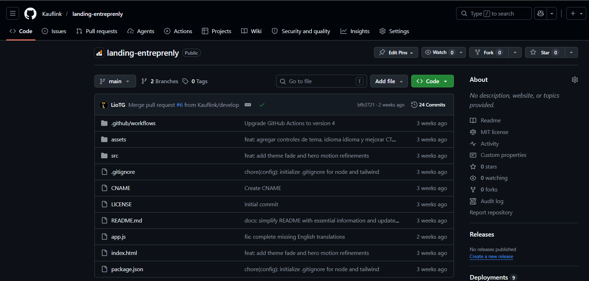

2. **Configuración del dominio personalizado:** Se añadió el archivo `CNAME` al repositorio con el dominio personalizado asignado al Landing Page.

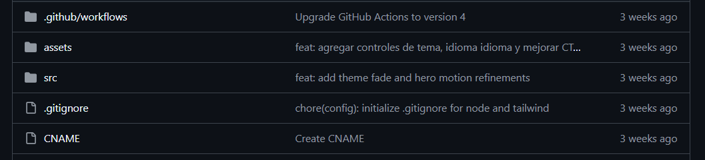

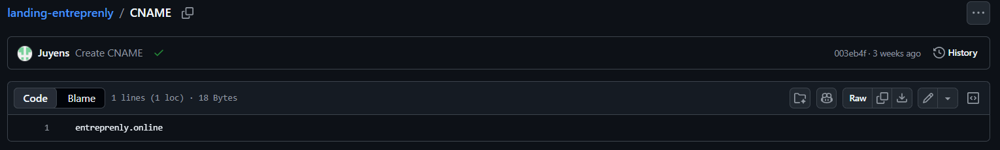

3. **Configuración del pipeline de CI/CD:** Se creó un workflow de GitHub Actions (`.github/workflows/`) que automatiza el proceso de build y despliegue. El workflow incluye los pasos de instalación de dependencias (`npm ci`), compilación de estilos con Tailwind CSS (`npm run build`) y despliegue automático a la rama `gh-pages` al fusionar cambios en `main`.

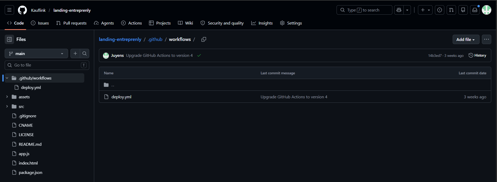

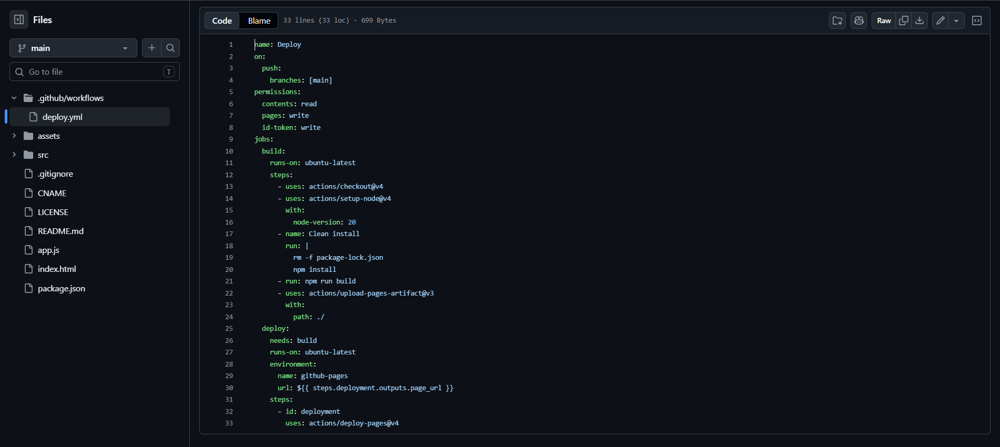

4. **Verificación del despliegue:** Se comprobó que el Landing Page quedó correctamente publicado y accesible desde la URL de GitHub Pages con el dominio configurado.


---

#### 5.2.1.8. Team Collaboration Insights during Sprint

Durante el Sprint 1, todos los miembros del equipo participaron activamente en la implementación del Landing Page, evidenciado a través de los commits registrados en el repositorio `ap-entreprenly-landing`. El trabajo se distribuyó de manera colaborativa: Joseph Julius lideró la configuración del repositorio y el pipeline de despliegue; Lionel Abraham se encargó del desarrollo de funcionalidades interactivas y animaciones; Elynor Mikela, José Antonio y José Fernando contribuyeron con correcciones de contenido y en la estructura base de la página.

El equipo aplicó GitFlow como estrategia de control de versiones, trabajando en la rama `develop` y realizando la integración a `main` mediante Pull Requests revisados y aprobados por otros miembros. Se realizaron un total de 5 Pull Requests durante el Sprint.

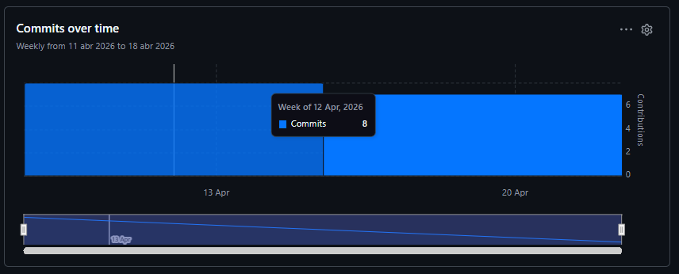

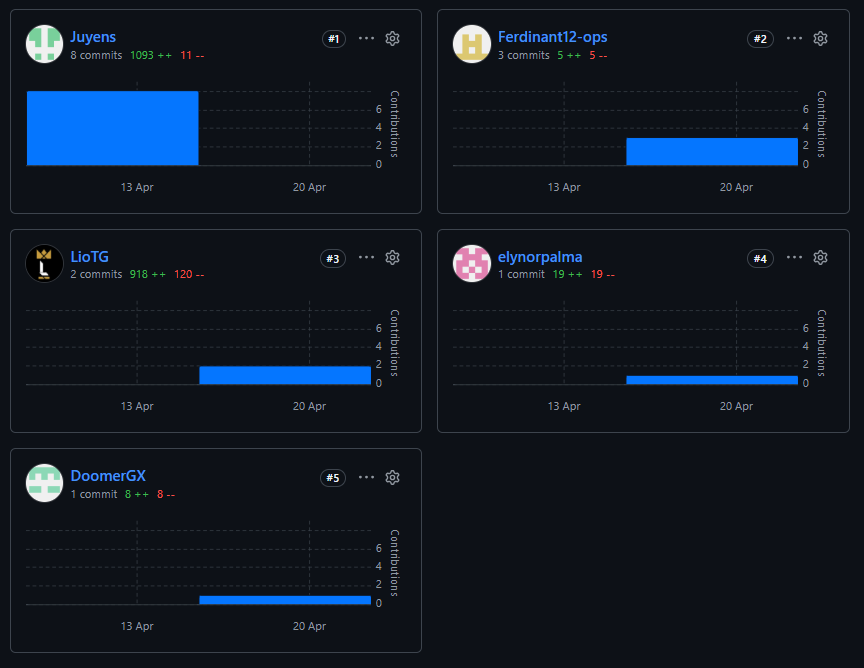


**URL del repositorio del Landing Page:** https://github.com/Kauflink/ap-entreprenly-landing

### 5.2.2. Sprint 2

#### 5.2.2.1. Sprint Planning 2

Para este segundo Sprint, el equipo estableció como objetivo principal la implementación de la Frontend Web Application de Entreprenly en Vue, cubriendo todos los Bounded Contexts planificados: Auth, Profile, Subscription, Inventory, Sales y Chatbot. La reunión de planificación se llevó a cabo de manera virtual, donde se definieron las User Stories a abordar, el Sprint Goal y la distribución de responsabilidades por Bounded Context.

<table border="1" cellpadding="8" cellspacing="0" style="border-collapse: collapse; width: 100%;">
  <tbody>
    <tr>
      <td colspan="2"><strong>Sprint 2</strong></td>
    </tr>
    <tr>
      <td colspan="2"><strong>Sprint Planning Background</strong></td>
    </tr>
    <tr>
      <td><strong>Date</strong></td>
      <td>2026-04-21</td>
    </tr>
    <tr>
      <td><strong>Time</strong></td>
      <td>09:00 AM</td>
    </tr>
    <tr>
      <td><strong>Location</strong></td>
      <td>Reunión virtual vía Discord</td>
    </tr>
    <tr>
      <td><strong>Prepared By</strong></td>
      <td>Camargo Briceño, Joseph Julius</td>
    </tr>
    <tr>
      <td><strong>Attendees (to planning meeting)</strong></td>
      <td>Camargo Briceño, Joseph Julius / Chavez Carrasco, Lionel Abraham / Palma De Los Santos, Elynor Mikela / Peirano Brun, José Antonio / Flores Pinchi, José Fernando</td>
    </tr>
    <tr>
      <td><strong>Sprint 1 Review Summary</strong></td>
      <td>En el Sprint 1 se implementó y desplegó exitosamente la primera versión del Landing Page de Entreprenly. La página se encuentra disponible en <a href="https://landing.entreprenly.online">landing.entreprenly.online</a> con dominio personalizado y despliegue continuo mediante GitHub Actions. Se cubrieron todas las secciones planificadas: Hero, Funcionalidades, Planes, FAQ y Footer, con soporte de tema claro/oscuro e idioma Español/Inglés.</td>
    </tr>
    <tr>
      <td><strong>Sprint 1 Retrospective Summary</strong></td>
      <td>El equipo identificó que la coordinación entre ramas mejoró con GitFlow. Para el Sprint 2 se acordó asignar un Bounded Context por miembro del equipo para evitar conflictos de merge, mantener la rama <code>develop</code> como punto de integración central y aumentar la frecuencia de Pull Requests para revisión cruzada.</td>
    </tr>
    <tr>
      <td colspan="2"><strong>Sprint Goal &amp; User Stories</strong></td>
    </tr>
    <tr>
      <td><strong>Sprint 2 Goal</strong></td>
      <td>Nuestro enfoque está en desarrollar el Frontend Web Application completo de Entreprenly en Vue, cubriendo todos los Bounded Contexts principales: Sales (Punto de Venta), Chatbot (Pedidos WhatsApp), Subscription, Inventory y Profile. Creemos que entrega una aplicación web funcional y desplegable con la que los comerciantes peruanos pueden gestionar sus operaciones de venta y sus pedidos de WhatsApp. Esto se confirmará cuando la aplicación Vue esté desplegada exitosamente en Firebase Hosting y todos los flujos clave —registro de ventas en caja, gestión de pedidos por chatbot y configuración del perfil de usuario— sean funcionales y navegables.</td>
    </tr>
    <tr>
      <td><strong>Sprint 2 Velocity</strong></td>
      <td>34</td>
    </tr>
    <tr>
      <td><strong>Sum of Story Points</strong></td>
      <td>34</td>
    </tr>
  </tbody>
</table>

---

#### 5.2.2.2. Aspect Leaders and Collaborators

En el Sprint 2, el equipo organizó el trabajo asignando un Bounded Context principal por miembro para maximizar la autonomía y reducir conflictos de merge. Los aspectos cubiertos fueron: la infraestructura base y el DashboardLayout compartido, el BC de Sales (Punto de Venta), el BC de Chatbot (Pedidos WhatsApp), los BCs de Subscription e Inventory, y el BC de Profile junto con la internacionalización (i18n) y el sistema de temas. A continuación se presenta la matriz de liderazgo y colaboración (LACX):

<table border="1" cellpadding="8" cellspacing="0" style="border-collapse: collapse; width: 100%;">
  <thead>
    <tr>
      <th>Team Member (Last Name, First Name)</th>
      <th>GitHub Username</th>
      <th>Infraestructura Base y DashboardLayout<br>Leader (L) / Collaborator (C)</th>
      <th>Sales BC — Punto de Venta<br>Leader (L) / Collaborator (C)</th>
      <th>Chatbot BC — Pedidos WhatsApp<br>Leader (L) / Collaborator (C)</th>
      <th>Subscription & Inventory BC<br>Leader (L) / Collaborator (C)</th>
      <th>Profile BC, i18n y Tema<br>Leader (L) / Collaborator (C)</th>
    </tr>
  </thead>
  <tbody>
    <tr>
      <td>Camargo Briceño, Joseph Julius</td>
      <td>Juyens</td>
      <td>L</td>
      <td>C</td>
      <td>C</td>
      <td>C</td>
      <td>L</td>
    </tr>
    <tr>
      <td>Chavez Carrasco, Lionel Abraham</td>
      <td>LioTG</td>
      <td>C</td>
      <td>C</td>
      <td>C</td>
      <td>L</td>
      <td>C</td>
    </tr>
    <tr>
      <td>Palma De Los Santos, Elynor Mikela</td>
      <td>elynorpalma</td>
      <td>C</td>
      <td>C</td>
      <td>L</td>
      <td>C</td>
      <td>C</td>
    </tr>
    <tr>
      <td>Peirano Brun, José Antonio</td>
      <td>DoomerGX</td>
      <td>C</td>
      <td>C</td>
      <td>C</td>
      <td>L</td>
      <td>C</td>
    </tr>
    <tr>
      <td>Flores Pinchi, José Fernando</td>
      <td>Ferdinant12-ops</td>
      <td>C</td>
      <td>L</td>
      <td>C</td>
      <td>C</td>
      <td>C</td>
    </tr>
  </tbody>
</table>

---

#### 5.2.2.3. Sprint Backlog 2

El objetivo principal de este Sprint fue implementar la Frontend Web Application de Entreprenly en Vue, cubriendo los Bounded Contexts de Auth, Profile, Subscription, Inventory, Sales y Chatbot, junto con las vistas compartidas de Home y Help. A continuación se presenta el tablero del Sprint y el detalle de los Work-items asociados.


<table border="1" cellpadding="8" cellspacing="0" style="border-collapse: collapse; width: 100%;">
  <thead>
    <tr>
      <th colspan="8">Sprint # Sprint 2</th>
    </tr>
    <tr>
      <th colspan="2">User Story</th>
      <th colspan="6">Work-Item / Task</th>
    </tr>
    <tr>
      <th>Id</th>
      <th>Title</th>
      <th>Id</th>
      <th>Title</th>
      <th>Description</th>
      <th>Estimation (Hours)</th>
      <th>Assigned To</th>
      <th>Status</th>
    </tr>
  </thead>
  <tbody>
    <tr>
      <td>US-01</td>
      <td>Iniciar sesión en la aplicación</td>
      <td>T-01</td>
      <td>Configurar proyecto Vue y estructura base</td>
      <td>Inicializar el proyecto Vue con la arquitectura DDD por Bounded Context, configurar rutas lazy-loading, el shell del DashboardLayout con sidebar naranja y <code>router-view</code>, y conectar las rutas principales.</td>
      <td>4</td>
      <td>Camargo Briceño, Joseph Julius</td>
      <td>Done</td>
    </tr>
    <tr>
      <td>US-01</td>
      <td>Iniciar sesión en la aplicación</td>
      <td>T-02</td>
      <td>Implementar DashboardLayout responsive con sidebar</td>
      <td>Desarrollar el componente <code>DashboardLayoutComponent</code> con sidebar naranja, logotipo, íconos de navegación por BC y botón de logout, con layout responsive para distintas resoluciones de pantalla.</td>
      <td>4</td>
      <td>Camargo Briceño, Joseph Julius</td>
      <td>Done</td>
    </tr>
    <tr>
      <td>US-06</td>
      <td>Configurar perfil de usuario</td>
      <td>T-03</td>
      <td>Implementar Profile BC con 8 tarjetas de configuración</td>
      <td>Desarrollar el Bounded Context de perfil con sus 8 tarjetas de configuración (información personal, seguridad, preferencias, notificaciones, entre otras), siguiendo la arquitectura DDD de 4 capas.</td>
      <td>5</td>
      <td>Camargo Briceño, Joseph Julius</td>
      <td>Done</td>
    </tr>
    <tr>
      <td>US-07</td>
      <td>Personalizar preferencias de idioma y tema</td>
      <td>T-04</td>
      <td>Implementar i18n bilingüe, selector de moneda y persistencia de tema</td>
      <td>Integrar el sistema de internacionalización ES/EN en todos los BCs, agregar el selector de moneda (PEN/USD) en el BC de Profile, y persistir las preferencias de idioma y tema claro/oscuro en <code>localStorage</code> para evitar el flash al recargar.</td>
      <td>4</td>
      <td>Camargo Briceño, Joseph Julius</td>
      <td>Done</td>
    </tr>
    <tr>
      <td>US-24</td>
      <td>Buscar producto en el punto de venta</td>
      <td>T-05</td>
      <td>Implementar Sales BC base y buscador con autocompletado</td>
      <td>Crear la estructura DDD del Sales BC (domain, application, infrastructure, presentation), configurar el <code>db.json</code> con productos peruanos, e implementar el buscador de productos con autocompletado y validación "Producto no encontrado".</td>
      <td>4</td>
      <td>Flores Pinchi, José Fernando</td>
      <td>Done</td>
    </tr>
    <tr>
      <td>US-25</td>
      <td>Registrar cantidad de producto por unidad</td>
      <td>T-06</td>
      <td>Implementar modal "Registrar Cantidad" con teclado numérico</td>
      <td>Desarrollar el modal de registro de cantidad con teclado numérico y validación de stock disponible para productos vendidos por unidad.</td>
      <td>4</td>
      <td>Flores Pinchi, José Fernando</td>
      <td>Done</td>
    </tr>
    <tr>
      <td>US-26</td>
      <td>Registrar peso de producto con balanza IoT</td>
      <td>T-07</td>
      <td>Implementar modal "Registrar Peso" con modo IoT y manual</td>
      <td>Desarrollar el modal de peso con dos modos: automático (lee peso de <code>db.json</code> y auto-confirma) cuando la balanza está conectada, y manual con teclado decimal cuando <code>connected: false</code>.</td>
      <td>4</td>
      <td>Flores Pinchi, José Fernando</td>
      <td>Done</td>
    </tr>
    <tr>
      <td>US-27</td>
      <td>Eliminar producto del ticket de venta</td>
      <td>T-08</td>
      <td>Implementar eliminación de ítems y resumen lateral del ticket</td>
      <td>Agregar el ícono de basurero por ítem del ticket para eliminación individual, y el panel de resumen lateral con subtotal, cantidad de ítems y total en tiempo real usando el sistema de reactividad de Vue (ref y computed).</td>
      <td>4</td>
      <td>Flores Pinchi, José Fernando</td>
      <td>Done</td>
    </tr>
    <tr>
      <td>US-28</td>
      <td>Seleccionar método de pago</td>
      <td>T-09</td>
      <td>Implementar selección de método de pago y validaciones</td>
      <td>Desarrollar la selección de método de pago (Efectivo / Tarjeta-Yape-Plin agrupados como digital) con validación "Por favor seleccione un método de pago" que se auto-oculta a los 3 segundos.</td>
      <td>4</td>
      <td>Flores Pinchi, José Fernando</td>
      <td>Done</td>
    </tr>
    <tr>
      <td>US-29</td>
      <td>Finalizar venta y confirmar pago</td>
      <td>T-10</td>
      <td>Implementar finalización de venta y modal "Venta Exitosa"</td>
      <td>Desarrollar el flujo de finalización de venta con validaciones ("No hay productos en el ticket"), modal "Venta Exitosa" con auto-cierre a los 2 segundos, y reset del ticket al completar la venta. Incluir el decremento de stock en el Inventory BC tras cada venta.</td>
      <td>5</td>
      <td>Flores Pinchi, José Fernando</td>
      <td>Done</td>
    </tr>
    <tr>
      <td>US-30</td>
      <td>Ver resumen del cierre de caja</td>
      <td>T-11</td>
      <td>Implementar Resumen de Caja con persistencia en db.json</td>
      <td>Desarrollar el panel de Resumen de Caja con totales por día (Total Día, Efectivo, Digital), persitirlos en <code>cash-registers</code> del <code>db.json</code> mediante PUT al finalizar cada venta, y recargarlos al volver a la vista de ventas.</td>
      <td>4</td>
      <td>Flores Pinchi, José Fernando</td>
      <td>Done</td>
    </tr>
    <tr>
      <td>US-32</td>
      <td>Conectar cuenta de WhatsApp al chatbot</td>
      <td>T-12</td>
      <td>Implementar Chatbot BC base y flujo de conexión QR</td>
      <td>Crear la estructura DDD del Chatbot BC e implementar la vista de conexión WhatsApp con generación de QR scannable, countdown de expiración y reinicio automático del código QR.</td>
      <td>4</td>
      <td>Palma De Los Santos, Elynor Mikela</td>
      <td>Done</td>
    </tr>
    <tr>
      <td>US-33</td>
      <td>Ver conversaciones de WhatsApp entrantes</td>
      <td>T-13</td>
      <td>Implementar vista de conversaciones con session guard</td>
      <td>Desarrollar la lista de conversaciones activas del chatbot con guard que bloquea el acceso si WhatsApp no está conectado, burbuja de escritura del cliente y efecto typewriter del bot en la barra de mensajes.</td>
      <td>4</td>
      <td>Palma De Los Santos, Elynor Mikela</td>
      <td>Done</td>
    </tr>
    <tr>
      <td>US-34</td>
      <td>Gestionar pedidos recibidos por WhatsApp</td>
      <td>T-14</td>
      <td>Implementar vista de órdenes y validación de pago del chatbot</td>
      <td>Desarrollar la vista de órdenes del chatbot con carga de productos reales del Inventory BC, validación de pago y chips de rechazo traducidos. Implementar soporte i18n bilingüe completo (ES/EN) en todos los componentes del Chatbot BC.</td>
      <td>5</td>
      <td>Palma De Los Santos, Elynor Mikela</td>
      <td>Done</td>
    </tr>
    <tr>
      <td>US-11</td>
      <td>Ver planes de suscripción disponibles</td>
      <td>T-15</td>
      <td>Implementar Subscription BC con vista de planes</td>
      <td>Desarrollar el Bounded Context de Subscription con la vista de planes disponibles (Plan Free y Plan Control), precios sincronizados con el selector de moneda del Profile BC, y traducciones bilingües completas.</td>
      <td>4</td>
      <td>Chavez Carrasco, Lionel Abraham</td>
      <td>Done</td>
    </tr>
    <tr>
      <td>US-16</td>
      <td>Ver inventario de productos y lotes</td>
      <td>T-16</td>
      <td>Implementar Inventory BC e integración con Sales y Home</td>
      <td>Desarrollar el Bounded Context de Inventory con la vista de productos y lotes, e integrar sus datos reales con el BC de Sales (para el buscador y el decremento de stock) y con la vista de Home (alertas de lotes próximos a vencer).</td>
      <td>4</td>
      <td>Chavez Carrasco, Lionel Abraham / Peirano Brun, José Antonio</td>
      <td>Done</td>
    </tr>
    <tr>
      <td>US-41</td>
      <td>Ver panel principal del dashboard</td>
      <td>T-17</td>
      <td>Implementar vistas de Home y Help del dashboard</td>
      <td>Desarrollar la vista de Home con el panel de resumen del negocio (alertas de lotes, accesos rápidos, locale reactivo al idioma) y la vista de Help con el centro de ayuda, artículos bilingües y conteo real por categoría.</td>
      <td>4</td>
      <td>Palma De Los Santos, Elynor Mikela</td>
      <td>Done</td>
    </tr>
    <tr>
      <td>US-01</td>
      <td>Iniciar sesión en la aplicación</td>
      <td>T-18</td>
      <td>Configurar despliegue en Firebase Hosting</td>
      <td>Configurar Firebase Hosting para el Frontend Web Application, crear el workflow de GitHub Actions para despliegue continuo al integrar cambios en <code>main</code>, y validar el despliegue en <code>https://ap.entreprenly.online</code>.</td>
      <td>4</td>
      <td>Camargo Briceño, Joseph Julius</td>
      <td>Done</td>
    </tr>
  </tbody>
</table>

---

#### 5.2.2.4. Development Evidence for Sprint Review

Durante el Sprint 2, el equipo trabajó exclusivamente sobre el repositorio del Frontend Web Application (`ap-entreprenly-frontend`). El repositorio se inicializó el 25 de abril de 2026 y el grueso de la implementación se realizó entre el 14 y el 16 de mayo de 2026, sumando más de 70 commits que cubren desde la configuración inicial del proyecto Vue 3 hasta la integración de todos los Bounded Contexts sobre una API simulada con JSON-Server. A continuación se presenta el registro de los commits más representativos:

<table border="1" cellpadding="8" cellspacing="0" style="border-collapse: collapse; width: 100%;">
  <thead>
    <tr>
      <th>Repository</th>
      <th>Branch</th>
      <th>Commit Id</th>
      <th>Commit Message</th>
      <th>Commit Message Body</th>
      <th>Committed on (Date)</th>
    </tr>
  </thead>
  <tbody>
    <tr><td>Kauflink/ap-entreprenly-frontend</td><td>main</td><td>4bb3de2</td><td>Initial commit</td><td>Creación inicial del repositorio del Frontend Web Application.</td><td>2026-04-25</td></tr>
    <tr><td>Kauflink/ap-entreprenly-frontend</td><td>main</td><td>e8abfa9</td><td>chore: set up initial Vue 3 project with Vite and Pinia</td><td>Se configura el proyecto base de Vue 3 con Vite como herramienta de build y Pinia para la gestión de estado.</td><td>2026-05-14</td></tr>
    <tr><td>Kauflink/ap-entreprenly-frontend</td><td>develop</td><td>887fb9c</td><td>fix: correct db.json structure</td><td>Se corrige la estructura del <code>db.json</code> utilizado como API simulada con JSON-Server.</td><td>2026-05-14</td></tr>
    <tr><td>Kauflink/ap-entreprenly-frontend</td><td>develop</td><td>f8b72c5</td><td>refactor: reorganize project structure - move shared to root src/</td><td>Se reorganiza la estructura del proyecto, moviendo el código compartido (<code>shared</code>) a la raíz de <code>src/</code>.</td><td>2026-05-14</td></tr>
    <tr><td>Kauflink/ap-entreprenly-frontend</td><td>feature/chatbot</td><td>07134af</td><td>feat: implementar modulo chatbot-bc</td><td>Se implementa la estructura base del Bounded Context de Chatbot.</td><td>2026-05-14</td></tr>
    <tr><td>Kauflink/ap-entreprenly-frontend</td><td>feature/sales</td><td>3393fcc</td><td>feat(sales): implementar módulo de ventas con arquitectura DDD</td><td>Se implementa el Bounded Context de Sales (ventas presenciales) siguiendo la arquitectura DDD.</td><td>2026-05-14</td></tr>
    <tr><td>Kauflink/ap-entreprenly-frontend</td><td>main</td><td>2b51099</td><td>Merge pull request #3 from Kauflink/feature/sales</td><td>Integración del Bounded Context de Sales a la rama principal.</td><td>2026-05-14</td></tr>
    <tr><td>Kauflink/ap-entreprenly-frontend</td><td>feature/subscription</td><td>31ac9a6</td><td>feat: add subscription module, i18n and routes</td><td>Se agrega el Bounded Context de Subscription con sus traducciones (i18n) y rutas.</td><td>2026-05-15</td></tr>
    <tr><td>Kauflink/ap-entreprenly-frontend</td><td>feature/chatbot</td><td>615eecd</td><td>feat(chatbot): add chatbot module with QR session, conversations and payment approval</td><td>Se completa el Chatbot BC con sesión por QR, conversaciones y aprobación de pago.</td><td>2026-05-15</td></tr>
    <tr><td>Kauflink/ap-entreprenly-frontend</td><td>develop</td><td>ec046c7</td><td>feat: add help, orders and home views with i18n keys</td><td>Se agregan las vistas de Home, Help y Orders con sus claves de internacionalización.</td><td>2026-05-15</td></tr>
    <tr><td>Kauflink/ap-entreprenly-frontend</td><td>feature/chatbot</td><td>0a943eb</td><td>feat(chatbot): add plin and yape receipt components</td><td>Se agregan los componentes de comprobante de Yape y Plin al Chatbot BC.</td><td>2026-05-15</td></tr>
    <tr><td>Kauflink/ap-entreprenly-frontend</td><td>feature/chatbot</td><td>be34115</td><td>feat(i18n): add English translations for chatbot module</td><td>Se agregan las traducciones al inglés del módulo de Chatbot.</td><td>2026-05-15</td></tr>
    <tr><td>Kauflink/ap-entreprenly-frontend</td><td>feature/inventory</td><td>994a1ef</td><td>feat(inventory): Agregacion de inventory BC</td><td>Se implementa el Bounded Context de Inventory (productos unitarios y por peso, lotes).</td><td>2026-05-15</td></tr>
    <tr><td>Kauflink/ap-entreprenly-frontend</td><td>develop</td><td>22807bc</td><td>fix: unify endpoint configuration via environment variables</td><td>Se unifica la configuración de endpoints mediante variables de entorno de Vite (<code>VITE_*</code>).</td><td>2026-05-15</td></tr>
    <tr><td>Kauflink/ap-entreprenly-frontend</td><td>feature/profile-configuration</td><td>418ac0b</td><td>feat(profile): add profile bounded context</td><td>Se implementa el Bounded Context de Profile (perfil y configuración del comerciante).</td><td>2026-05-15</td></tr>
    <tr><td>Kauflink/ap-entreprenly-frontend</td><td>feature/profile-configuration</td><td>5880670</td><td>feat(profile): connect profile context to app shell</td><td>Se conecta el Bounded Context de Profile al shell de la aplicación.</td><td>2026-05-15</td></tr>
    <tr><td>Kauflink/ap-entreprenly-frontend</td><td>develop</td><td>9f0d39f</td><td>fix(router): translate page titles via i18n keys</td><td>Se traducen dinámicamente los títulos de página mediante claves i18n.</td><td>2026-05-15</td></tr>
    <tr><td>Kauflink/ap-entreprenly-frontend</td><td>main</td><td>d87e5d0</td><td>fix: responsive zoom layout and chatbot button wrap</td><td>Se corrige el layout responsive ante zoom y el ajuste del botón del Chatbot.</td><td>2026-05-15</td></tr>
    <tr><td>Kauflink/ap-entreprenly-frontend</td><td>feature/inventory</td><td>40cfca5</td><td>feat(inventory): close gaps in inventory bounded context</td><td>Se cierran brechas funcionales pendientes del Inventory BC.</td><td>2026-05-16</td></tr>
    <tr><td>Kauflink/ap-entreprenly-frontend</td><td>develop</td><td>db3be9d</td><td>feat: add login/register flows, assets and UI updates</td><td>Se agregan los flujos de inicio de sesión y registro (UI), recursos y mejoras visuales.</td><td>2026-05-16</td></tr>
    <tr><td>Kauflink/ap-entreprenly-frontend</td><td>develop</td><td>317da6d</td><td>feat: env</td><td>Se agrega la configuración de variables de entorno del proyecto.</td><td>2026-05-16</td></tr>
  </tbody>
</table>

---

#### 5.2.2.5. Execution Evidence for Sprint Review

Al término del Sprint 2, el equipo implementó y desplegó el Frontend Web Application de Entreprenly en Vue. La aplicación se encuentra disponible públicamente en Firebase Hosting en la URL `https://ap.entreprenly.online`. Los Bounded Contexts implementados y sus funcionalidades clave son los siguientes:

- **DashboardLayout:** Sidebar naranja responsive con logo de Entreprenly, íconos de navegación por BC y botón de logout. Funciona como shell de la aplicación con rutas lazy-loading anidadas.

- **Sales BC — Punto de Venta:** Buscador de productos con autocompletado, modales de registro por cantidad (teclado numérico) y por peso (modo balanza IoT automático / modo manual), eliminación de ítems del ticket, selección de método de pago (Efectivo / Tarjeta-Yape-Plin), finalización de venta con modal "Venta Exitosa", y Resumen de Caja con persistencia en `db.json`.

- **Chatbot BC — Pedidos WhatsApp:** Vista de conexión de cuenta WhatsApp mediante QR escaneable con countdown de expiración, guard de sesión, lista de conversaciones activas con burbuja de escritura del cliente, gestión de órdenes con productos reales del inventario, y validación de pago con chips de rechazo.

- **Subscription BC:** Vista de planes disponibles (Plan Free y Plan Control) con precios sincronizados al selector de moneda del usuario.

- **Inventory BC:** Vista de productos y lotes con datos reales consumidos por el Sales BC (decremento de stock) y por el Home BC (alertas de lotes próximos a vencer).

- **Profile BC:** 8 tarjetas de configuración incluyendo selector de moneda (PEN/USD) y preferencias de idioma/tema que persisten en `localStorage`.

- **Home y Help:** Panel resumen del negocio con alertas reactivas al idioma activo, y centro de ayuda con artículos bilingües agrupados por categoría con conteos reales.

- **i18n:** Soporte bilingüe ES/EN en todos los BCs con traducción dinámica del título de la pestaña del navegador.

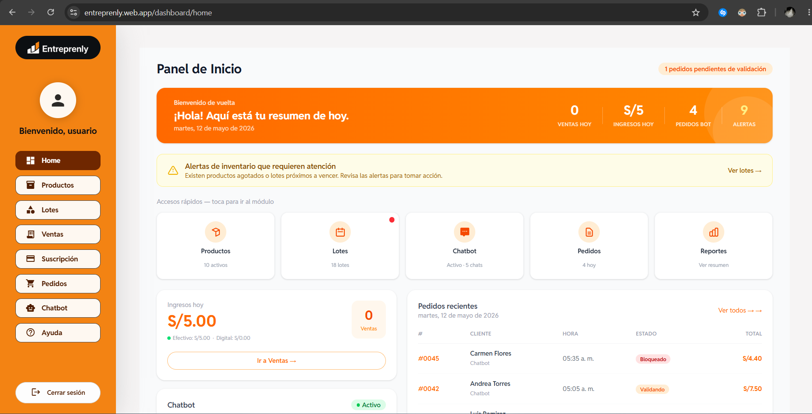


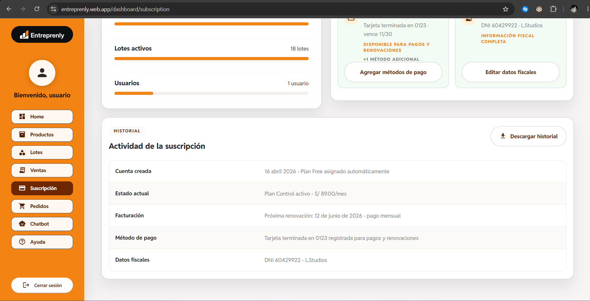

---

#### 5.2.2.6. Services Documentation Evidence for Sprint Review

Durante el Sprint 2, el Backend (RESTful Web Services con ASP.NET Core) aún no ha sido implementado. Por ello, la Frontend Web Application consume una API simulada mediante **JSON-Server**, que sirve el archivo `server/db.json` como una REST API completa. Esta API está disponible localmente en `http://localhost:3000/api/v1` y, adicionalmente, se desplegó una instancia remota en `http://db.entreprenly.online/api/v1` para que los datos también sean accesibles desde la aplicación publicada en Firebase. A continuación se documentan los endpoints utilizados durante este Sprint:

<table border="1" cellpadding="8" cellspacing="0" style="border-collapse: collapse; width: 100%;">
  <thead>
    <tr>
      <th>Endpoint</th>
      <th>Verbo HTTP</th>
      <th>Descripción</th>
      <th>Parámetros</th>
      <th>Response ejemplo</th>
    </tr>
  </thead>
  <tbody>

  <!-- Inventario: productos unitarios -->
  <tr>
    <td><code>/api/v1/inventory-unit-products</code></td>
    <td>GET</td>
    <td>Retorna la lista completa de productos vendidos por unidad.</td>
    <td>Ninguno</td>
    <td><code>[{ "id": 1, "name": "Coca Cola 500ml", "price": 2.50, "productType": "unit", "codeQR": "7501055363483", "weightGrams": 500, "brand": "Coca-Cola" }]</code></td>
  </tr>
  <tr>
    <td><code>/api/v1/inventory-unit-products/:id</code></td>
    <td>GET</td>
    <td>Retorna un producto unitario específico por su ID.</td>
    <td><code>id</code>: identificador numérico del producto (path param)</td>
    <td><code>{ "id": 1, "name": "Coca Cola 500ml", "price": 2.50, "productType": "unit", "codeQR": "7501055363483", "weightGrams": 500, "brand": "Coca-Cola" }</code></td>
  </tr>
  <tr>
    <td><code>/api/v1/inventory-unit-products/:id</code></td>
    <td>PATCH</td>
    <td>Actualiza parcialmente un producto unitario (precio, descripción, etc.).</td>
    <td><code>id</code>: path param. Body: campos a actualizar, ej. <code>{ "price": 3.00 }</code></td>
    <td><code>{ "id": 1, "name": "Coca Cola 500ml", "price": 3.00, "productType": "unit", ... }</code></td>
  </tr>

  <!-- Inventario: productos a granel -->
  <tr>
    <td><code>/api/v1/inventory-weight-products</code></td>
    <td>GET</td>
    <td>Retorna la lista completa de productos vendidos por kilogramo.</td>
    <td>Ninguno</td>
    <td><code>[{ "id": 1, "name": "White Rice", "pricePerKg": 1.80, "productType": "weight", "codeQR": "WP-RICE-001" }]</code></td>
  </tr>
  <tr>
    <td><code>/api/v1/inventory-weight-products/:id</code></td>
    <td>PATCH</td>
    <td>Actualiza parcialmente un producto a granel (precio por kg, descripción, etc.).</td>
    <td><code>id</code>: path param. Body: campos a actualizar, ej. <code>{ "pricePerKg": 2.00 }</code></td>
    <td><code>{ "id": 1, "name": "White Rice", "pricePerKg": 2.00, "productType": "weight", ... }</code></td>
  </tr>

  <!-- Inventario: lotes unitarios -->
  <tr>
    <td><code>/api/v1/inventory-unit-lots</code></td>
    <td>GET</td>
    <td>Retorna todos los lotes de productos unitarios con su cantidad y fecha de vencimiento.</td>
    <td>Ninguno</td>
    <td><code>[{ "id": 1, "productId": 1, "codeQR": "LOT-CC-001", "lotType": "unit", "quantity": 80, "expiryDate": "2026-03-15T00:00:00.000Z" }]</code></td>
  </tr>
  <tr>
    <td><code>/api/v1/inventory-unit-lots/:id</code></td>
    <td>PATCH</td>
    <td>Actualiza la cantidad de un lote unitario, usado para decrementar stock tras una venta.</td>
    <td><code>id</code>: path param. Body: <code>{ "quantity": &lt;nuevo valor&gt; }</code></td>
    <td><code>{ "id": 1, "productId": 1, "quantity": 77, "expiryDate": "2026-03-15T00:00:00.000Z" }</code></td>
  </tr>

  <!-- Inventario: lotes a granel -->
  <tr>
    <td><code>/api/v1/inventory-weight-lots</code></td>
    <td>GET</td>
    <td>Retorna todos los lotes de productos a granel con su cantidad en kg.</td>
    <td>Ninguno</td>
    <td><code>[{ "id": 1, "productId": 1, "codeQR": "WLOT-RICE-001", "lotType": "weight", "quantityKg": 120 }]</code></td>
  </tr>
  <tr>
    <td><code>/api/v1/inventory-weight-lots/:id</code></td>
    <td>PATCH</td>
    <td>Actualiza la cantidad en kg de un lote a granel tras una venta o ajuste de inventario.</td>
    <td><code>id</code>: path param. Body: <code>{ "quantityKg": &lt;nuevo valor&gt; }</code></td>
    <td><code>{ "id": 1, "productId": 1, "quantityKg": 118.5, "lotType": "weight" }</code></td>
  </tr>

  <!-- Alertas de stock -->
  <tr>
    <td><code>/api/v1/inventory-stock-alerts</code></td>
    <td>GET</td>
    <td>Retorna las alertas activas de inventario: productos vencidos, por vencer, con bajo stock o agotados.</td>
    <td>Ninguno</td>
    <td><code>[{ "id": 1, "lotId": 1, "productId": 1, "alertType": "expired", "severity": "critical", "message": "Coca Cola 500ml lot #1 expired on 15/3/2026.", "createdAt": "2026-03-16T08:00:00Z" }]</code></td>
  </tr>

  <!-- Ventas -->
  <tr>
    <td><code>/api/v1/sales</code></td>
    <td>GET</td>
    <td>Retorna el historial de ventas registradas en el Punto de Venta.</td>
    <td>Ninguno</td>
    <td><code>[{ "id": 1, "date": "2026-05-12", "total": 25.50, "paymentMethod": "cash", "items": [...] }]</code></td>
  </tr>
  <tr>
    <td><code>/api/v1/sales</code></td>
    <td>POST</td>
    <td>Registra una nueva venta al finalizar el ticket en el Punto de Venta.</td>
    <td>Body: <code>{ "date", "total", "paymentMethod", "items": [{ "productId", "quantity", "subtotal" }] }</code></td>
    <td><code>{ "id": 1, "date": "2026-05-12", "total": 5.00, "paymentMethod": "cash", "items": [...] }</code> — HTTP 201</td>
  </tr>
  <tr>
    <td><code>/api/v1/cash-registers</code></td>
    <td>GET</td>
    <td>Retorna los registros de caja por fecha, con totales de efectivo, digital y conteo de ventas.</td>
    <td>Ninguno</td>
    <td><code>[{ "id": 1, "date": "2026-05-12", "totalCash": 5, "totalDigital": 0, "saleCount": 1 }]</code></td>
  </tr>
  <tr>
    <td><code>/api/v1/cash-registers/:id</code></td>
    <td>PUT</td>
    <td>Actualiza el registro de caja del día con los nuevos totales acumulados tras cada venta.</td>
    <td><code>id</code>: path param. Body: <code>{ "date", "totalCash", "totalDigital", "saleCount" }</code></td>
    <td><code>{ "id": 2, "date": "2026-05-12", "totalCash": 10, "totalDigital": 0, "saleCount": 2 }</code></td>
  </tr>

  <!-- Balanza IoT -->
  <tr>
    <td><code>/api/v1/iot-scale</code></td>
    <td>GET</td>
    <td>Retorna el estado actual de la balanza IoT (conectada o desconectada) y su identificador de dispositivo.</td>
    <td>Ninguno</td>
    <td><code>{ "id": 1, "connected": false, "deviceId": "SCALE-001" }</code></td>
  </tr>
  <tr>
    <td><code>/api/v1/iot-scale/1</code></td>
    <td>PATCH</td>
    <td>Actualiza el estado de conexión de la balanza IoT.</td>
    <td>Body: <code>{ "connected": true }</code></td>
    <td><code>{ "id": 1, "connected": true, "deviceId": "SCALE-001" }</code></td>
  </tr>

  <!-- Chatbot WhatsApp -->
  <tr>
    <td><code>/api/v1/whatsapp-sessions</code></td>
    <td>GET</td>
    <td>Retorna las sesiones de WhatsApp vinculadas al vendedor.</td>
    <td>Ninguno</td>
    <td><code>[{ "id": 1, "sellerId": 1, "phone": "+51 999 888 777", "businessName": "Bodega El Huerto", "status": "connected", "connectedAt": "11/5/2026..." }]</code></td>
  </tr>
  <tr>
    <td><code>/api/v1/conversations</code></td>
    <td>GET</td>
    <td>Retorna las conversaciones de WhatsApp con su estado: ACTIVE, WAITING_PAYMENT, COMPLETED o CLOSED.</td>
    <td>Ninguno</td>
    <td><code>[{ "id": 1, "sellerId": 1, "clientPhone": "+51 987 654 321", "clientName": "Andrea Torres", "status": "WAITING_PAYMENT", "lastMessage": "Comprobante enviado" }]</code></td>
  </tr>
  <tr>
    <td><code>/api/v1/conversations/:id</code></td>
    <td>PATCH</td>
    <td>Actualiza el estado de una conversación (ej: marcar como COMPLETED tras aprobar el pago).</td>
    <td><code>id</code>: path param. Body: <code>{ "status": "COMPLETED" }</code></td>
    <td><code>{ "id": 1, "clientName": "Andrea Torres", "status": "COMPLETED", ... }</code></td>
  </tr>
  <tr>
    <td><code>/api/v1/chat-messages</code></td>
    <td>GET</td>
    <td>Retorna los mensajes de una conversación (remitente: bot, client o system).</td>
    <td>Query param: <code>?conversationId=1</code></td>
    <td><code>[{ "id": 1, "conversationId": 1, "sender": "bot", "type": "text", "content": "Hola Andrea...", "sentAt": "2026-04-15T10:00:00.000Z" }]</code></td>
  </tr>
  <tr>
    <td><code>/api/v1/chat-orders</code></td>
    <td>GET</td>
    <td>Retorna los pedidos generados por WhatsApp con sus items, dirección de entrega y estado de pago.</td>
    <td>Ninguno</td>
    <td><code>[{ "id": 1, "conversationId": 1, "orderNumber": "#0042", "total": 7.50, "status": "WAITING_PAYMENT", "paymentMethod": "YAPE", "deliveryAddress": "Av. Los Alamos 234, Miraflores" }]</code></td>
  </tr>
  <tr>
    <td><code>/api/v1/chat-orders/:id</code></td>
    <td>PATCH</td>
    <td>Actualiza el estado de un pedido de WhatsApp (ej: CONFIRMED, BLOCKED, CANCELLED).</td>
    <td><code>id</code>: path param. Body: <code>{ "status": "CONFIRMED" }</code></td>
    <td><code>{ "id": 3, "orderNumber": "#0044", "status": "CONFIRMED", "total": 7.60, ... }</code></td>
  </tr>

  <!-- Perfil y suscripción -->
  <tr>
    <td><code>/api/v1/profile</code></td>
    <td>GET</td>
    <td>Retorna los datos del usuario, preferencias (idioma, tema, moneda) y configuración de notificaciones.</td>
    <td>Ninguno</td>
    <td><code>{ "user": { "id": 1, "role": "Administrador", "plan": "Plan Control" }, "preferences": { "language": "en", "theme": "light" }, "notification_settings": { "stock_alerts": true } }</code></td>
  </tr>
  <tr>
    <td><code>/api/v1/subscription-dashboard</code></td>
    <td>GET</td>
    <td>Retorna el plan actual, plan recomendado, límites de uso y configuración de facturación y métodos de pago.</td>
    <td>Ninguno</td>
    <td><code>[{ "id": 1, "currentPlan": { "name": "Plan Control", "status": "active", "monthlyPrice": 89 }, "limits": [...], "billingSetup": { "hasPaymentMethod": true, ... } }]</code></td>
  </tr>
  </tbody>
</table>


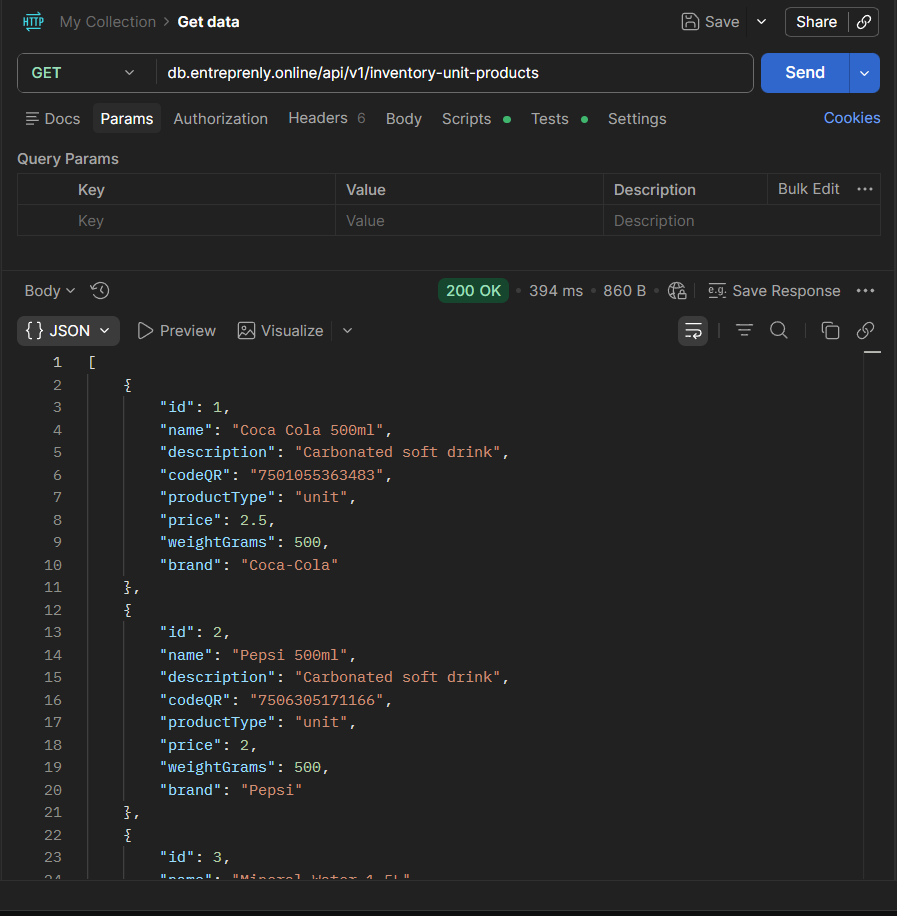

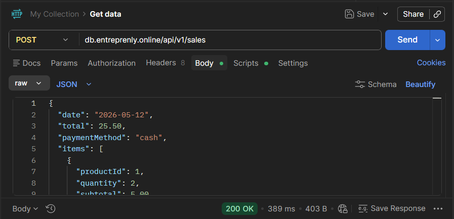

**URL del repositorio del Frontend Web Application:** https://github.com/Kauflink/ap-entreprenly-frontend

La documentación formal de los endpoints con OpenAPI/Swagger se incorporará a partir del Sprint 3, cuando se implemente el Backend con ASP.NET Core, conforme a lo planificado en el Product Backlog.

---

#### 5.2.2.7. Software Deployment Evidence for Sprint Review

Durante el Sprint 2, el equipo configuró y ejecutó el proceso de despliegue del Frontend Web Application mediante Firebase Hosting y un pipeline de integración continua con GitHub Actions. A continuación se describe el proceso realizado:

1. **Creación del repositorio del Frontend:** Se creó el repositorio público `ap-entreprenly-frontend` bajo la organización `Kauflink` en GitHub, aplicando GitFlow con ramas `main`, `develop` y ramas `feature/` por Bounded Context.

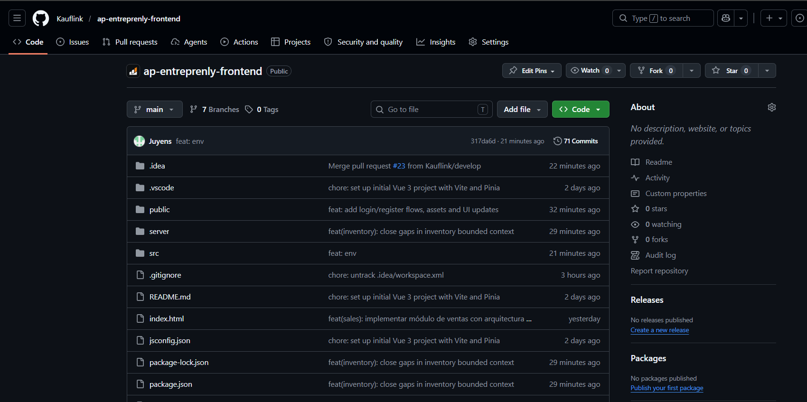

2. **Configuración de Firebase Hosting:** Se creó un proyecto en Firebase Console, se inicializó Firebase Hosting en el repositorio del frontend con `firebase init hosting`, configurando `dist` como directorio público y habilitando la reescritura de rutas al `index.html` para el SPA routing de Vue Router.


3. **Verificación del despliegue:** Se validó que la aplicación Vue se encuentra correctamente desplegada y accesible en `https://ap.entreprenly.online`, con navegación entre BCs funcional sin errores 404 al refrescar el navegador.

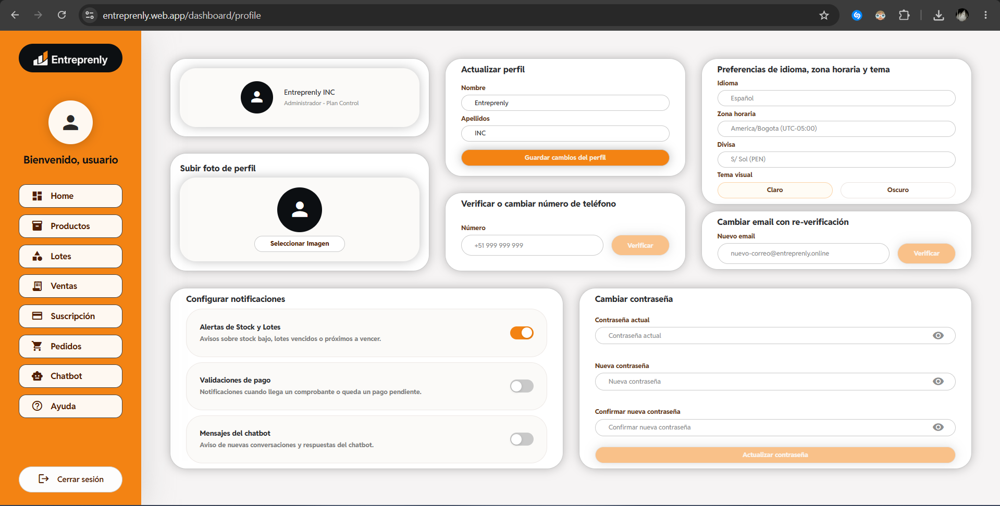

---

#### 5.2.2.8. Team Collaboration Insights during Sprint

Durante el Sprint 2, los cinco miembros del equipo participaron activamente en la implementación del Frontend Web Application, evidenciado a través de los commits y Pull Requests registrados en el repositorio `ap-entreprenly-frontend`. El trabajo se distribuyó por Bounded Context: Joseph Julius lideró la infraestructura base, el DashboardLayout, el Profile BC y la configuración del i18n y el sistema de temas; Elynor Mikela lideró el Chatbot BC y las vistas de Home y Help; José Fernando lideró el Sales BC; Lionel Abraham lideró el Subscription BC con soporte en el Inventory BzC; y José Antonio contribuyó con las traducciones del Subscription BC.

El equipo aplicó GitFlow como estrategia de control de versiones, trabajando en ramas `feature/` por Bounded Context (e.g., `feature/sales`, `feature/chatbot`, `feature/profile-configuration`, `feature/subscription`, `feature/inventory`) y realizando la integración a `develop` y `main` mediante Pull Requests. Se realizaron un total de **53 Pull Requests** durante el Sprint. La distribución de commits por miembro del equipo fue la siguiente: Camargo Briceño (87 commits), Palma De Los Santos (58 commits), Flores Pinchi (51 commits), Chavez Carrasco (49 commits) y Peirano Brun (5 commits).


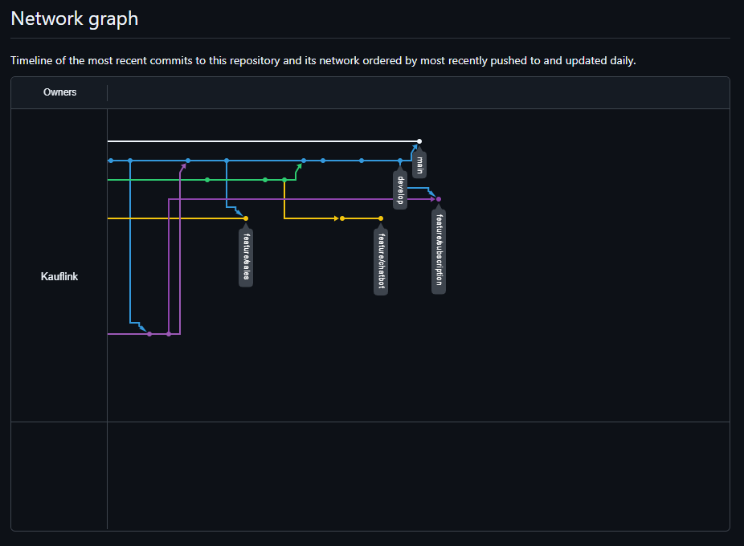

**URL del repositorio del Frontend Web Application:** https://github.com/Kauflink/ap-entreprenly-frontend

---

### 5.2.3. Sprint 3

#### 5.2.3.1. Sprint Planning 3

Para el tercer Sprint, el equipo estableció como objetivo principal la implementación y despliegue de los **RESTful Web Services** de Entreprenly en **ASP.NET Core (C#, .NET 10)**, cubriendo todos los Bounded Contexts del backend (IAM, Profiles, Inventory, Sales, Subscription y Chatbot), y la **integración del Frontend Web Application con la API real**, reemplazando el mock de JSON-Server utilizado en el Sprint 2. La reunión de planificación se realizó de forma virtual.

<table border="1" cellpadding="8" cellspacing="0" style="border-collapse: collapse; width: 100%;">
  <tbody>
    <tr>
      <td colspan="2"><strong>Sprint 3</strong></td>
    </tr>
    <tr>
      <td colspan="2"><strong>Sprint Planning Background</strong></td>
    </tr>
    <tr>
      <td><strong>Date</strong></td>
      <td>2026-06-11</td>
    </tr>
    <tr>
      <td><strong>Time</strong></td>
      <td>09:00 PM</td>
    </tr>
    <tr>
      <td><strong>Location</strong></td>
      <td>Reunión virtual vía Discord</td>
    </tr>
    <tr>
      <td><strong>Prepared By</strong></td>
      <td>Camargo Briceño, Joseph Julius</td>
    </tr>
    <tr>
      <td><strong>Attendees (to planning meeting)</strong></td>
      <td>Camargo Briceño, Joseph Julius / Chavez Carrasco, Lionel Abraham / Palma De Los Santos, Elynor Mikela / Peirano Brun, José Antonio / Flores Pinchi, José Fernando</td>
    </tr>
    <tr>
      <td><strong>Sprint 2 Review Summary</strong></td>
      <td>En el Sprint 2 se implementó y desplegó la Frontend Web Application en Vue 3 + PrimeVue sobre Firebase Hosting (<a href="https://ap.entreprenly.online">ap.entreprenly.online</a>), cubriendo todos los Bounded Contexts con una API simulada mediante JSON-Server. Quedó pendiente la implementación del backend real y la integración de la aplicación con dicho backend.</td>
    </tr>
    <tr>
      <td><strong>Sprint 2 Retrospective Summary</strong></td>
      <td>El equipo confirmó que la asignación de un Bounded Context por miembro funcionó bien para el frontend. Para el Sprint 3 se acordó replicar ese esquema en el backend (un BC por responsable), tomar como referencia la arquitectura de <code>learning-center-platform</code>, y coordinar tempranamente los contratos REST para minimizar el retrabajo durante la integración frontend–backend.</td>
    </tr>
    <tr>
      <td colspan="2"><strong>Sprint Goal &amp; User Stories</strong></td>
    </tr>
    <tr>
      <td><strong>Sprint 3 Goal</strong></td>
      <td>Nuestro enfoque está en implementar y desplegar los RESTful Web Services de Entreprenly en ASP.NET Core, exponiendo los endpoints de IAM, Profiles, Inventory, Sales, Subscription y Chatbot, e integrar la Frontend Web Application con la API real. Creemos que entrega a los comerciantes una solución completamente funcional con datos persistentes, y a los desarrolladores una API documentada y desplegada. Esto se confirmará cuando la API esté desplegada en <code>ap-api.entreprenly.online</code> con su documentación Swagger disponible, y la aplicación web consuma los endpoints reales en todos los flujos clave sin depender del mock de JSON-Server.</td>
    </tr>
    <tr>
      <td><strong>Sprint 3 Velocity</strong></td>
      <td>42</td>
    </tr>
    <tr>
      <td><strong>Sum of Story Points</strong></td>
      <td>42</td>
    </tr>
  </tbody>
</table>

---

#### 5.2.3.2. Aspect Leaders and Collaborators

En el Sprint 3, el equipo replicó el esquema de un Bounded Context por responsable, esta vez sobre el backend. Los aspectos cubiertos fueron: el Shared Kernel, la infraestructura de despliegue (Docker, Caddy, CI/CD) y los BCs de IAM y Profiles; el BC de Inventory; el BC de Sales; el BC de Subscription; y el BC de Chatbot. A continuación se presenta la matriz de liderazgo y colaboración (LACX):

<table border="1" cellpadding="8" cellspacing="0" style="border-collapse: collapse; width: 100%;">
  <thead>
    <tr>
      <th>Team Member (Last Name, First Name)</th>
      <th>GitHub Username</th>
      <th>Shared Kernel, Deploy, IAM & Profiles<br>Leader (L) / Collaborator (C)</th>
      <th>Inventory BC<br>Leader (L) / Collaborator (C)</th>
      <th>Sales BC<br>Leader (L) / Collaborator (C)</th>
      <th>Subscription BC<br>Leader (L) / Collaborator (C)</th>
      <th>Chatbot BC<br>Leader (L) / Collaborator (C)</th>
    </tr>
  </thead>
  <tbody>
    <tr>
      <td>Camargo Briceño, Joseph Julius</td>
      <td>Juyens</td>
      <td>L</td>
      <td>C</td>
      <td>C</td>
      <td>C</td>
      <td>C</td>
    </tr>
    <tr>
      <td>Peirano Brun, José Antonio</td>
      <td>DoomerGX</td>
      <td>C</td>
      <td>L</td>
      <td>C</td>
      <td>C</td>
      <td>C</td>
    </tr>
    <tr>
      <td>Flores Pinchi, José Fernando</td>
      <td>Ferdinant12-ops</td>
      <td>C</td>
      <td>C</td>
      <td>L</td>
      <td>C</td>
      <td>C</td>
    </tr>
    <tr>
      <td>Chavez Carrasco, Lionel Abraham</td>
      <td>LioTG</td>
      <td>C</td>
      <td>C</td>
      <td>C</td>
      <td>L</td>
      <td>C</td>
    </tr>
    <tr>
      <td>Palma De Los Santos, Elynor Mikela</td>
      <td>elynorpalma</td>
      <td>C</td>
      <td>C</td>
      <td>C</td>
      <td>C</td>
      <td>L</td>
    </tr>
  </tbody>
</table>

---

#### 5.2.3.3. Sprint Backlog 3

El objetivo principal de este Sprint fue implementar los RESTful Web Services por Bounded Context e integrarlos con el Frontend Web Application. A continuación se presentan los Work-items, organizados por aspecto, con el responsable y su estado al cierre del Sprint.


<table border="1" cellpadding="8" cellspacing="0" style="border-collapse: collapse; width: 100%;">
  <thead>
    <tr>
      <th>Aspecto / Bounded Context</th>
      <th>Work-item / Task</th>
      <th>Estimation (Hours)</th>
      <th>Assigned To</th>
      <th>Status</th>
    </tr>
  </thead>
  <tbody>
    <tr>
      <td>Shared Kernel</td>
      <td>Configurar el shared kernel y la configuración base de la Web API (EF Core, MySQL, mediator Cortex, manejo de errores).</td>
      <td>8</td>
      <td>Camargo Briceño, Joseph Julius</td>
      <td>Done</td>
    </tr>
    <tr>
      <td>IAM</td>
      <td>Implementar el modelo de dominio de usuarios y roles, servicios de aplicación, persistencia, hashing BCrypt y autenticación JWT; exponer endpoints de authentication, users y roles; agregar cambio de contraseña y de correo.</td>
      <td>14</td>
      <td>Camargo Briceño, Joseph Julius</td>
      <td>Done</td>
    </tr>
    <tr>
      <td>Profiles</td>
      <td>Implementar el modelo de dominio y value objects de perfil, auto-aprovisionamiento vía evento de integración de IAM, almacenamiento de avatar y endpoints REST de perfil y preferencias.</td>
      <td>10</td>
      <td>Camargo Briceño, Joseph Julius</td>
      <td>Done</td>
    </tr>
    <tr>
      <td>Deploy / CI/CD</td>
      <td>Containerizar el backend (Dockerfile multi-etapa), definir el stack de la VM con Docker Compose y Caddy, y crear el workflow de despliegue a la VM mediante Workload Identity Federation.</td>
      <td>10</td>
      <td>Camargo Briceño, Joseph Julius</td>
      <td>Done</td>
    </tr>
    <tr>
      <td>Inventory</td>
      <td>Implementar el Bounded Context de Inventory (productos por unidad y por peso, lotes, alertas de stock) con su migración de base de datos y endpoints REST.</td>
      <td>12</td>
      <td>Peirano Brun, José Antonio</td>
      <td>Done</td>
    </tr>
    <tr>
      <td>Sales</td>
      <td>Implementar el Bounded Context de Sales (capas de dominio, aplicación, persistencia e interfaces REST), el descuento de stock vía Inventory y el filtrado de ventas por día de negocio.</td>
      <td>12</td>
      <td>Flores Pinchi, José Fernando</td>
      <td>Done</td>
    </tr>
    <tr>
      <td>Subscription</td>
      <td>Implementar el Bounded Context de Subscription con su migración, el mapeo de planes y datos de facturación, y los endpoints <code>me/dashboard</code> y <code>me/payment-confirmation</code>.</td>
      <td>12</td>
      <td>Chavez Carrasco, Lionel Abraham</td>
      <td>Done</td>
    </tr>
    <tr>
      <td>Chatbot</td>
      <td>Implementar el Bounded Context de Chatbot (dominio, aplicación, infraestructura e interfaces REST), la máquina de estados de pedidos, la detección de productos contra el inventario real, el QR del bridge de WhatsApp y los endpoints de conversaciones, mensajes y pedidos.</td>
      <td>16</td>
      <td>Palma De Los Santos, Elynor Mikela</td>
      <td>Done</td>
    </tr>
    <tr>
      <td>Integración Frontend–API</td>
      <td>Reemplazar el mock de JSON-Server por la API real: cliente HTTP autenticado con interceptor de token, alineación de modelos y assemblers por BC y parametrización de endpoints vía variables de entorno (<code>VITE_*</code>).</td>
      <td>14</td>
      <td>Equipo completo</td>
      <td>Done</td>
    </tr>
  </tbody>
</table>

---

#### 5.2.3.4. Development Evidence for Sprint Review

Durante el Sprint 3, el equipo trabajó principalmente sobre el repositorio de Web Services (`ap-entreprenly-web-services`) y, de forma complementaria, sobre el repositorio del Frontend (`ap-entreprenly-frontend`) para la integración con la API real. El trabajo se realizó entre el 12 y el 19 de junio de 2026, aplicando GitFlow con ramas `feature/` por Bounded Context. A continuación se presenta el registro de los commits más representativos:

<table border="1" cellpadding="8" cellspacing="0" style="border-collapse: collapse; width: 100%;">
  <thead>
    <tr>
      <th>Repository</th>
      <th>Branch</th>
      <th>Commit Id</th>
      <th>Commit Message</th>
      <th>Committed on (Date)</th>
    </tr>
  </thead>
  <tbody>
    <tr><td>Kauflink/ap-entreprenly-web-services</td><td>feature/shared-kernel</td><td>71c25cb</td><td>feat: add shared kernel and web api configuration</td><td>2026-06-12</td></tr>
    <tr><td>Kauflink/ap-entreprenly-web-services</td><td>feature/iam-context</td><td>64aad46</td><td>feat(iam): expose authentication, users and roles rest endpoints</td><td>2026-06-12</td></tr>
    <tr><td>Kauflink/ap-entreprenly-web-services</td><td>feature/profiles-context</td><td>0408620</td><td>feat(profiles): expose profile rest endpoints</td><td>2026-06-12</td></tr>
    <tr><td>Kauflink/ap-entreprenly-web-services</td><td>feature/app-bootstrap</td><td>8f8d85a</td><td>feat(persistence): add initial database migration</td><td>2026-06-12</td></tr>
    <tr><td>Kauflink/ap-entreprenly-web-services</td><td>feature/deployment</td><td>2976a19</td><td>feat(deploy): containerize the backend</td><td>2026-06-12</td></tr>
    <tr><td>Kauflink/ap-entreprenly-web-services</td><td>feature/deployment</td><td>88c96ec</td><td>feat(deploy): add vm compose stack with caddy</td><td>2026-06-12</td></tr>
    <tr><td>Kauflink/ap-entreprenly-web-services</td><td>feature/deployment</td><td>2d71068</td><td>ci: deploy to the vm on pushes to main</td><td>2026-06-12</td></tr>
    <tr><td>Kauflink/ap-entreprenly-web-services</td><td>feature/chatbot</td><td>6211f75</td><td>feat(chatbot): add chatbot bounded context — domain, application, infrastructure and REST interfaces</td><td>2026-06-13</td></tr>
    <tr><td>Kauflink/ap-entreprenly-web-services</td><td>feature/sales</td><td>1e278ef</td><td>feat(sales): add sales persistence and REST interfaces</td><td>2026-06-15</td></tr>
    <tr><td>Kauflink/ap-entreprenly-web-services</td><td>feature/inventory</td><td>1cd6fa6</td><td>feat(inventory): add inventory bounded context</td><td>2026-06-15</td></tr>
    <tr><td>Kauflink/ap-entreprenly-web-services</td><td>feature/subscription</td><td>ffac4aa</td><td>feat: add Subscription bounded context and migration</td><td>2026-06-15</td></tr>
    <tr><td>Kauflink/ap-entreprenly-web-services</td><td>feature/chatbot</td><td>a52153a</td><td>feat(chatbot): implement conversation flow with product detection and order state machine</td><td>2026-06-17</td></tr>
    <tr><td>Kauflink/ap-entreprenly-web-services</td><td>feature/chatbot</td><td>c181a2b</td><td>feat(chatbot): wire catalog product repository to real inventory</td><td>2026-06-18</td></tr>
    <tr><td>Kauflink/ap-entreprenly-web-services</td><td>develop</td><td>763b6d3</td><td>feat(subscription): add me/dashboard and me/payment-confirmation endpoints</td><td>2026-06-18</td></tr>
    <tr><td>Kauflink/ap-entreprenly-web-services</td><td>feature/change-credentials</td><td>26106e1</td><td>feat(iam): add change password and change email endpoints</td><td>2026-06-19</td></tr>
    <tr><td>Kauflink/ap-entreprenly-frontend</td><td>feature/connect-backend</td><td>46ccfa0</td><td>feat(auth): add IAM session store, API client and token interceptor</td><td>2026-06-12</td></tr>
    <tr><td>Kauflink/ap-entreprenly-frontend</td><td>develop</td><td>e5e0ef1</td><td>feat(sales): align sales domain models and assemblers with backend contract</td><td>2026-06-15</td></tr>
    <tr><td>Kauflink/ap-entreprenly-frontend</td><td>develop</td><td>b8f2e57</td><td>feat(chatbot): connect store and API to real backend endpoints</td><td>2026-06-15</td></tr>
    <tr><td>Kauflink/ap-entreprenly-frontend</td><td>develop</td><td>5f76582</td><td>fix(dashboard): route home API calls through authenticated client</td><td>2026-06-18</td></tr>
  </tbody>
</table>

---

#### 5.2.3.5. Execution Evidence for Sprint Review

Al término del Sprint 3, la Frontend Web Application consume la API real desplegada en `https://ap-api.entreprenly.online/api/v1`, con persistencia en MySQL y autenticación JWT. Los flujos clave —registro e inicio de sesión, gestión de inventario y lotes, registro de ventas en el punto de venta, gestión de la suscripción y atención de pedidos por el chatbot de WhatsApp— operan sobre datos persistentes reales. A continuación se incluyen las capturas de las principales vistas funcionando contra el backend.

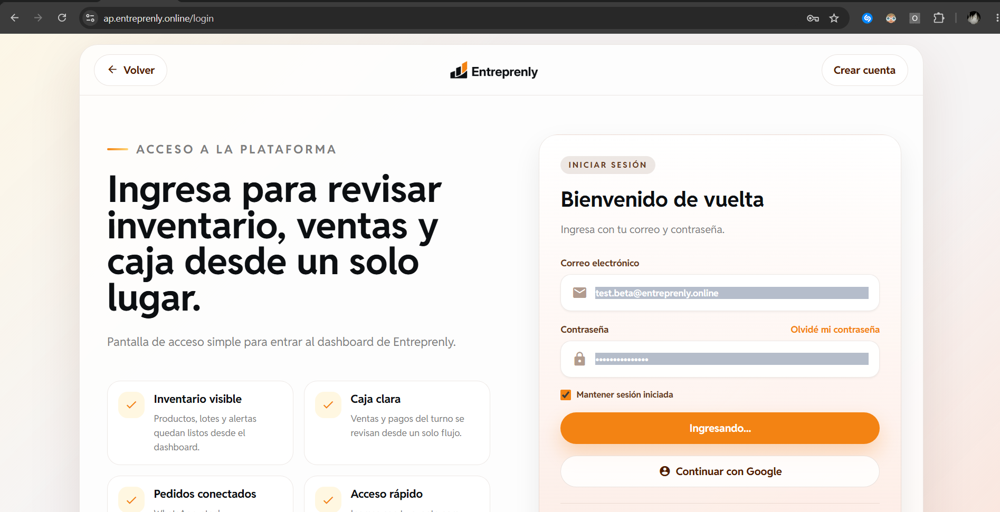

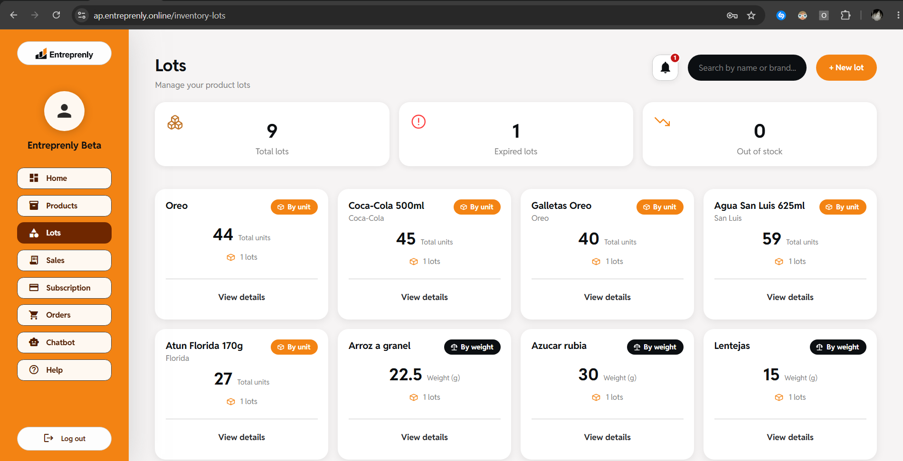

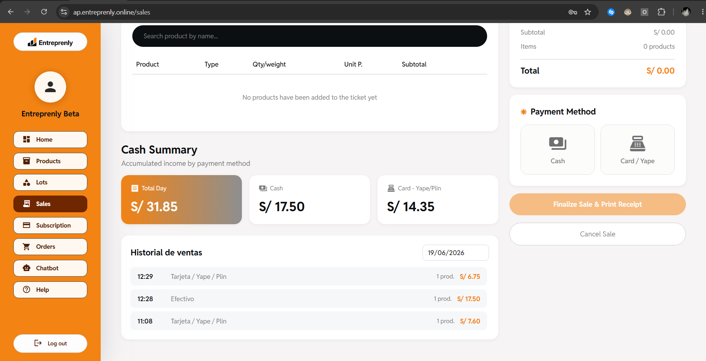

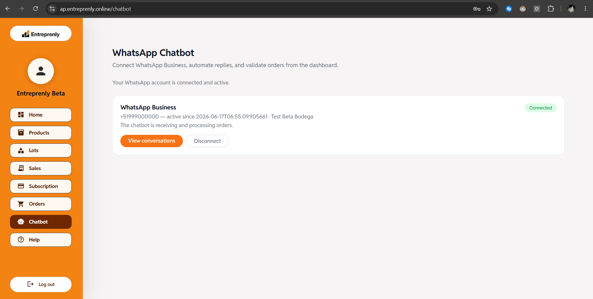

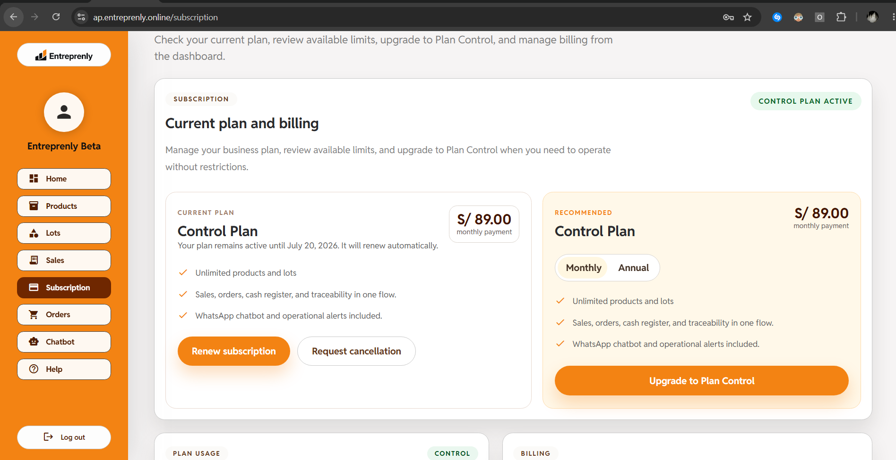


---

#### 5.2.3.6. Services Documentation Evidence for Sprint Review

Durante el Sprint 3 se documentaron los endpoints del RESTful API mediante **OpenAPI/Swagger** (Swashbuckle), disponibles en `https://ap-api.entreprenly.online/swagger`. A continuación se resume, por Bounded Context, la relación de endpoints implementados:

<table border="1" cellpadding="8" cellspacing="0" style="border-collapse: collapse; width: 100%;">
  <thead>
    <tr>
      <th>Bounded Context</th>
      <th>Endpoints (verbo HTTP + ruta)</th>
    </tr>
  </thead>
  <tbody>
    <tr>
      <td>IAM</td>
      <td><code>POST /api/v1/authentication/sign-in</code>, <code>POST /api/v1/authentication/sign-up</code>, <code>GET /api/v1/users</code>, <code>GET /api/v1/users/{id}</code>, <code>PUT /api/v1/users/me/password</code>, <code>PUT /api/v1/users/me/email</code>, <code>GET /api/v1/roles</code></td>
    </tr>
    <tr>
      <td>Profiles</td>
      <td><code>GET /api/v1/profiles</code>, <code>GET /api/v1/profiles/{id}</code>, <code>GET /api/v1/profiles/by-user/{userId}</code>, <code>POST /api/v1/profiles</code>, <code>PUT /api/v1/profiles/{id}</code>, <code>PUT /api/v1/profiles/{id}/preferences</code>, <code>PUT /api/v1/profiles/{id}/notification-settings</code></td>
    </tr>
    <tr>
      <td>Inventory</td>
      <td><code>GET/POST/PUT/DELETE /api/v1/inventory-unit-products</code>, <code>GET/POST/PUT/DELETE /api/v1/inventory-weight-products</code>, <code>GET /api/v1/inventory-lots</code>, <code>GET /api/v1/inventory-unit-lots</code>, <code>GET /api/v1/inventory-weight-lots</code>, <code>GET /api/v1/inventory-stock-alerts</code></td>
    </tr>
    <tr>
      <td>Sales</td>
      <td><code>POST /api/v1/sales</code>, <code>GET /api/v1/sales</code> (filtro opcional <code>?date</code>), <code>GET /api/v1/sales/{saleId}</code></td>
    </tr>
    <tr>
      <td>Subscription</td>
      <td><code>GET /api/v1/subscriptions/me/dashboard</code>, <code>PUT /api/v1/subscriptions/me/dashboard</code>, <code>GET /api/v1/subscriptions/me/payment-confirmation</code>, y endpoints <code>by-user/{userId}</code> (<code>billing-setup</code>, <code>activate-control</code>, <code>schedule-cancellation</code>, <code>keep-control</code>)</td>
    </tr>
    <tr>
      <td>Chatbot</td>
      <td><code>GET/POST /api/v1/conversations</code>, <code>GET/POST /api/v1/chat-messages</code>, <code>GET/POST /api/v1/chat-orders</code>, <code>POST /api/v1/chat-orders/{id}/confirm</code>, <code>POST /api/v1/chat-orders/{id}/reject</code>, <code>GET/POST /api/v1/whatsapp-sessions</code>, <code>POST /api/v1/chatbot/whatsapp</code> (webhook)</td>
    </tr>
  </tbody>
</table>

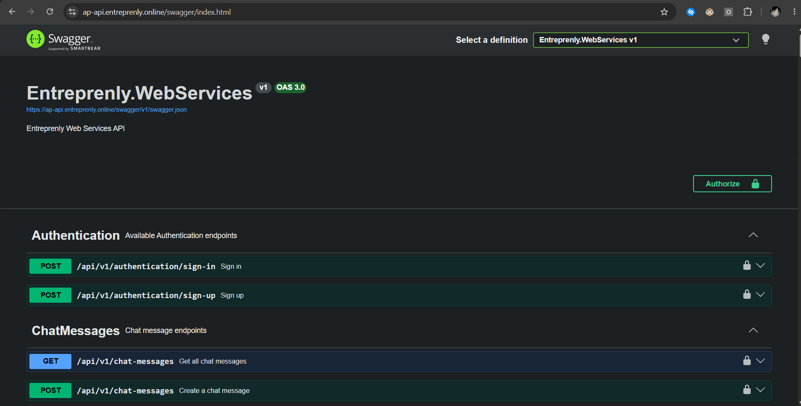

**URL del repositorio de Web Services:** https://github.com/Kauflink/ap-entreprenly-web-services

---

#### 5.2.3.7. Software Deployment Evidence for Sprint Review

Durante el Sprint 3 se configuró y ejecutó el despliegue del RESTful Web Services. El proceso (detallado en la sección 5.1.4) consistió en: construir la imagen Docker multi-etapa del backend (`mcr.microsoft.com/dotnet/sdk:10.0` → `aspnet:10.0`), publicarla en **Google Artifact Registry** (`us-east1-docker.pkg.dev`), y desplegarla en la instancia de **Google Compute Engine** mediante **Docker Compose**, con **Caddy** como reverse proxy y gestor automático de TLS. La autenticación del pipeline de GitHub Actions se realiza mediante **Workload Identity Federation**. El API quedó disponible en `https://ap-api.entreprenly.online`, con su documentación Swagger en `https://ap-api.entreprenly.online/swagger`.

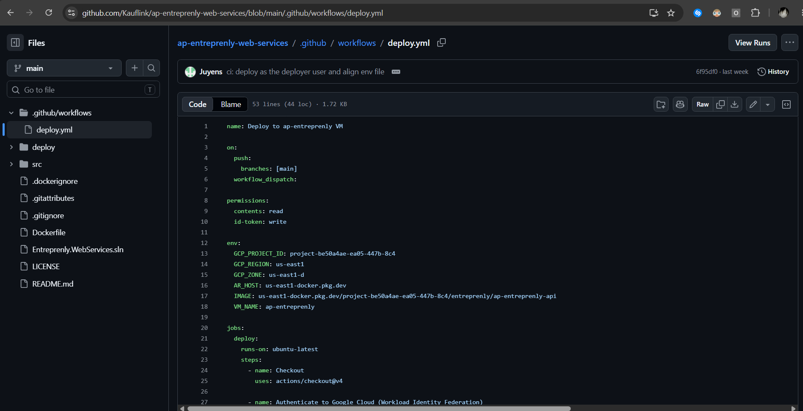

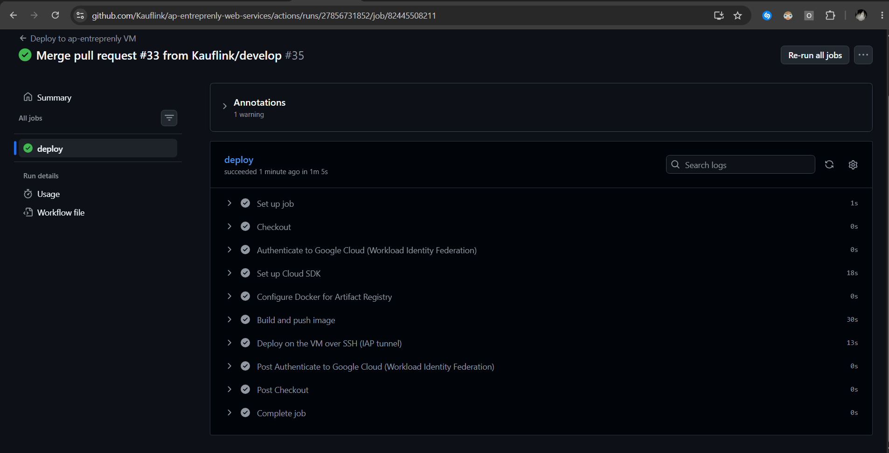

---

#### 5.2.3.8. Team Collaboration Insights during Sprint

Durante el Sprint 3, los cinco miembros del equipo participaron en la implementación del backend y su integración con el frontend. El trabajo se distribuyó por Bounded Context en el repositorio `ap-entreprenly-web-services`: Joseph Julius lideró el Shared Kernel, la infraestructura de despliegue (Docker, Caddy, CI/CD) y los BCs de IAM y Profiles; José Antonio lideró el BC de Inventory; José Fernando lideró el BC de Sales; Lionel Abraham lideró el BC de Subscription; y Elynor Mikela lideró el BC de Chatbot. La integración del frontend con la API real se realizó de forma colaborativa, cada miembro sobre su BC.

El equipo aplicó GitFlow con ramas `feature/` por Bounded Context (`feature/iam-context`, `feature/profiles-context`, `feature/inventory`, `feature/sales`, `feature/subscription`, `feature/chatbot`, `feature/deployment`) integradas a `develop` y `main` mediante Pull Requests (más de 20 PRs en el repositorio de Web Services). La distribución aproximada de commits en el backend fue: Camargo Briceño (37), Palma De Los Santos (25), Chavez Carrasco (12), Flores Pinchi (6) y Peirano Brun (3).

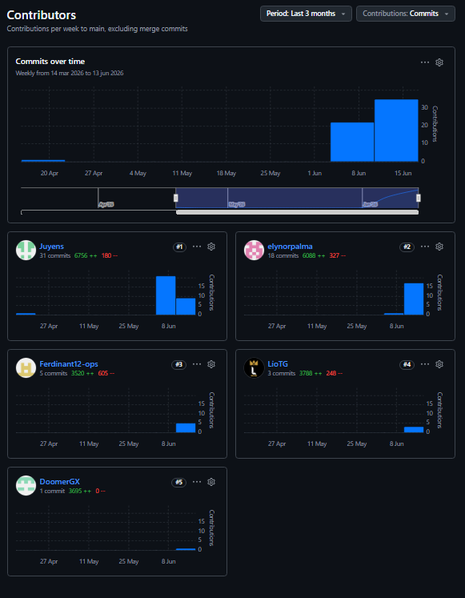

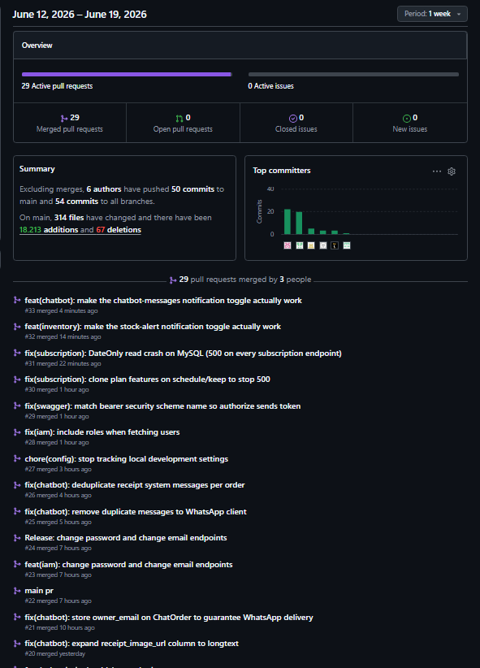

---

## 5.3. Validation Interviews

En esta sección el equipo registra y explica las actividades de entrevistas de validación realizadas durante el proyecto. A diferencia de las entrevistas de elicitación presentadas en la sección 2.2 —cuyo objetivo fue descubrir los problemas y necesidades de los usuarios—, las entrevistas de validación tienen como propósito confirmar si la solución construida (Landing Page y aplicaciones) resuelve efectivamente esos problemas y resulta usable para los segmentos objetivo.

Para ello se realizaron sesiones en las que usuarios reales de cada segmento interactuaron directamente con el Landing Page y con las aplicaciones de Entreprenly, ejecutando tareas concretas basadas en los User Flows definidos en la sección 4.4.4. Durante cada sesión se observó el desempeño del usuario al completar las tareas y, al finalizar, se aplicó un cuestionario de validación orientado a contrastar los dolores identificados en el needfinding con la experiencia real de uso del producto. Adicionalmente, se registraron observaciones de usabilidad siguiendo principios de evaluación heurística. Cada entrevista fue grabada en video como evidencia y se encuentra disponible en Microsoft Stream.

### 5.3.1. Diseño de Entrevistas

Antes de iniciar cada sesión de validación se brinda un saludo cordial y una breve presentación del entrevistador, explicando que el propósito de la sesión es evaluar la facilidad de uso y la utilidad del producto Entreprenly, y no evaluar al participante. Se aclara que la información será utilizada únicamente con fines académicos y se mantendrá en estricta confidencialidad. Como primer paso se solicita al participante su nombre completo, edad y distrito de residencia para fines de registro. Luego se le invita a interactuar libremente con el Landing Page y las aplicaciones, ejecutando las tareas propuestas y expresando en voz alta sus impresiones (técnica de _thinking aloud_), destacando que no existen respuestas correctas o incorrectas.

El proceso de validación para cada segmento se compone de tres momentos: (1) la exploración del Landing Page, (2) la ejecución de tareas guiadas sobre las aplicaciones siguiendo los User Flows correspondientes, y (3) un cuestionario de validación de diez preguntas. A continuación se detallan los elementos a incluir en la sesión de validación para cada segmento objetivo.

**Preguntas introductorias (ambos segmentos)**

- ¿Cuál es su nombre y apellidos?
- ¿Cuántos años tiene?
- ¿En qué distrito vive?

---

**Segmento objetivo 1: Comerciantes (Dueños de Minimarkets/Mercados)**

_Elementos a validar:_ Landing Page y Aplicación Web (Dashboard de gestión).

_User Flows a validar (sección 4.4.4):_

- User Flow 1 – Gestión de inventario (agregar, editar y buscar productos).
- User Flow 2 – Creación de lotes y gestión de alertas de vencimiento.
- User Flow 3 – Registro de venta presencial (POS con pesaje).
- User Flow 4 – Validación de pago de pedido del chatbot.
- User Flow 5 – Suscripción al Plan Control.

_Tareas asignadas:_

1. Explorar el Landing Page e identificar qué ofrece Entreprenly y los planes disponibles.
2. Registrar un producto nuevo, editarlo y luego buscarlo en el inventario.
3. Crear un lote con fecha de vencimiento y revisar las alertas del dashboard de lotes.
4. Registrar una venta presencial seleccionando un producto por peso y uno por unidad, y finalizar el cobro.
5. Revisar un pedido del chatbot pendiente y aprobar (o rechazar) su pago.
6. Iniciar el proceso de suscripción al Plan Control.

_Preguntas de validación:_

1. Después de explorar el Landing Page, ¿quedó claro qué hace Entreprenly y cómo resolvería los problemas de su negocio?
2. Al registrar, editar y buscar productos en el módulo de inventario, ¿le resultó más sencillo y ordenado que su método actual (cuaderno, Excel o memoria)?
3. Cuando creó un lote y visualizó las alertas de stock y vencimiento, ¿siente que esto le ayudaría a evitar pérdidas por productos vencidos o desabastecimiento no detectado?
4. Al registrar una venta presencial con el POS, incluido el pesaje, ¿le pareció un proceso rápido y confiable para el día a día en el local?
5. ¿La separación automática de los ingresos por efectivo y por medios digitales (Yape, Plin, POS) le daría mayor control al momento de cuadrar la caja?
6. Al validar el pago de un pedido del chatbot desde el dashboard, ¿le resultó claro el proceso de aprobar o rechazar el pago y confirmar el pedido?
7. ¿Considera que atender los pedidos por WhatsApp mediante el chatbot le quitaría la carga de estar pendiente del celular mientras atiende a los clientes en el local?
8. Durante el uso de la aplicación, ¿encontró alguna pantalla, botón o paso que le resultara confuso o difícil de entender?
9. En una escala del 1 al 5, ¿qué tan probable es que utilice Entreprenly en su negocio? ¿Por qué?
10. ¿Qué funcionalidad agregaría, quitaría o mejoraría para que la aplicación se ajuste mejor a su forma de trabajar?

---

**Segmento objetivo 2: Clientes Finales**

_Elementos a validar:_ Landing Page y Chatbot de WhatsApp (experiencia de compra).

_User Flows a validar:_

- Flujo de pedido por el chatbot: consulta de producto disponible, confirmación del pedido, recepción de las instrucciones de pago, reporte del comprobante de pago digital y recepción de la confirmación/comprobante.

_Tareas asignadas:_

1. Explorar el Landing Page e identificar qué ofrece la tienda y por qué convendría comprar por este medio.
2. Iniciar una conversación con el chatbot y consultar la disponibilidad de un producto.
3. Confirmar un pedido a través del chatbot.
4. Recibir las instrucciones de pago y reportar el comprobante de pago digital.
5. Recibir la confirmación del pedido y su comprobante.

_Preguntas de validación:_

1. Después de ver el Landing Page, ¿entendió qué ofrece la tienda y por qué le convendría comprar por este medio?
2. Al realizar un pedido por el chatbot de WhatsApp, ¿le resultó fácil y rápido encontrar el producto y completar la compra?
3. ¿La confirmación de stock en tiempo real le dio mayor confianza de que el producto que pidió sí está disponible?
4. Al recibir las instrucciones de pago y reportar su comprobante por el chat, ¿le pareció un proceso claro y seguro?
5. ¿Recibir una confirmación o comprobante automático del pedido le dio mayor tranquilidad al pagar por adelantado?
6. ¿Le resultó cómodo el medio de pago ofrecido (efectivo, Yape o Plin)?
7. ¿Prefiere esta experiencia de compra mediante el chatbot frente a esperar que una persona le responda manualmente?
8. Durante el pedido, ¿hubo algún mensaje o paso del chatbot que le resultara confuso o poco claro?
9. En una escala del 1 al 5, ¿qué tan probable es que vuelva a comprar en una tienda que use este sistema? ¿Por qué?
10. ¿Qué mejoraría de la experiencia de compra a través del chatbot?

### 5.3.2. Registro de Entrevistas

A continuación se registran las entrevistas de validación realizadas por segmento. Para cada entrevista se consigna el nombre y apellidos del participante, su edad, su distrito de residencia, un screenshot de un cuadro del video, el enlace al video alojado en Microsoft Stream —indicando el timing donde inicia la entrevista y su duración— y un resumen descriptivo de las principales apreciaciones del entrevistado respecto a las tareas asignadas. De acuerdo con lo planificado por el equipo, se realizaron dos entrevistas para el Segmento 1 (Comerciantes) y una entrevista para el Segmento 2 (Clientes Finales).

**Segmento 1: Comerciantes (Dueños de Minimarkets/Mercados)**

- Primera entrevista:

<div align="center">
<div style="font-family: 'Segoe UI', sans-serif; max-width: 680px; margin: 24px auto; border: 1.5px solid #b0bec5; border-radius: 4px; overflow: hidden; box-shadow: 0 2px 8px rgba(0,0,0,0.12);">

  <!-- Encabezado -->
  <div style="background-color: #1a6b6b; color: white; padding: 10px 16px; font-weight: 700; font-size: 1.1em; letter-spacing: 0.05em;">
  Entrevista de Validación
  </div>

  <!-- Imagen de la captura de pantalla -->
  <div style="background-color: #1a6b6b; padding: 12px 16px 16px;">
    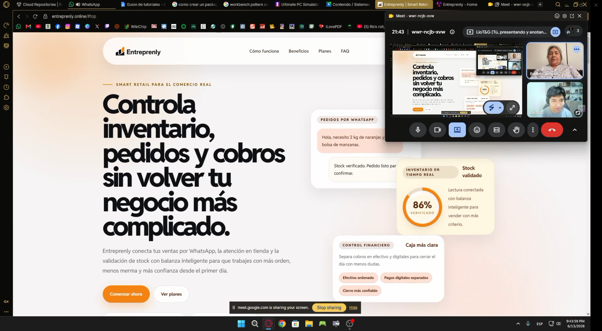
  </div>

  <!-- Datos en dos columnas -->
  <table style="width: 100%; border-collapse: collapse; font-size: 0.88em;">
    <tr>
      <td style="padding: 7px 14px; border: 1px solid #cfd8dc; width: 50%;">
        <strong>Entrevistado(a):</strong> María Encarnación Velasquez
      </td>
      <td style="padding: 7px 14px; border: 1px solid #cfd8dc; width: 50%;">
        <strong>Edad:</strong> 62
      </td>
    </tr>
    <tr>
      <td style="padding: 7px 14px; border: 1px solid #cfd8dc;">
        <strong>Entrevistador(a):</strong> Lionel Chavez Carrasco
      </td>
      <td style="padding: 7px 14px; border: 1px solid #cfd8dc;">
        <strong>Distrito:</strong> San Miguel, Lima
      </td>
    </tr>
    <tr>
      <td style="padding: 7px 14px; border: 1px solid #cfd8dc;">
        <strong>Inicio de la entrevista:</strong> 03:20
      </td>
      <td style="padding: 7px 14px; border: 1px solid #cfd8dc;">
        <strong>Duración:</strong> 16:34
      </td>
    </tr>
  </table>

  <!-- Link -->
  <table style="width: 100%; border-collapse: collapse; font-size: 0.88em;">
    <tr>
      <td style="padding: 7px 14px; border: 1px solid #cfd8dc;">
        <strong>Link de la entrevista (Microsoft Stream):</strong>
        <a href="https://upcedupe-my.sharepoint.com/:v:/g/personal/u202416151_upc_edu_pe/IQDLOgZZQciGT4vb_yjShsLTAS0Hr5RXYveIiQsCDk62_3g?nav=eyJyZWZlcnJhbEluZm8iOnsicmVmZXJyYWxBcHAiOiJPbmVEcml2ZUZvckJ1c2luZXNzIiwicmVmZXJyYWxBcHBQbGF0Zm9ybSI6IldlYiIsInJlZmVycmFsTW9kZSI6InZpZXciLCJyZWZlcnJhbFZpZXciOiJNeUZpbGVzTGlua0NvcHkifX0&e=Ykle0r" style="color: #1a6b6b;">María Encarnación-Entrevista de Validación</a>
      </td>
    </tr>
  </table>

  <!-- Descripción -->
  <table style="width: 100%; border-collapse: collapse; font-size: 0.88em;">
    <tr>
      <td style="padding: 10px 14px; border: 1px solid #cfd8dc; line-height: 1.6;">
        Durante la entrevista, María Encarnación Velázquez manifestó que el Landing Page de Entreprenly le pareció claro y fácil de comprender, ya que explica de manera sencilla los beneficios de la aplicación y cómo puede ayudar a los pequeños comerciantes en la gestión de sus negocios. Respecto a los User Flows ejecutados, consideró que las funciones de inventario y gestión de lotes son intuitivas y facilitan el registro, búsqueda y control de productos. Asimismo, indicó que el proceso de venta presencial es rápido y permite llevar un mejor control de los ingresos diarios. La validación de pagos mediante el chatbot de WhatsApp le pareció una alternativa práctica para automatizar pedidos y cobros, mientras que el flujo de suscripción resultó sencillo y comprensible. La entrevistada señaló que la solución contribuye significativamente a resolver problemas operativos relacionados con el control de inventario, seguimiento de ventas y organización de productos, reduciendo la necesidad de registros manuales y disminuyendo el riesgo de errores o pérdidas. No se identificaron dificultades importantes durante la interacción con la aplicación; sin embargo, sugirió incorporar funcionalidades adicionales como la generación de facturas y guías de remisión para complementar la gestión comercial. Finalmente, manifestó una alta probabilidad de utilizar la aplicación en su negocio debido a los beneficios que ofrece en términos de organización, ahorro de tiempo y reducción del estrés asociado a las tareas administrativas.
      </td>
    </tr>
  </table>

</div>

</div>

---

- Segunda entrevista:

<div align="center">
<div style="font-family: 'Segoe UI', sans-serif; max-width: 680px; margin: 24px auto; border: 1.5px solid #b0bec5; border-radius: 4px; overflow: hidden; box-shadow: 0 2px 8px rgba(0,0,0,0.12);">

  <!-- Encabezado -->
  <div style="background-color: #1a6b6b; color: white; padding: 10px 16px; font-weight: 700; font-size: 1.1em; letter-spacing: 0.05em;">
  Entrevista de Validación
  </div>

  <!-- Imagen de la captura de pantalla -->
  <div style="background-color: #1a6b6b; padding: 12px 16px 16px;">
    
  </div>

  <!-- Datos en dos columnas -->
  <table style="width: 100%; border-collapse: collapse; font-size: 0.88em;">
    <tr>
      <td style="padding: 7px 14px; border: 1px solid #cfd8dc; width: 50%;">
        <strong>Entrevistado(a):</strong> Hercilio Carrasco Herrera
      </td>
      <td style="padding: 7px 14px; border: 1px solid #cfd8dc; width: 50%;">
        <strong>Edad:</strong> 59
      </td>
    </tr>
    <tr>
      <td style="padding: 7px 14px; border: 1px solid #cfd8dc;">
        <strong>Entrevistador(a):</strong> Lionel Chavez Carrasco
      </td>
      <td style="padding: 7px 14px; border: 1px solid #cfd8dc;">
        <strong>Distrito:</strong> San Miguel, Lima
      </td>
    </tr>
    <tr>
      <td style="padding: 7px 14px; border: 1px solid #cfd8dc;">
        <strong>Inicio de la entrevista:</strong> 03:35
      </td>
      <td style="padding: 7px 14px; border: 1px solid #cfd8dc;">
        <strong>Duración:</strong> 17:07
      </td>
    </tr>
  </table>

  <!-- Link -->
  <table style="width: 100%; border-collapse: collapse; font-size: 0.88em;">
    <tr>
      <td style="padding: 7px 14px; border: 1px solid #cfd8dc;">
        <strong>Link de la entrevista (Microsoft Stream):</strong>
        <a href="https://upcedupe-my.sharepoint.com/:v:/g/personal/u202416151_upc_edu_pe/IQDfZ1lUJuh6QIJJfAiZtDGhAfoa0SvaRV9JKz7SKHOnDxQ?nav=eyJyZWZlcnJhbEluZm8iOnsicmVmZXJyYWxBcHAiOiJPbmVEcml2ZUZvckJ1c2luZXNzIiwicmVmZXJyYWxBcHBQbGF0Zm9ybSI6IldlYiIsInJlZmVycmFsTW9kZSI6InZpZXciLCJyZWZlcnJhbFZpZXciOiJNeUZpbGVzTGlua0NvcHkifX0&e=1rjqKF" style="color: #1a6b6b;">Hercilio Carrasco-Entrevista de Validación</a>
      </td>
    </tr>
  </table>

  <!-- Descripción -->
  <table style="width: 100%; border-collapse: collapse; font-size: 0.88em;">
    <tr>
      <td style="padding: 10px 14px; border: 1px solid #cfd8dc; line-height: 1.6;">
        Durante la entrevista, Hercilio Carrasco Herrera indicó que el Landing Page de Entreprenly presenta de manera clara las funcionalidades y beneficios de la aplicación, permitiéndole comprender rápidamente cómo la herramienta puede apoyar la gestión de su negocio. En cuanto a los User Flows ejecutados, consideró que los procesos de inventario y gestión de lotes son fáciles de utilizar y útiles para mantener un mejor control de los productos, especialmente aquellos con fecha de vencimiento. Asimismo, valoró positivamente el flujo de venta presencial, destacando la facilidad para registrar ventas y diferenciar ingresos por efectivo y pagos electrónicos. La validación de pagos mediante el chatbot de WhatsApp le pareció una funcionalidad innovadora que simplifica la atención de pedidos, mientras que el proceso de suscripción fue percibido como sencillo y accesible. El entrevistado señaló que la solución responde adecuadamente a varios de sus problemas operativos, principalmente en el control de inventario, la gestión de productos perecibles y la organización de ventas. También destacó que las alertas de vencimiento y el control de stock en tiempo real pueden contribuir a reducir pérdidas económicas y mejorar la eficiencia del negocio. No reportó dificultades significativas durante la ejecución de las tareas; sin embargo, identificó una oportunidad de mejora relacionada con la incorporación de recordatorios automáticos para clientes con pagos pendientes, lo que facilitaría la gestión de cobranzas y reduciría el riesgo de impagos. Finalmente, manifestó una alta disposición a utilizar la aplicación en su actividad comercial, ya que considera que las funcionalidades propuestas aportan valor y contribuyen a modernizar la administración de pequeños negocios.
      </td>
    </tr>
  </table>

</div>

</div>

---

**Segmento 2: Clientes Finales**

- Primera entrevista:

<div align="center">
<div style="font-family: 'Segoe UI', sans-serif; max-width: 680px; margin: 24px auto; border: 1.5px solid #b0bec5; border-radius: 4px; overflow: hidden; box-shadow: 0 2px 8px rgba(0,0,0,0.12);">

  <!-- Encabezado -->
  <div style="background-color: #1a6b6b; color: white; padding: 10px 16px; font-weight: 700; font-size: 1.1em; letter-spacing: 0.05em;">
  Entrevista de Validación
  </div>

  <!-- Imagen de la captura de pantalla -->
  <div style="background-color: #1a6b6b; padding: 12px 16px 16px;">
    
  </div>

  <!-- Datos en dos columnas -->
  <table style="width: 100%; border-collapse: collapse; font-size: 0.88em;">
    <tr>
      <td style="padding: 7px 14px; border: 1px solid #cfd8dc; width: 50%;">
        <strong>Entrevistado(a):</strong> Sebastián Curay
      </td>
      <td style="padding: 7px 14px; border: 1px solid #cfd8dc; width: 50%;">
        <strong>Edad:</strong> 19
      </td>
    </tr>
    <tr>
      <td style="padding: 7px 14px; border: 1px solid #cfd8dc;">
        <strong>Entrevistador(a):</strong> Fernando Flores
      </td>
      <td style="padding: 7px 14px; border: 1px solid #cfd8dc;">
        <strong>Distrito:</strong> San Martín de Porres, Lima
      </td>
    </tr>
    <tr>
      <td style="padding: 7px 14px; border: 1px solid #cfd8dc;">
        <strong>Inicio de la entrevista:</strong> 00:00
      </td>
      <td style="padding: 7px 14px; border: 1px solid #cfd8dc;">
        <strong>Duración:</strong> 09:50
      </td>
    </tr>
  </table>

  <!-- Link -->
  <table style="width: 100%; border-collapse: collapse; font-size: 0.88em;">
    <tr>
      <td style="padding: 7px 14px; border: 1px solid #cfd8dc;">
        <strong>Link de la entrevista (Microsoft Stream):</strong>
        <a href="https://upcedupe-my.sharepoint.com/:v:/g/personal/u20241a290_upc_edu_pe/IQBA8Q70W8bCRoDGM1oUhrJdATc8nAY1ysMnwvptFJXACZk?nav=eyJyZWZlcnJhbEluZm8iOnsicmVmZXJyYWxBcHAiOiJTdHJlYW1XZWJBcHAiLCJyZWZlcnJhbFZpZXciOiJTaGFyZURpYWxvZy1MaW5rIiwicmVmZXJyYWxBcHBQbGF0Zm9ybSI6IldlYiIsInJlZmVycmFsTW9kZSI6InZpZXcifX0%3D&e=wdusaa" style="color: #1a6b6b;">Sebastián Curay-Entrevista de Validación</a>
      </td>
    </tr>
  </table>

  <!-- Descripción -->
  <table style="width: 100%; border-collapse: collapse; font-size: 0.88em;">
    <tr>
      <td style="padding: 10px 14px; border: 1px solid #cfd8dc; line-height: 1.6;">
        Sebastián, cliente final de 19 años habituado a los pagos digitales (Yape y Plin), validó el Landing Page y el flujo de compra por el chatbot de WhatsApp realizando un pedido real durante la sesión (dos Coca-Colas, con entrega en Girón Apurímac y pago reportado mediante una captura de Yape). Sobre el Landing Page, indicó que comprendió la propuesta de valor y la encontró interesante, destacando que representa una forma más rápida de comprar y que poder ver el stock disponible le resulta útil. Respecto al pedido por el chatbot, lo percibió rápido y directo, con mensajes claros y bien enfocados. Valoró especialmente la confirmación de stock en tiempo real: comentó que en otros emprendimientos suele ocurrir que paga y luego le indican que el producto está agotado, le retrasan o le cancelan el pedido, por lo que ver la cantidad disponible al momento de consultar le da confianza para comprar.
        Sobre el pago, calificó el proceso de recibir las instrucciones y reportar el comprobante como claro, seguro, dinámico y sencillo, y señaló que recibir la confirmación automática del pedido le da tranquilidad al pagar por adelantado, pues le permite verificar que el pago fue confirmado y que no fue estafado ni perdió el tiempo. Indicó que el medio de pago ofrecido (Yape/Plin) le resulta cómodo por ser de uso generalizado. Manifestó preferir la atención por chatbot frente a la respuesta manual de una persona, por considerarla rápida y eficiente al estar todo automatizado. No identificó pasos confusos durante el flujo. Calificó con 5 sobre 5 la probabilidad de volver a comprar en una tienda que utilice este sistema, por considerarlo rápido, eficiente e intuitivo y fácil de usar para cualquier persona. Como mejora, sugirió que el mensaje de bienvenida del chatbot muestre un pequeño catálogo de los productos más solicitados o más vendidos y que, en caso de no estar disponibles, el cliente pueda escribir el producto para verificar su disponibilidad.
      </td>
    </tr>
  </table>

</div>

</div>

### 5.3.3. Evaluaciones según heurísticas

Esta sección presenta la evaluación heurística aplicada a **Entreprenly** durante la etapa de validación. La evaluación se organiza en tres grupos: heurísticas de usabilidad, arquitectura de información e inclusive design. Cada criterio incluye un puntaje del 1 al 5, la evidencia observada (referenciada por figura) y las oportunidades de mejora identificadas.

#### Catálogo de figuras

| Fig.    | Pantalla                                       | Archivo                                                 |
| ------- | ---------------------------------------------- | ------------------------------------------------------- |
| Fig. 1  | Panel de Inicio (Dashboard)                    | `Fig-01-panel-de-inicio.jpeg`                           |
| Fig. 2  | Catálogo de Productos                          | `Fig-02-catalogo-de-productos.jpeg`                     |
| Fig. 3  | Modal "Editar Producto"                        | `Fig-03-modal-editar-producto.jpeg`                     |
| Fig. 4  | Modal "Agregar Nuevo Producto"                 | `Fig-04-modal-agregar-producto.jpeg`                    |
| Fig. 5  | Lotes de Inventario (vista general)            | `Fig-05-lotes-de-inventario.jpeg`                       |
| Fig. 6  | Panel de Alertas de Lotes                      | `Fig-06-panel-alertas-de-lotes.jpeg`                    |
| Fig. 7  | Modal "Agregar Nuevo Lote"                     | `Fig-07-modal-agregar-lote.jpeg`                        |
| Fig. 8  | Detalle de Lote (lote vencido)                 | `Fig-08-detalle-de-lote-vencido.jpeg`                   |
| Fig. 9  | Ventas – "Producto no encontrado"              | `Fig-09-ventas-producto-no-encontrado.jpeg`             |
| Fig. 10 | Suscripción – Planes Free y Control            | `Fig-10-suscripcion-planes.jpeg`                        |
| Fig. 11 | Suscripción – Límites, facturación e historial | `Fig-11-suscripcion-limites-facturacion-historial.jpeg` |
| Fig. 12 | Modal "Agregar método de pago"                 | `Fig-12-modal-agregar-metodo-de-pago.jpeg`              |
| Fig. 13 | Modal "Completar datos de facturación"         | `Fig-13-modal-datos-de-facturacion.jpeg`                |
| Fig. 14 | Modal "Historial de suscripción"               | `Fig-14-modal-historial-de-suscripcion.jpeg`            |
| Fig. 15 | Ventas – Registrar cantidad (teclado numérico) | `Fig-15-ventas-registrar-cantidad.jpeg`                 |
| Fig. 16 | Centro de Ayuda                                | `Fig-16-centro-de-ayuda.jpeg`                           |
| Fig. 17 | Formulario "Reportar un problema"              | `Fig-17-reportar-un-problema.jpeg`                      |
| Fig. 18 | Artículo de ayuda "¿Cómo validar un pago?"     | `Fig-18-articulo-validar-un-pago.jpeg`                  |
| Fig. 19 | Perfil y configuración de cuenta               | `Fig-19-perfil-configuracion.jpeg`                      |

---

#### 5.3.3.1. Heurísticas de usabilidad

En esta subsección se evalúa la experiencia de uso de Entreprenly tomando como referencia las heurísticas de Nielsen.

##### Visibilidad del estado del sistema — Puntaje: 5/5

Entreprenly comunica oportunamente el estado del sistema. El Panel de Inicio muestra en tiempo real el resumen del día (ventas, ingresos, pedidos y alertas), el estado del chatbot ("Activo") y el estado del inventario con etiquetas como "Vencido" y "Stock bajo". El panel de alertas de lotes notifica vencimientos y faltantes, y la vista de Suscripción refleja el plan activo y el consumo de límites mediante barras de progreso.


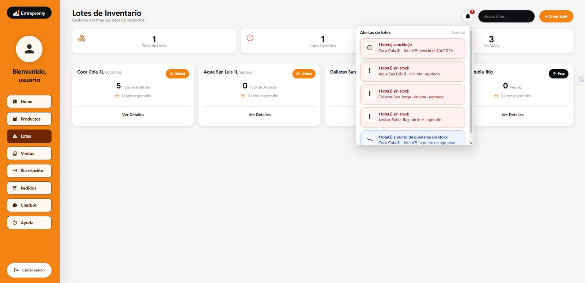

**Evidencia observada:** Fig. 1 (resumen y alertas del dashboard), Fig. 6 (notificaciones de lotes), Fig. 11 (uso del plan y estado de facturación).

**Mejora sugerida:** Añadir un _toast_ de confirmación visible tras guardar producto/lote, ya que el modal se cierra sin un mensaje persistente de éxito.

---

##### Relación entre el sistema y el mundo real — Puntaje: 5/5

El lenguaje es cercano al comerciante peruano: "Lotes", "Stock", "Caja diaria", "Boleta", "Yape/Plin", "RUC" y "Razón social". En las vistas de Lotes y de Datos de facturación se emplean términos fiscales y de inventario propios del rubro.

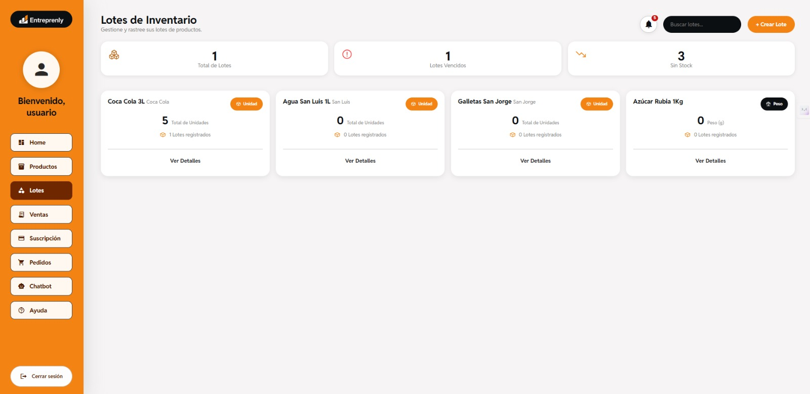


**Evidencia observada:** Fig. 5 (lotes/unidades), Fig. 8 (fecha de vencimiento), Fig. 13 (RUC, razón social, dirección fiscal), Fig. 9 ("Tarjeta – Yape/Plin").

**Mejora sugerida:** Incluir ayuda contextual (tooltip) en "Peso (g)" para productos a granel, diferenciándolo de "Unidad".

---

##### Libertad y control por parte del usuario — Puntaje: 5/5

Todos los modales tienen botón de cierre (×) y opción Cancelar; el detalle de lote ofrece "Volver"; el Perfil permite editar datos, cambiar contraseña, idioma, tema y notificaciones sin quedar atrapado. En Ventas existe "Cancelar Venta".

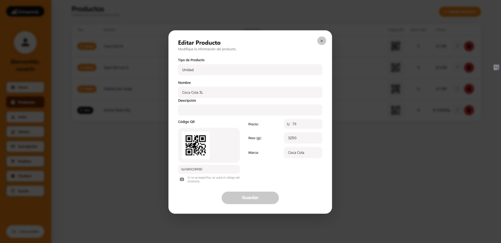


**Evidencia observada:** Fig. 3 y Fig. 4 (× y Cancelar en modales), Fig. 8 (botón Volver), Fig. 13 (Cancelar), Fig. 19 (edición libre de perfil).

**Mejora sugerida:** Agregar confirmación "¿Descartar cambios?" al cerrar un modal con campos ya editados, para evitar pérdidas accidentales.

---

##### Consistencia y estándares — Puntaje: 5/5

Se mantiene un patrón visual uniforme: sidebar naranja fija, tipografía estable, botones primarios naranjas, y tarjetas y tablas con el mismo estilo en Productos, Lotes, Ventas, Suscripción y Ayuda. La nomenclatura de navegación es consistente en todas las pantallas.

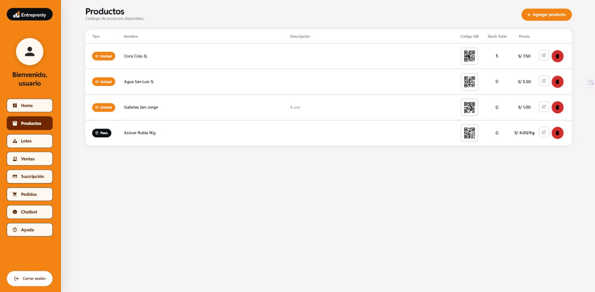


**Evidencia observada:** Fig. 1, Fig. 2, Fig. 5, Fig. 10 y Fig. 16 comparten layout, colores y jerarquía de botones.

**Mejora sugerida:** Unificar el estilo del botón "Volver" (Fig. 8, negro) con el resto de botones secundarios (blancos con borde).

---

##### Prevención de errores — Puntaje: 4/5

Los formularios usan campos guía y valores por defecto. En Agregar Producto el botón Guardar permanece atenuado hasta completar lo necesario; en Agregar Lote se solicitan fecha de ingreso y vencimiento; en Datos de facturación y Método de pago se marcan formatos esperados (tarjeta, CVV, RUC).

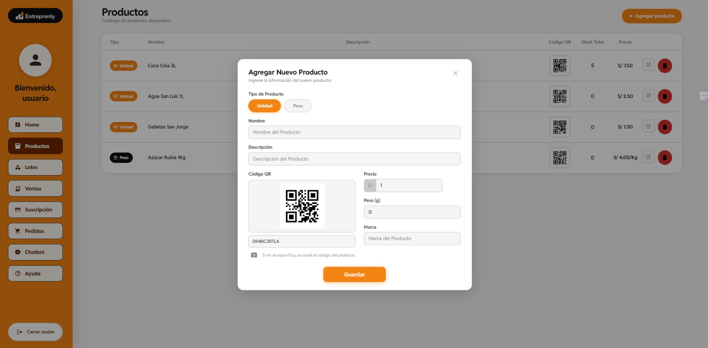


**Evidencia observada:** Fig. 4 (Guardar atenuado), Fig. 7 (fechas obligatorias), Fig. 12 y Fig. 13 (formatos guía).

**Mejora sugerida:** Validar en línea que la _Fecha de Vencimiento_ sea posterior a la _Fecha de Ingreso_ y advertir antes de registrar un lote ya vencido.

---

##### Reconocer antes que recordar — Puntaje: 5/5

El dashboard ofrece "Accesos rápidos" con íconos y una sidebar siempre visible con etiquetas de texto. El usuario reconoce los módulos sin memorizar rutas; las tarjetas resumen muestran lo relevante de un vistazo.


**Evidencia observada:** Fig. 1 (accesos rápidos e íconos), sidebar persistente en todas las figuras, Fig. 16 (categorías con íconos).

**Mejora sugerida:** Resaltar de forma más marcada el ítem activo del menú para reforzar la ubicación del usuario.

---

##### Flexibilidad y eficiencia en el uso — Puntaje: 4/5

Existen atajos (accesos rápidos del dashboard), buscador de lotes, descarga de historial, teclado numérico para registrar cantidad en ventas y generación automática de código QR, lo que agiliza tanto al usuario nuevo como al recurrente.

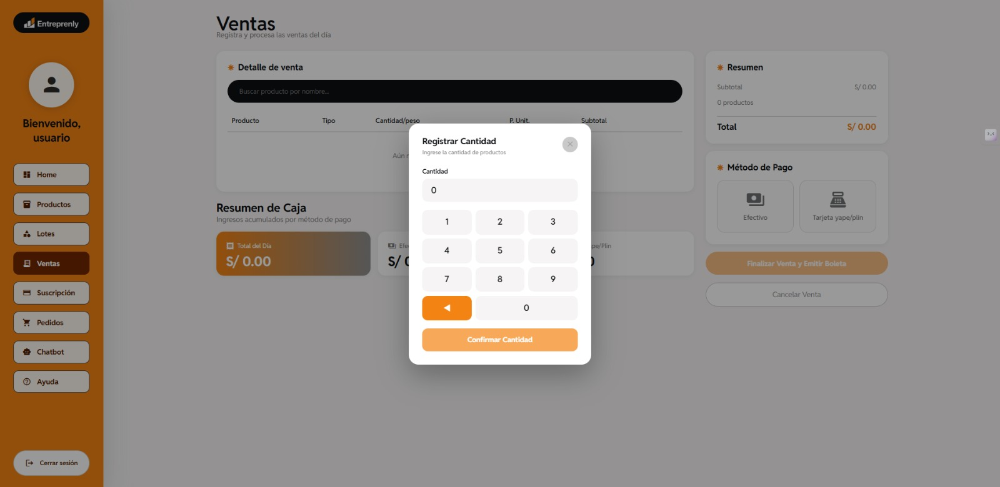

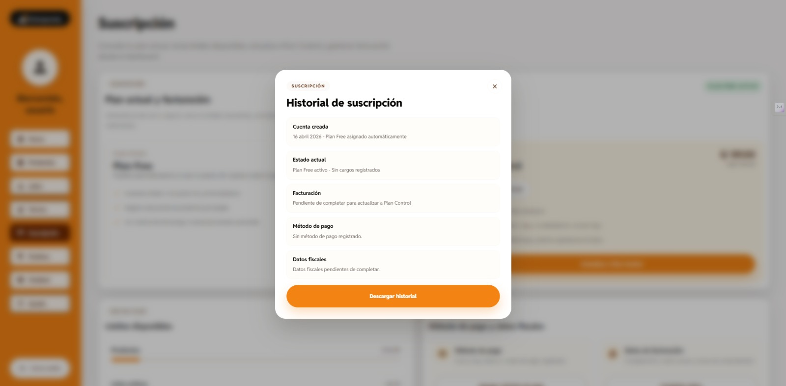

**Evidencia observada:** Fig. 1 (accesos rápidos), Fig. 14 (Descargar historial), Fig. 15 (teclado numérico), Fig. 2 (QR por producto).

**Mejora sugerida:** Incorporar búsqueda/filtros en el catálogo de Productos y atajos de teclado en el módulo de Ventas para usuarios avanzados.

---

##### Diseño estético y minimalista — Puntaje: 5/5

La interfaz mantiene jerarquía clara y bajo ruido visual: uso consistente del naranja como color de acción, espacios en blanco amplios y tarjetas bien delimitadas en Suscripción y en el dashboard.


**Evidencia observada:** Fig. 1, Fig. 10 (cards de planes), Fig. 16 (centro de ayuda ordenado).

**Mejora sugerida:** En el dashboard, equilibrar la densidad de la zona inferior (estado de inventario) para evitar acumulación de tarjetas pequeñas.

---

##### Ayuda a los usuarios a reconocer, diagnosticar y recuperarse de los errores — Puntaje: 4/5

El sistema señala errores con color y texto: en Ventas muestra "⊘ Producto no encontrado"; en Lotes marca el lote "Vencido" en rojo con la fecha. Los estados de error son reconocibles.

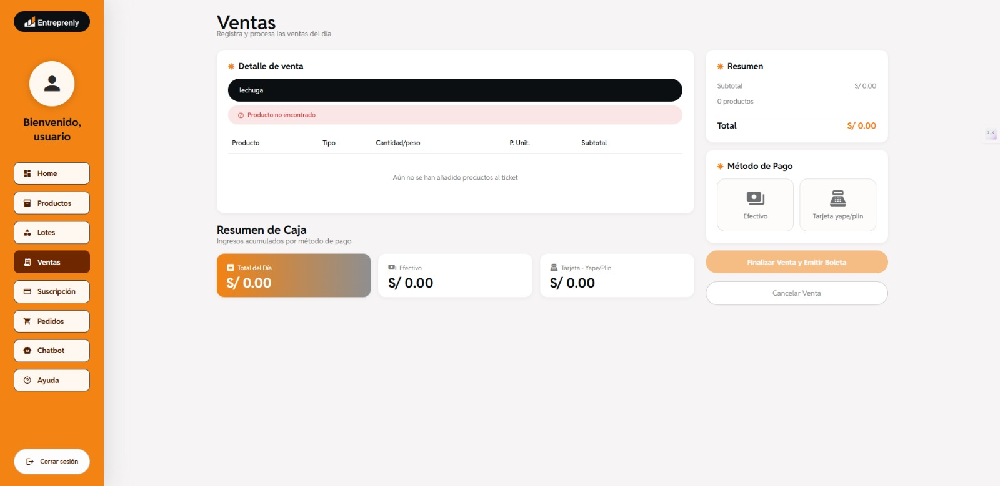


**Evidencia observada:** Fig. 9 (producto no encontrado), Fig. 8 (lote vencido), Fig. 11 (estados "pendiente de completar").

**Mejora sugerida:** Que el mensaje "Producto no encontrado" sugiera la acción siguiente (p. ej. "Verifica el nombre o créalo en Productos"), explicando cómo recuperarse y no solo qué ocurrió.

---

##### Ayuda y documentación — Puntaje: 5/5

Cuenta con un Centro de Ayuda con artículos frecuentes, categorías, buscador y datos de soporte (correo, WhatsApp, horario); artículos paso a paso; y un formulario para reportar problemas con tiempos de respuesta.


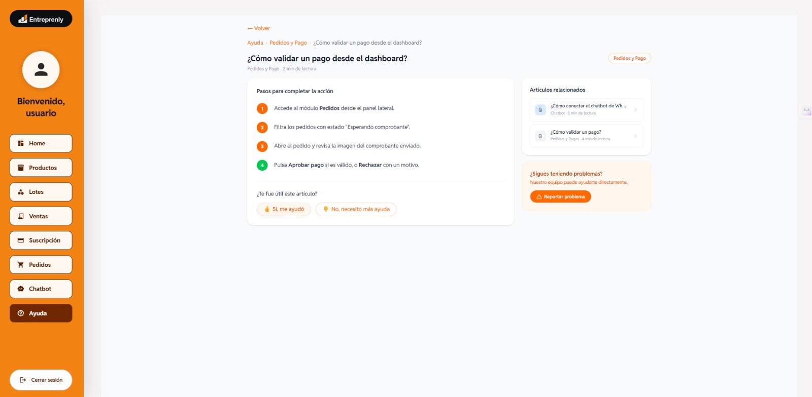

**Evidencia observada:** Fig. 16 (artículos y soporte), Fig. 17 (reporte de problema), Fig. 18 (guía "¿Cómo validar un pago?").

**Mejora sugerida:** Enlazar ayuda contextual ("?") desde cada módulo directamente al artículo correspondiente del centro de ayuda.

---

#### 5.3.3.2. Arquitectura de información

En esta subsección se evalúa si la organización de la información permite encontrar, comprender y utilizar el contenido de forma clara.

##### Is it findable? — Puntaje: 5/5

Las funciones principales se ubican en la sidebar fija y en los accesos rápidos del dashboard; el Centro de Ayuda agrupa soporte y FAQ por categorías.


**Evidencia observada:** Fig. 1, Fig. 16, navegación lateral presente en todas las figuras.

**Mejora sugerida:** Añadir un buscador global en el header del dashboard.

---

##### Is it accessible? — Puntaje: 4/5

Buen contraste (texto oscuro sobre blanco, acción naranja), etiquetas visibles y opción de tema Claro/Oscuro e idioma/zona horaria configurables.


**Evidencia observada:** Fig. 19 (preferencias de tema/idioma), formularios con labels (Fig. 4, Fig. 13).

**Mejora sugerida:** Validar el contraste del texto blanco sobre naranja (banner del dashboard) y confirmar el comportamiento responsivo en móvil/tablet.

---

##### Is it clear? — Puntaje: 5/5

Títulos y subtítulos describen cada sección ("Catálogo de productos disponibles", "Registra y procesa las ventas del día"); los modales incluyen título y descripción.


**Evidencia observada:** Fig. 2, Fig. 5, Fig. 8 (encabezados descriptivos).

**Mejora sugerida:** Acompañar las barras de "Límites disponibles" con una leyenda del significado al alcanzar el tope.

---

##### Is it communicative? — Puntaje: 5/5

La interfaz informa en el momento adecuado: estado del plan, stock, alertas de lotes y actividad de suscripción.

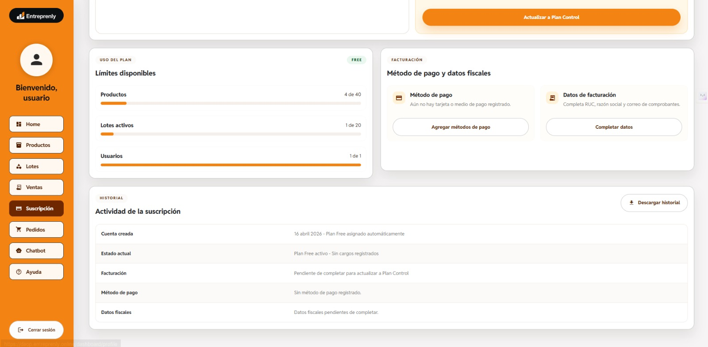

**Evidencia observada:** Fig. 1 (resumen), Fig. 6 (alertas), Fig. 11 (historial/estado de facturación).

**Mejora sugerida:** Mostrar contadores de notificaciones también en la sidebar (módulos Lotes/Pedidos).

---

##### Is it usable? — Puntaje: 4/5

Las tareas principales se completan sin asistencia: alta de productos y lotes, registro de ventas, gestión de suscripción, método de pago, datos fiscales y descarga de historial.

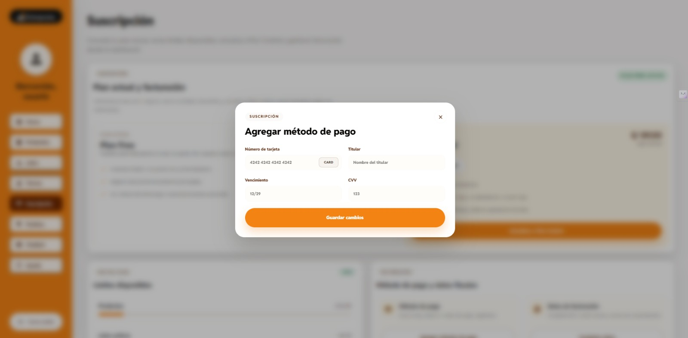

**Evidencia observada:** Fig. 4, Fig. 7, Fig. 12, Fig. 13, Fig. 14, Fig. 15.

**Mejora sugerida:** Guiar el primer registro con un mini-onboarding; los módulos vacíos ya muestran estados como "Aún no hay pedidos".

---

##### Is it credible? — Puntaje: 5/5

Transmite confianza con precios transparentes, identidad visual coherente, datos de soporte reales y una propuesta de valor clara.


**Evidencia observada:** Fig. 10 (planes y precios), Fig. 16 (soporte con correo/WhatsApp/horario).

**Mejora sugerida:** Incluir un sello/nota de seguridad de pago en el modal de tarjeta (Fig. 12).

---

##### Is it controllable? — Puntaje: 5/5

El usuario cambia de sección, cancela acciones, mantiene su plan, edita su perfil y vuelve a estados previos (botón Volver, ×, Cancelar).


**Evidencia observada:** Fig. 8 (Volver), Fig. 13 (Cancelar), Fig. 19 (control total del perfil).

**Mejora sugerida:** Confirmar antes de cerrar modales con cambios sin guardar.

---

##### Is it valuable? — Puntaje: 5/5

Aporta valor real: control de stock y vencimientos, conciliación de caja por método de pago, pedidos por WhatsApp vía chatbot y gestión de suscripción.


**Evidencia observada:** Fig. 1 (caja por método de pago), Fig. 6 (vencimientos), Fig. 10 (valor del plan Control).

**Mejora sugerida:** Resaltar en el dashboard el beneficio acumulado (p. ej. mermas evitadas por alertas de vencimiento).

---

##### Is it learnable? — Puntaje: 5/5

Patrones repetidos, labels claros y guías paso a paso facilitan el aprendizaje.


**Evidencia observada:** Fig. 4 (formulario autoexplicativo), Fig. 18 (artículo paso a paso).

**Mejora sugerida:** Tour interactivo opcional en el primer ingreso.

---

##### Is it delightful? — Puntaje: 4/5

La experiencia es fluida, limpia y profesional, con estados claros y sensación de control.


**Evidencia observada:** Fig. 1, Fig. 10 (estética cuidada).

**Mejora sugerida:** Sumar microinteracciones (animación al guardar, checkmark al finalizar una venta) para reforzar la satisfacción.

---

#### 5.3.3.3. Inclusive design

En esta subsección se evalúa si Entreprenly considera distintos contextos de uso, niveles de experiencia digital y necesidades de accesibilidad.

##### Principio 1: Proporciona experiencias comparables — Puntaje: 5/5

Los puntos de contacto (dashboard, módulos, soporte y chatbot) ofrecen una experiencia equivalente y coherente; el chatbot habilita la compra por WhatsApp como canal alterno.


**Evidencia observada:** Fig. 1 (chatbot activo), Fig. 16 (soporte), navegación uniforme en todas las figuras.

**Mejora sugerida:** Garantizar paridad de la experiencia en la versión móvil del dashboard.

---

##### Principio 2: Considera la situación del usuario — Puntaje: 5/5

Responde a contextos reales de tienda: registro ágil de ventas con teclado numérico, cierre de caja por método de pago, revisión rápida de stock y alertas, y pedidos por WhatsApp en horas de demanda.


**Evidencia observada:** Fig. 15 (registro rápido), Fig. 1 (resumen de caja), Fig. 6 (alertas operativas).

**Mejora sugerida:** Modo de venta rápida a pantalla completa para horas pico.

---

##### Principio 3: Sé consistente — Puntaje: 5/5

Botones, formularios, mensajes y navegación se mantienen consistentes en todos los módulos.


**Evidencia observada:** Fig. 2, Fig. 5, Fig. 10, Fig. 16 (mismo sistema visual).

**Mejora sugerida:** Homogeneizar el estilo del botón "Volver" (Fig. 8).

---

##### Principio 4: Deja al usuario mandar — Puntaje: 5/5

El usuario conserva autonomía: editar perfil, mantener su plan, cancelar, corregir y cerrar popups.


**Evidencia observada:** Fig. 19 (perfil), Fig. 3 (editar), Fig. 13 (Cancelar), Fig. 14 (descargar/cerrar).

**Mejora sugerida:** Permitir deshacer la última acción en Ventas (quitar un producto agregado por error).

---

##### Principio 5: Ofrece opciones — Puntaje: 5/5

Brinda alternativas de navegación y acción: botones primarios y secundarios, sidebar, accesos rápidos, FAQ, reporte de problema y métodos de pago Efectivo / Tarjeta-Yape/Plin.


**Evidencia observada:** Fig. 9 (métodos de pago), Fig. 16 (FAQ + reporte), Fig. 1 (accesos rápidos).

**Mejora sugerida:** Hacer más visible la comparación de ahorro entre el plan Mensual y Anual (el toggle ya existe en Fig. 10).

---

##### Principio 6: Prioriza el contenido — Puntaje: 5/5

El contenido más importante aparece primero: resumen del día y alertas en el tope del dashboard; plan recomendado destacado en Suscripción.


**Evidencia observada:** Fig. 1 (jerarquía del resumen), Fig. 10 (Plan Control "Recomendado" resaltado).

**Mejora sugerida:** Priorizar visualmente las alertas críticas (vencidos) sobre las informativas.

---

##### Principio 7: Agrega valor — Puntaje: 5/5

Genera beneficios concretos: ahorro de tiempo, menos errores, confianza en el stock, control de caja, automatización por chatbot y claridad de suscripción.


**Evidencia observada:** Fig. 6 (evita mermas), Fig. 1 (control de caja), Fig. 10 (valor del plan), Fig. 18 (autoservicio de soporte).

**Mejora sugerida:** Agregar reportes/indicadores de tendencia (ventas semanales, productos más vendidos) para reforzar el valor analítico.

---

#### Resumen de puntajes

| Grupo                                       | Promedio    |
| ------------------------------------------- | ----------- |
| 5.3.3.1 Heurísticas de usabilidad (Nielsen) | **4.7 / 5** |
| 5.3.3.2 Arquitectura de información         | **4.8 / 5** |
| 5.3.3.3 Inclusive design                    | **5.0 / 5** |

---

## 5.4. Video About-the-Product

En esta sección se presenta el video **About-the-Product** de Entreprenly, una pieza de orientación promocional que resume el modelo de negocio, las características y los beneficios del producto. El video, de una duración de entre uno y tres minutos, parte de los dolores cotidianos de un negocio de barrio —el inventario llevado en cuaderno, los productos que se vencen y los pedidos de WhatsApp que no paran— para presentar a **Entreprenly como la plataforma que digitaliza el negocio de retail integrando inventario, ventas y atención por WhatsApp en un solo lugar**. A lo largo de la narración se muestran sus capacidades centrales: el control del stock en tiempo real con alertas anticipadas de vencimiento y desabastecimiento, el registro de ventas en segundos con cuadre de caja que separa automáticamente el efectivo de los medios digitales, y un chatbot que atiende los pedidos por WhatsApp de forma automática —confirmando stock y registrando la venta— de modo que el comerciante solo aprueba el pago.

El video incluye escenas de interacción real con el producto (navegación por el dashboard de inventario, registro de ventas y el flujo de pedido por el chatbot) y recoge **al menos una opinión por cada segmento objetivo**. Por el **Segmento 1 (Comerciantes)** participa Stephanie, dueña de negocio, quien destaca que la plataforma reúne inventario, ventas y caja en un solo lugar de forma ordenada, frente a su método anterior basado en cuaderno y celular; resalta el ahorro de tiempo, la prevención de pérdidas gracias a las alertas de vencimiento y la rapidez al cuadrar la caja, y califica con 5/5 la probabilidad de volver a comprar en una tienda que use el sistema por considerarlo rápido, eficiente e intuitivo. Por el **Segmento 2 (Clientes Finales)** se incorpora la apreciación de Sebastián (registrada en la sección 5.3.2), quien valora la confirmación de stock en tiempo real y la atención automatizada por el chatbot de WhatsApp como un proceso claro, seguro y rápido.

El video fue subido a **Microsoft Stream** y a **YouTube**. A continuación se incluye un screenshot del video con su respectivo enlace.

<div align="center">
<div style="font-family: 'Segoe UI', sans-serif; max-width: 680px; margin: 24px auto; border: 1.5px solid #b0bec5; border-radius: 4px; overflow: hidden; box-shadow: 0 2px 8px rgba(0,0,0,0.12);">

  <!-- Encabezado -->
  <div style="background-color: #1a6b6b; color: white; padding: 10px 16px; font-weight: 700; font-size: 1.1em; letter-spacing: 0.05em;">
  Video About-the-Product — Entreprenly
  </div>

  <!-- Imagen de la captura de pantalla -->
  <div style="background-color: #1a6b6b; padding: 12px 16px 16px;">
    
  </div>

  <!-- Links -->
  <table style="width: 100%; border-collapse: collapse; font-size: 0.88em;">
    <tr>
      <td style="padding: 7px 14px; border: 1px solid #cfd8dc;">
        <strong>Link del video (Microsoft Stream):</strong>
        <a href="https://upcedupe-my.sharepoint.com/:v:/g/personal/u20241a290_upc_edu_pe/IQD7F8snmaJaQoAKXPJo6MHJARZWmd7lIrkanbWw0uIJt9Y?nav=eyJyZWZlcnJhbEluZm8iOnsicmVmZXJyYWxBcHAiOiJTdHJlYW1XZWJBcHAiLCJyZWZlcnJhbFZpZXciOiJTaGFyZURpYWxvZy1MaW5rIiwicmVmZXJyYWxBcHBQbGF0Zm9ybSI6IldlYiIsInJlZmVycmFsTW9kZSI6InZpZXcifX0%3D&e=i9I4BZ" style="color: #1a6b6b;">Entreprenly — Video About-the-Product (Microsoft Stream)</a>
      </td>
    </tr>
    <tr>
      <td style="padding: 7px 14px; border: 1px solid #cfd8dc;">
        <strong>Link del video (YouTube):</strong>
        <a href="https://youtu.be/JFLwl_6-Alg" style="color: #1a6b6b;">Entreprenly — Video About-the-Product (YouTube)</a>
      </td>
    </tr>
  </table>

</div>
</div>
